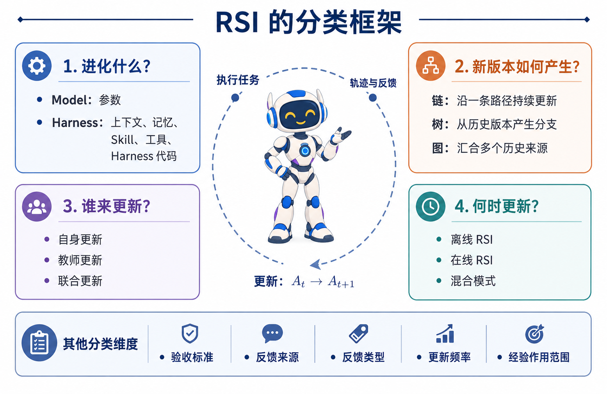
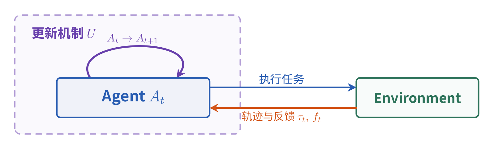
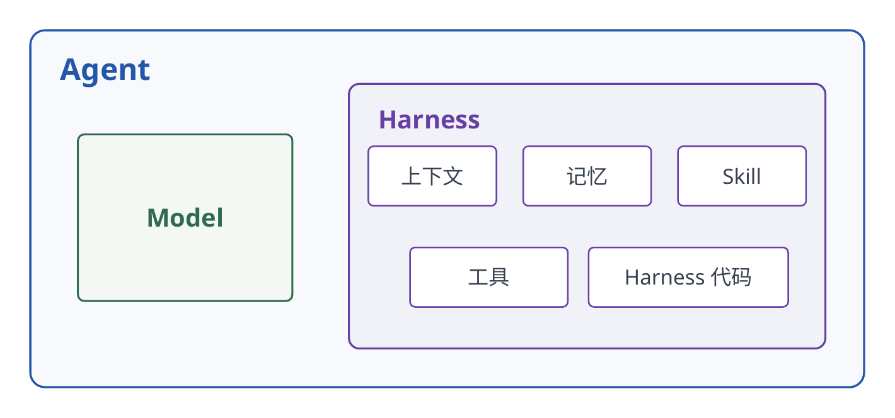
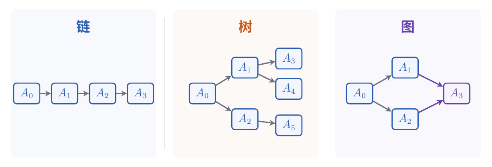

# 万字长文带你读懂 RSI（自进化，Self-Evolving）

## 来源信息

| 项 | 内容 |
| --- | --- |
| 标题 | 万字长文带你读懂 RSI（自进化，Self-Evolving）；英文版题名 *Understanding RSI: A Comprehensive Guide to Self-Evolving AI* |
| 作者 | Prism-Shadow（站点与仓库的署名，未披露个人姓名；仓库 README 的 BibTeX `author` 字段即 `Prism-Shadow`, 2026，正文亦以"我们"自称） |
| 站点 | [Awesome RSI](https://prism-shadow.github.io/awesome-rsi/#blog/understanding-rsi) — 一个 RSI 论文精选集，站点自称收录 **100 篇 method、31 篇 benchmark、3 个 system**，另含引用图谱、书籍与课程；本文是其中「导读」栏目的文章 |
| 仓库编号 | **00192**（非论文条目，与论文共用序列；无 PDF 可归档，README 编号列直接指向本页的博客地址） |
| 原文 | 站点为 Vite 单页应用，正文以 markdown 字符串内嵌于 `/awesome-rsi/assets/index-B80jtE9h.js`；原始源文件：[`site/src/data/blog/rsi-guide.zh.md`](https://github.com/Prism-Shadow/awesome-rsi/blob/main/site/src/data/blog/rsi-guide.zh.md)（中文原版，38,168 B，sha256 `22666c24e9b06bee…`）与 [`rsi-guide.en.md`](https://github.com/Prism-Shadow/awesome-rsi/blob/main/site/src/data/blog/rsi-guide.en.md)（英文版，44,182 B）。本笔记基于 main 分支 commit [`36e91f8`](https://github.com/Prism-Shadow/awesome-rsi/commit/36e91f8fed67e2cd0c761126f91042513df5d6ae)（未指定版本，取阅读时的最新 main，2026-09-30） |
| 发布日期 | 2026-09-03（站点元数据文件 `blogPosts.zh.js` 的 `published` 字段） |
| 阅读日期 | 2026-10-06 |
| 阅读范围 | 中文版**全文 413 行**（§1–6 + 参考资料）；英文版全文取回并交叉核对（本笔记引用的量化结论在两版中一致，两版差异仅在插图的 `-v1`/`-en` 语言变体）。同站姊妹篇《Awesome RSI：递归自我改进基准与方法精选集》（2026-08-21）与仓库 `README.md`（46 KB）**部分阅读**，仅用于补充动机、定义与 explorer 用法 |
| 配图 | 文中 22 张插图取用 4 张存入 `assets/`（**整图复制，未做裁剪**，故无越界/黑边风险；4 张均已回看确认与站点中文版同图，文件名沿用原文）。**本次取用的这 4 张**均为示意性结构图（框、箭头、拓扑），不含需要读数的曲线或柱状图，因此未对它们做像素测量，笔记中也不含"图中读数"；未取用的 13 张编号图**未逐张检查**，抽查中至少发现 2 张含定量元素（`10-dgm-fig3.png` 带 SWE-bench 分数色标、`05-skillsmith-fig2.png` 内嵌小型柱状/折线图），本轮未从它们读取任何数值 |
| 核验 | 所引 13 篇 arXiv 论文的元信息（编号 / 标题 / 作者 / 日期）经 arXiv API 逐条核对，**13/13 一致**；13 篇的官方摘要逐篇取回，用于复核导读转引的量化结论；另对 MGM、DGM、ReasoningBank、Evo-Harness、GDPevo 取全文核对具体数字（MGM 与 ReasoningBank 的关键表格在**渲染页**逐格核对，详见「代表工作与核对结果」）。**仅核到摘要层面**：SEAL、Prime Agent 的实验细节 |
| 许可 | 仓库与站点**未标注许可**（GitHub API 的 `license` 字段为 `null`）；`assets/` 下 4 张图版权归原作者，引用请注明出处 |
| 复核记录 | 2026-10-06 依 check-paper-note 复核（基准：同 commit 的 `rsi-guide.zh.md`，重取 sha256 `22666c24e9b06bee…` 与笔记一致；英文版 44,182 B 同步取回；独立子 agent 审计）。手段：28 条导读级数字逐条回源检索、18 处 `§x.y` 归因逐条比对、9 条否定性断言在 zh/en 双向检索、13 篇论文 arXiv 元信息 API 复比（13/13）、11 篇摘要重取比对、MGM Table 1 与 ReasoningBank Table 1/2 在**渲染页**逐格核对并复算区间、DGM「2 weeks」与 Evo-Harness「超过基线」全文检索、4 张配图与站点文件 sha256 逐字节比对。本轮修正：①矩阵图位置（导言、§1 之前，原写"§1 之后"）；②取消"所有插图均为示意图"的过宽表述并点明两张含定量元素的编号图；③"不裁决术语"改标姊妹篇来源（导读 0 命中）；④Evo-Harness 的证据层级由"摘要"改为正文 Table 1；⑤MGM 预算改为 200 φ-evaluation + 24 Φ-expansion 并注明并行 worker 出自消融节；⑥GDPevo 的 240/24 与 MGM 的 200 标注为论文来源；⑦"SkillSmith 两个机制"改三个；⑧§4.1 无代表工作的例外写进核心结论；⑨GDPevo 实验配置、Evo-Harness 五个 benchmark 名单、§2.1 两条边界、§3.3 末句两项结论补入；⑩GDPevo 的 50.63%/67.07% 本轮取全文闭环（原标"未取全文"），并查明 24.53 为论文中不存在的推导值。**仍未读**：那篇综述（2607.07663）的全文（只核到摘要） |

> 说明：导读共 22 张插图，分两类——**9 张作者自制的结构示意图**（`codex-*.png`，本次复制其中 4 张）与 **13 张从各被引论文截取的编号图**（`01-seal-fig1.png`…`14-evo-harness-fig3.png`；编号 01–14 之间跳号，缺 07 与 12，10 出现两次。这类图本次未复制）。

---

## 核心结论

一句话：**这不是一篇提出新方法的工作，而是一篇给"RSI / 自进化"建立坐标系的导读**——它先把 RSI 收成一个闭环 $A_{t+1}=U(A_t,\tau_t,f_t)$，再用**四组主维度**（进化什么 / 新版本如何产生 / 谁来更新 / 何时更新）加**五组次级维度**（验收标准 / 反馈来源 / 反馈类型 / 更新频率 / 经验作用范围），把近年涌现的这批自进化工作摆进同一张图，并给每个类别配一个代表工作——**唯一的例外是 §4.1"自身更新"，该节只有示意图、没有代表工作**（见「局限」）。

作者的四条主张（§1–§6）：

1. **RSI 不是一条技术路线，而是一族。** 被改对象可以是参数、上下文、记忆、Skill、Harness 代码五类；不先说清"改的是什么"就争论某个工作算不算 RSI，没有意义。
2. **"自我"的判据是产物被后续任务复用，而不是更新由 Agent 自己执行。** 更新算子 $U$ 可以由 Student 自己、独立的 Teacher、Meta-Agent 或外部训练程序完成（§1、§4）。
3. **每类更新者都有硬边界**：只给分数或验收结果的模块不算 Teacher（它没有决定"写回什么"）；Student 只执行任务、或 Teacher 只负责评分，都不算"联合更新"（§4.2、§4.3）。
4. **每个维度都对应一种代价**：链式实现简单但直接继承上一轮的错误，树/图能保留分支但评测成本随分支增长；参数进化把知识内化进权重但贵、难撤销、一次坏训练污染面大；上下文/记忆便宜但依赖检索质量与写入判断（§2、§3）。

一句话的使用方式：**再遇到一篇自进化论文时，先问四件事——改的是什么？新版本怎么来的？谁动手改？什么时候改？** 这套坐标系的直接价值是让不同技术路线可比——作者在开篇（未编号的引言，§1 之前）把目标写成"再遇到新的自进化工作时，可以迅速判断它与已有工作的联系和区别"。

*图：导读自绘的"RSI 的分类框架"总览图（来源：Awesome RSI 导读，许可未标注）。*

---

## 问题与动机

**补充背景（来自同站姊妹篇《Awesome RSI：递归自我改进基准与方法精选集》，2026-08-21）**——导读只用开篇一段话概括动机（领域仍在飞速发展、尚未形成统一技术范式、不同工作的改进对象与实现路径差异很大），姊妹篇则把问题拆成三条：

1. **术语未稳定**：RSI 与 "world model" 一样被宽泛使用，不同作者说的往往不是同一件事。
2. **研究增长速度超过整理速度**：姊妹篇援引 2026 年 7 月的一篇综述（[arXiv:2607.07663](https://arxiv.org/abs/2607.07663)，标题 *Recursive Self-Improvement in AI: From Bounded Self-Refinement to Autonomous Research Loops*），称其收录了 2024–2026 年间 **1,250 篇** arXiv 论文，但这些工作缺少便于横向比较的统一组织方式（**核验说明**：编号、标题与该数字均已对该综述摘要核对——摘要原文 "We survey 1,250 arXiv papers (2024-2026)"；**综述全文未读**）。
3. **教学材料没跟上**：既无共识课程也无成熟教材。

作者的应对是明确放弃裁决："**我们不试图裁决什么才算'真正的' RSI，而是用一组相互独立的维度来界定概念**，并标出每篇论文在这些维度上的位置"（姊妹篇原文大意）。这条自我限定很重要——它意味着下文所有分类都是**作者构造的坐标**，不是领域共识。

**历史脉络（姊妹篇）**：I. J. Good 1965 年提出"智能爆炸"（第一台超智能机器将是人类需要完成的最后一项发明）→ Yudkowsky 的可自我改写"种子 AI" → Bostrom 2014《超级智能》。此后几十年 RSI 主要是思想实验，LLM 让它变得触手可及。

---

## 形式化定义与两个前提

### 定义：一个闭环

导读 §1 把 RSI 定义为：Agent 与环境交互后，利用任务轨迹与反馈，通过更新机制修改自身状态，并让更新后的状态参与后续任务，以提升未来表现。写成式子：

$$A_{t+1} = U(A_t,\ \tau_t,\ f_t)$$

| 符号 | 含义 |
| --- | --- |
| $A_t$ | 第 $t$ 轮使用的 Agent，**包含 Model 与 Harness** |
| $\tau_t$ | 该轮任务产生的轨迹（trajectory） |
| $f_t$ | 获得的反馈（feedback） |
| $U$ | 更新机制；**不要求由 Agent 自己执行**，也可以是 Teacher、Meta-Agent 或外部训练程序 |

更新后的 $A_{t+1}$ 参与后续任务——这一点是定义里的**关键限定**：没有"更新产物被后续任务复用"的环节，就不构成导读所说的 RSI。

*图：导读自绘的 RSI 循环图（来源同上，许可未标注）。「更新机制 $U$」被画成一个把 $A_t$ 映射到 $A_{t+1}$ 的自环，与环境侧的"执行任务 / 轨迹与反馈"构成闭环。*

### 前提一：Agent = Model + Harness

导读 §2 开篇给出全篇的分解方式：**Agent = Model + Harness**。Model 提供基础的理解、推理与生成能力；Harness 负责组织模型如何接收信息、积累经验、调用工具并完成任务，具体含**上下文、记忆、Skill、工具、Harness 代码**五项。

- 参数进化改的是 **Model**；
- 上下文、记忆、Skill 进化改的是 **Harness 中可持续积累的状态**；
- 工具与 Harness 代码进化改的是 **动作空间与控制流程**。

*图：导读自绘的 Agent 结构分解图（来源同上，许可未标注）。*

### 前提二：参数式与非参数式作用于同一个输出分布（补充背景）

姊妹篇给了一个把两类进化统一起来的视角，导读正文未复述但值得记：**Agent 的输出是 $P(y \mid \theta, C)$**（$y$ 输出、$\theta$ 模型参数、$C$ 提供给模型的上下文）。参数式改进改变 $\theta$，所有非参数式改进最终都改变 $C$——**两者作用于同一个输出分布**，因此"参数 vs 非参数"的差别没有表面看起来那么大。

姊妹篇还给了这个维度最常见的**归类错误**示例：PostTrainBench（[arXiv:2603.08640](https://arxiv.org/abs/2603.08640)）里一个教师 Agent 训练学生模型并多轮提升学生准确率，直觉上会把学生模型当成自我改进的系统，但**真正执行 RSI 的是教师**（**我的推断**：导读 §2.1 之所以开篇先做范围界定，很可能就是针对这类误判）。

导读 §2.1 的范围限定原文有两条边界，读论文时值得照搬：① **每轮可以从初始模型重新训练，不必继承上一轮 Student 的参数**；② **不要求存在独立的 Teacher**——只要 Student 的表现反馈继续用于改进后续训练，就属于参数 RSI。

---

## 四个主维度

### 维度 1：RSI 在进化什么（§2）

按被改对象分五类。导读每类只给**一个代表工作**（站点目录里有 100 篇 method，此处是举例而非穷尽）：

| 被改对象 | 主要优势 | 主要代价 | 导读代表工作 | 导引数字 |
| --- | --- | --- | --- | --- |
| **参数**（Model 权重） | 知识内化进权重，不必每次检索外部材料 | 更新昂贵、难定位与撤销、一次错误训练可影响大量无关任务 | SEAL（Self-Adapting Language Models, [2506.10943](https://arxiv.org/abs/2506.10943)） | 无数值 |
| **上下文**（本次推理直接看到的材料） | 改动即时生效、无需训练 | 受窗口限制，需不断压缩/重写 | Prime Agent（[2608.23552](https://arxiv.org/abs/2608.23552)） | 无数值 |
| **记忆**（外部存储、按需检索） | 可跨任务积累，容量不受窗口约束 | 需筛选、抽象与修订，错误归因会持续污染 | ReasoningBank（[2509.25140](https://arxiv.org/abs/2509.25140)） | WebArena 总体成功率 +3.7–6.2 pp；SWE-Bench Verified 解决率 +3.4–4.0 pp |
| **Skill**（同类问题的可复用做法） | 比单条记忆更抽象、可重复使用 | 需在多次任务后判断该改哪一条 | TRACE（[2608.22793](https://arxiv.org/abs/2608.22793)） | GPT-5.5 上连续三次全成功的比例 59.9% → 94.5% |
| **Harness 代码**（上下文构造、工具、执行逻辑） | 能改变动作空间与控制流程，突破"只改说明文字"的天花板 | 改动面大，需成套测试避免修一处坏一处 | SkillSmith（[2606.01314](https://arxiv.org/abs/2606.01314)） | 3 个 Benchmark、5 个 Qwen3.5 规模 |

几个值得记住的机制点：

- **上下文 vs 记忆的区分**（§2.2 原文）："记忆是存放在外部、等待检索的信息；记忆被取出并放入模型输入后，才成为当前上下文。" 这是全篇最实用的一条操作性判据。
- **SEAL 的两层结构**（§2.1）：模型面对新输入时除了答案还生成 **self-edit**——一份自我更新方案（重组原始信息、生成训练样本、指定优化超参、调用工具做数据增强或梯度更新）；系统按 self-edit 做 SFT，把"临时文本"变成持久权重变化；又因为模型起初不知道什么样的 self-edit 有效，外面再套一层 RL：**以更新后模型的下游表现为奖励**，训练模型以后生成更有用的 self-edit。代价是候选 self-edit 的微调与评测开销高。
- **Prime Agent 的持久工作台**（§2.2）：持久化 IPython REPL 保存代码/变量/文件/计算结果，**Continual Harness** 记录任务历史、记忆、Skill、Prompt 与子 Agent 配置；任务中断后后台进程保留工作现场，恢复时无需重读全部材料；可派子 Agent 并行探索。**它不更新模型参数**——这也是它被归入"上下文进化"的理由。（**补充背景**，来自 Prime Agent 论文摘要而非导读：该文把自己的定位写成 *prevents harness failures from becoming model failures*，即让评测逼近模型真实上限。）
- **ReasoningBank 与 MaTTS**（§2.3）：把成功与失败轨迹都蒸馏成简短可复用的经验，而不是保存整条轨迹；新任务先检索经验、任务结束后判断是否完成再提炼写回。**memory-aware test-time scaling (MaTTS)** 则是"同一任务多试几次 → 得到更丰富的成败样本 → 提炼出质量更高的记忆 → 再指导后续尝试"的正反馈。
- **TRACE 的 Skill Bank**（§2.4）：按"一类具体情况"组织多个 Skill，每轮评测后把调用过同一 Skill 的成功/失败轨迹分组做**对比式精修**；失败模式包括没问清必要信息、过早执行操作、承诺做不到的事。好处是**一类任务出问题只改相关 Skill，不必重写整套 Prompt**；部署时按当前对话状态在每一轮选择 Skill（**补充背景**：TRACE 论文摘要称其为 state-conditioned skill orchestration，导读未用此术语）。
- **SkillSmith 的三个机制**（§2.5）：① Skill 与工具**同时改**——若失败源于工具能力不足，只改工具说明文字无解，所以反思模块生成"成套修改"（编辑/组合/拆分/停用工具 + 调整 Skill）；② 借生态系统"合作与竞争"的思路，从执行轨迹中记录**哪些 Skill 常互相帮助、哪些易干扰**，据此决定优先调用/修改/淘汰谁；③ 保存历史失败模式（问题表现、原因、修复方法），新方案若重蹈覆辙会被提前排除。

### 维度 2：进化结构——链、树、图（§3）

关注"新版本与历史版本的继承关系"，直接影响探索范围、评测成本与**从错误更新中恢复的能力**。

| 结构 | 定义 | 代价 | 代表工作 |
| --- | --- | --- | --- |
| **链** | 始终只有一个在用版本，$A_0 \to A_1 \to A_2 \to \cdots$ | 实现简单，但上一轮的错误被下一轮直接继承 | SkillFlow（[2604.17308](https://arxiv.org/abs/2604.17308)） |
| **树** | 保留多个历史版本；一个版本可产生多个子版本，后续可从**任意**历史版本继续 | 选择父代与评测新版本的时间/算力随分支增长 | DGM（[2505.22954](https://arxiv.org/abs/2505.22954)） |
| **图** | 一次修改可**同时参考多个来源**（同一 Agent 在不同任务上的轨迹、或另一分支的结果） | 需要维护跨任务/跨分支的对照与检索 | MGM（[2608.07645](https://arxiv.org/abs/2608.07645)） |

*图：导读自绘的三种进化拓扑（来源同上，许可未标注）。图中"图"式拓扑画的是 $A_3$ 同时汇合自 $A_1$ 与 $A_2$ 两条支线。*

**SkillFlow（链）**：每个任务族从**空的** Skill 库开始，Agent 完成一个任务后由模型根据轨迹与验证反馈生成 **Skill patch**（新增/改写/删除 Skill 与辅助脚本），更新后的库直接用于下一项任务，依次形成 $S_0 \to S_1 \to \cdots$。基准含 **20 个任务族、166 个可执行任务**（金融、供应链、医疗、治理、数据处理），同一族内任务流程相似但输入与要求不同、难度递增。用例为 4 种 Agent Harness × 11 个模型。导读记录了一个很有价值的观察：**表现好的配置通常反复修订少量通用 Skill，表现差的配置容易不断新增相似 Skill 使库越来越碎**；错误 Skill 一旦写入会被后续任务继续沿用。

**DGM（树）**：维护已生成版本的集合（archive），每轮从中采样一个版本作父代，修改它的提示词、工具或工作流代码生成子版本；**底层模型保持不变**（只进化 scaffold）。被选中的 Agent 先读自己的 Benchmark 记录提出改进，再把改进实现进自己的代码（例如更细粒度的代码编辑工具、长上下文处理、多次尝试与 peer review）。新版本须通过基本检查（代码能跑、仍具备编辑代码库的能力），再用 SWE-bench / Polyglot 评测；**得分低于父代的版本也会保留**，父代与其他历史版本不被覆盖，之后仍可被选中再次演化。选父代与管理版本集合的规则**目前是预设的、不随 Agent 一起更新**。名字来自 Gödel Machine——后者要求先证明修改有益才执行，复杂编程 Agent 做不到形式证明，DGM 改为**直接运行修改后的版本、用 Benchmark 得分检验**。

**MGM（图）**：沿用 DGM 的版本树，改变的是"生成新版本时用什么信息"。除保留单条失败轨迹的 **clonal mutation** 外，新增两种：

- **reaction-norm mutation**：比较**同一 Agent 在不同任务**上的轨迹——多项任务反复出现相似问题时，更可能是 Agent 自身缺陷而非题目特殊性；
- **cross-lineage hybridization**：比较**不同分支的 Agent 在同一任务**上的表现——一方失败一方成功时用成功轨迹作参考；两方都失败则比较两条轨迹以识别互补的失败模式。修改时把两个 Agent 的轨迹与结果一并作为参考，由待改的 Agent 从中提取可复用做法写进自己的代码。

导读的解释是：这两种更新都**使用版本集合中已有的评测轨迹**，跨任务/跨分支对照能提供更具体的故障线索，**缩小需要排查的范围**。§3.3 末句另记录了两个附带结论：**不同更新方式的 Token 消耗相近**，且 MGM 演化出的 Harness **在更换编程 Benchmark 或底层模型后仍能继续发挥作用**。

### 维度 3：谁来更新——自身、教师与联合（§4）

导读把执行任务的 Agent 叫 **Student**，把分析轨迹并参与修改的另一个 Agent 叫 **Teacher**（导读原文写明是"为了方便讨论"而设定的称法）。

| 类型 | 谁动手 | 判据 | 代表工作 |
| --- | --- | --- | --- |
| **自身更新** | Student 自己总结并修改自身 | 环境可给分，但没有另一个 Agent 分析轨迹或编写更新 | **（导读未给代表工作，仅配示意图）** |
| **教师更新** | Student 执行任务，**独立的 Teacher** 完成更新 | Teacher 决定写回什么以及怎么改；只给分/给验收结果的模块不算 | Recuris（[2608.24876](https://arxiv.org/abs/2608.24876)） |
| **联合更新** | 两者都参与，分工不固定 | 判据是**两者是否都影响了最终写回的内容** | Evo-Harness（[2608.15071](https://arxiv.org/abs/2608.15071)） |

- **教师不一定是 Agent**：也可能是反思模块、优化器或带验证规则的更新流程；它可以是"生成或整理新的记忆/Skill/工具/Harness 代码"，也可以是"制定训练方案、通过训练程序更新 Student 的参数"。
- **联合更新的分工可正可反**：Student 先总结候选经验再由 Teacher 筛选写入，或 Teacher 先诊断、Student 再实现修改，都算。
- **Recuris（教师更新的实现）**：用 **Working Memory** 记录当前目标、已完成步骤与下一步计划，用 **Experiential Memory** 保存跨任务可复用的经验与 Skill；**依据 Working Memory 中的进度与未完成目标来选择 Skill**（使 Skill 选择与当前步骤对齐）。失败时把失败与本轮用到的记忆组件**关联定位**；同类问题在多个任务中反复出现时，固定的 **Meta-Agent** 分析这些记录并对相关 Skill 提出**局部修改**，候选修改**通过验证后才写入** Skill Memory。
- **Evo-Harness（联合更新的实现）**：Solver（≈Student）完成任务后**自己先总结候选经验**并标明适用情况与依据；每批任务结束后 Evolver（≈Teacher）把候选经验与当前 Harness 对照，决定**新增/合并/修改/舍弃**，整理成跨任务规则或特定任务类型的操作流程；更新后的 Skill Harness 用于下一批任务。它处理的是**连续任务流**，执行记录中"既有可复用做法，也包含只与当前任务有关的路径、文件名与具体条件"——这正是需要 Evolver 做提炼的原因。导读提到消融：去掉 Solver 生成候选经验的步骤后效果低于完整方法。

### 维度 4：更新时机——离线、在线与混合（§5）

| 模式 | 协议 | 评测方法 | 代表工作 |
| --- | --- | --- | --- |
| **离线** | 训练任务中完成更新，进入测试阶段后**保持不变** | 训练题与测试题不能完全重复（否则只是记住答案），也不能分布完全不同（否则无法判断经验是否有用） | GDPevo（[2608.03764](https://arxiv.org/abs/2608.03764)） |
| **在线** | 处理任务的同时持续更新，前面任务的经验影响后续任务 | 必须沿任务序列观察，才看得出经验是否起作用 | FinEvo-Bench（[2608.06144](https://arxiv.org/abs/2608.06144)） |
| **混合** | 先离线建立初始版本，上线后根据新任务继续调整 | 兼有两阶段 | Mem²Evolve（[2604.10923](https://arxiv.org/abs/2604.10923)） |

- **GDPevo 的 Rule Hybridization**（离线评测的设计核心）：从 CRM、ERP、金融、医疗、法律、数据处理等真实业务流程中拆出**原子规则**，同一批基础规则先以不同组合出现在**5 个训练任务**中，再重新组合形成**5 个测试任务**。这样测试任务虽未出现，但含训练期接触过的规则，**涨分可以归因于经验复用而非见过原题**。规模：**12 组 × (5 训练 + 5 测试) = 120 个任务**；另有自动生成流程可在**两天内**再生成 12 组，用于定期换题以降污染风险（**补充背景**，取自 GDPevo 摘要：全自动流程可在两天内扩到 V2 的 240 任务 / 24 组；导读只写了"两天内生成另外 12 组"）。作者用**四种 Agent 和四类反馈**做实验。
- **FinEvo-Bench 的对照设计**（在线评测的关键）：**120 个金融任务**、6 个领域、20 个业务场景，每场景 6 个任务共用同一流程但数据与问题不同；同场景的 6 个任务**不连续出现**，而是与其他场景**交错**，且任务顺序被**独立随机打乱三次**。为单独测出"保留经验"的贡献，设置**状态重置对照组**：两组同模型、同框架、同任务顺序、同评分方式，实验组保留经验、对照组每任务前清空状态，**两组分差即经验带来的提升**。
- **Mem²Evolve 的双 Memory**（混合模式的机制）：Experience Memory 存从成败任务中总结的经验，Asset Memory 存可直接调用的工具与专家 Agent。新任务先拆成子任务 → 从 Asset Memory 找组件（找到就复用）→ 找不到就检索经验并结合外部信息**创建新工具或专家 Agent** → **新工具须先通过自动生成的单元测试** → 任务结束后新经验与通过验证的组件分别写回两类 Memory。

---

## 五个次级维度（§6）

导读强调这些维度**需要分别判断，同一种方法可能在同维度里采用多种方式**：

| 维度 | 取值 | 备注 |
| --- | --- | --- |
| **验收标准** | 产物验证（单测/编译/接口检查）· 单题结果（本任务是否成功、Reward 是否更高）· Benchmark 得分（一组题的总体表现）· 组合指标（表现+成本+速度+稳定性+新颖性）· **无独立验证**（生成后直接写入） | 回答"改动凭什么被保留" |
| **反馈来源** | Benchmark · 训练/验证集（与最终测试分离）· 环境（状态变化、Observation、原生 Reward）· 可执行验证器（单测、编译器、容器、形式检查器）· LLM 反馈（评审/自我批评/自洽性/辩论）· 人工 | 记录**演化过程中实际使用的证据**，不只看最终测试方式 |
| **反馈类型** | **分数**（二值 / 非二值）· **非分数**（标准答案 / LLM 评审 / 其他信息如 Observation、日志、诊断、责任定位、约束） | **LLM 给的标量仍属"分数"**，只有文字判断、解释、批评才算"LLM 评审"；只用于演化 Teacher 的反馈不计入 |
| **更新频率** | 单步（一次动作—Observation 后）· 事件触发（失败、发现能力缺口、收到提示、完成子目标）· 完整轨迹（一条任务轨迹结束）· 批次（多条轨迹/多组候选/一轮离线收集后统一更新） | 不记录 Teacher 自身的演化周期；**按代更新与离线集中整理统一归入"批次"** |
| **经验作用范围** | 通用（跨任务类型/跨领域）· 专用（特定实例、任务类型、主题、领域） | 同时维护全局与任务专用产物时**可同时归入两类** |

---

## 代表工作与核对结果

导读共点名 13 篇论文（另 1 条参考资料是 Awesome RSI 仓库自身）。我用两个来源做了核对：**arXiv API 的元信息**（编号、标题、作者、日期）与**论文自身的摘要或正文**（用来判断导读转引的数字是否忠实）。

| # | 论文（导读归类） | 导读转引的关键数字 | 核对结果 |
| --- | --- | --- | --- |
| 1 | SEAL（参数进化，§2.1） | 无数值结论 | 摘要口径一致（self-edit → SFT → 以更新后模型下游表现为奖励的 RL） |
| 2 | Prime Agent（上下文进化，§2.2） | 无数值结论 | 摘要口径一致（IPython REPL、Continual Harness、递归子 Agent）；摘要另有 ARC-AGI-3 RHAE Best@1 30%→95.5%，导读未引 |
| 3 | ReasoningBank（记忆进化，§2.3） | WebArena 总体成功率 +3.7–6.2 pp；SWE-Bench Verified 解决率 +3.4–4.0 pp | **可由 v2 表格复算**：WebArena Overall SR 相对各模型最强基线为 +4.7 / +6.2 / +3.7；SWE-Bench 相对基线 Synapse 为 +3.4 / +4.0 ✅（导读未称此范围是论文原话，实为按表推导） |
| 4 | TRACE（Skill 进化，§2.4） | GPT-5.5 上连续三次全成功比例 59.9% → 94.5% | 摘要一致：Pass^3 **+34.6 点，59.9%→94.5%** ✅（"连续三次全成功"是 Pass^3 的中文转述）。摘要另有隐藏集 Pass^3 70% 与 4.0 点的 potential–reliable 差距，导读未引 |
| 5 | SkillSmith（Harness 代码进化，§2.5） | 3 个 Benchmark、5 个 Qwen3.5 规模 | 摘要一致：**五个 Qwen3.5 规模**，OfficeQA +10.2 / SealQA +9.8 个百分点（相对 EvoSkill），并在 WildClawBench 上持续超过 SkillClaw ✅ |
| 6 | SkillFlow（链，§3.1） | Claude Opus 4.6 任务成功率 62.65% → 71.08%；"部分配置持平或下降" | 摘要一致：**+8.43 点**；并明确给出反例——Kimi K2.5 技能使用率 66.87% 但仅 +0.60 点，Qwen-Coder-Next 仅 44.58% 且**相对 vanilla 回退** ✅（导读"部分配置持平或下降"有据） |
| 7 | DGM（树，§3.2） | SWE-bench 20.0% → 50.0%；Polyglot 14.2% → 30.7%；一次 SWE-bench 自进化实验约需两周 | 摘要给出两组数字 ✅；"约两周"经**全文核对**：原句为 "A single run of the DGM on SWE-bench … takes about 2 weeks and incurs significant API costs"，该句另注实验细节见 Section 4（API 成本细节在附录 E.1）✅ |
| 8 | MGM（图，§3.3） | 相同评测预算下 Polyglot 50.8% → 93.2%，单轨迹（树形）基线 77.9%；SWE-bench Verified 也超过该基线 | **全文 Table 1（渲染页）逐格核对** ✅：Initial 68.3 → HGM 73.3（+5.0）→ MGM **78.3**（+10.0，相对 Initial 的绝对百分点提升，原文以上标标注）（SWE-bench Verified-60）；Initial 50.8 → HGM 77.9（+27.1）→ MGM **93.2**（+42.4）（Polyglot-60）。**口径提示**：两组都是 **-60 子集**（导读未注明），backbone 为 Qwen3.6-35B-A3B，**预算 200 次 φ-evaluation + 24 次 Φ-expansion**（Table 1 图注；消融一节另说明同一预算下启用 2 个并行 worker）；论文另报**完整 Polyglot-225** 上的 93.3%（图 2 数据标签与正文 210/225） |
| 9 | Recuris（教师，§4.2） | 4 个长程 Benchmark × 10 个模型；37 个模型-Benchmark 组合中 **35 个**提升；最长任务最多 **+32.2 点** | 摘要一致 ✅（原文为 "35 of the 37 **completed** pairs"——4×10 中只有 37 组完成） |
| 10 | Evo-Harness（联合，§4.3） | 五个 Benchmark 上都超过其他经验复用方法；消融去掉 Solver 生成候选经验后效果下降 | **正文 Table 1 核对** ✅（摘要仅列出 5 个 benchmark 并称"demonstrates the effectiveness"，未下"超过"的结论）：§4.2 原文为 "Evo-Harness improves over both No-Evolve and prior experience-based baselines across all five benchmarks" 与 "Compared with the strongest baseline, XSkill, Evo-Harness still improves on every benchmark"；五个 benchmark 为 CL-Bench、TerminalBench-2、SWE-bench Lite、τ-bench、WebArena-Infinity。消融细节未展开 |
| 11 | GDPevo（离线，§5.1） | 120 任务 / 12 组；更新前 50.63% → 更新后 67.07%（+16.44）；oracle 上限 91.6%，差 24.53 | 摘要给出"**最多 +16.44 个百分点**"与 **91.6% oracle** ✅；**正文全文核对** ✅：50.63% 与 67.07% 原文可查（"Opus-4.8 has the highest base accuracy (50.63%) and the largest gain (+16.44 pp)"；表中 `fewshot Skill Creator 67.07 ± 6.22 → +16.44`），即该组数字对应 **Opus-4.8 + Claude Code + fewshot 监督 + Skill Creator** 这一配置。**24.53 在论文中不存在**（全文 0 命中），是 91.6 − 67.07 的推导值，导读的算法正确 |
| 12 | FinEvo-Bench（在线，§5.2） | 平均 +9.33–19.37 分；同场景后三个任务比前三个高 6.10–8.70 分；顺序打乱三次 | 摘要逐项一致 ✅（原文为 within-scene **ranks 4–6** 超过 ranks 1–3；另有每任务减少 0.12–0.44 个合规问题，导读未引）。**口径补充**（摘要，导读未提）：全部输出由"以 Claude Opus 4.6 为后端的 Claude Code rubric judge"评分——这是理解该榜分数的一个前提 |
| 13 | Mem²Evolve（混合，§5.3） | 比只积累经验的方法高 **11.80%**，比只创建工具/专家 Agent 的方法高 **6.46%** | 摘要逐项一致 ✅（另有相对标准 LLM **+18.53%**，导读未引） |

**元信息核对**：13 篇的 arXiv 编号、标题、第一作者姓氏（Zweiger / Karten / Ouyang / Wu / Wei / Zhang / Zhang / Liu / Yu / Wei / Zhou / Deng / Cheng）与导读参考资料列出的作者姓氏**全部对应**；导读标注的日期等于各篇 **v1 提交日期**（如 MGM 2026-08-07、Recuris 2026-08-25），而其中多篇后来有 v2/v3（如 DGM v3 2026-03-12、TRACE v2 2026-09-03、SkillSmith v2 2026-09-26、FinEvo-Bench v2 2026-10-01）——**导读标注的是 v1 日期，核对时我读的是各自最新版**。

---

## 工程视角：怎么用这套坐标系

**读一篇新论文的四步（导读 §1–§5 的直接用法）**：

1. **定位被改对象**（§2）：改的是 $\theta$ 还是 $C$？若声称改了参数，被训练的是"执行任务的模型"还是"负责训练的另一个系统"？——这一步最容易错。
2. **看版本结构**（§3）：单线迭代（链）、保留 archive（树）、还是跨任务/跨分支汇合信息（图）？决定的是**评测预算量级**。
3. **看谁执行 $U$**（§4）：Student 自己、独立 Teacher、还是两者都碰了写回内容？若只有一方评分，就是"自身更新"或"教师更新"，不是联合。
4. **看更新时机**（§5）：离线 / 在线 / 混合？决定的是**评测协议**——离线的分数只有在训练-测试题设计合理时才可归因，在线的分数只有在沿序列观察且有重置对照时才可归因。

随后用 §6 的五个次级维度补齐"验收标准 / 反馈来源 / 反馈类型 / 更新频率 / 作用范围"，即可把一篇新工作和已有工作对齐。站点的 explorer 支持按这些维度**组合筛选**（仓库 README 的 "Use the explorer" 一节给出的例子即"更新 **Skill** + 运行模式 **Online** + 反馈来源 **Environment**"），是这套坐标系的落地形态。

**按预算选路线的粗略直觉（我的推断，非导读原文）**：

- **算力受限**：链式 + 完整轨迹或批次更新 + 环境/可执行验证器反馈，是最省的一条路（如 SkillFlow 的单线 patch 循环）；代价是错误会向后传播——SkillFlow 的"碎片化 Skill 库"正是这个失败的典型形态，工程上应对"不断新增相似 Skill"设硬约束（如强制合并、限制库规模）。
- **追求上限**：树/图能探索更宽的方向，但**每个分支都要一次真实评测**（DGM 单次 SWE-bench 自进化约两周〔导读 §3.2〕；MGM 用 200 次评测预算〔出自 MGM 论文，见上表〕），成本随分支线性增长。
- **想避免"改一处坏一处"**：SkillSmith 的做法可操作性强——**把改动成套生成并成套测试**（Skill 与工具一起改），并用历史失败模式做否决。
- **判断"是模型不行还是框架不行"**：可借用 Prime Agent 论文摘要的说法（**补充背景**）——好的 harness 应当 *prevent harness failures from becoming model failures*，让评测逼近模型的真实上限；这条对做自进化评测的人尤其重要，因为**经验积累的效果很容易被 harness 缺陷掩盖**。

---

## 局限与待确认问题

**作者明确讨论的局限**

- 领域尚无统一技术范式，导读只用维度界定而不裁决术语（"尚未形成统一的技术范式"见开篇引言；"不试图裁决什么才算真正的 RSI"一句出自姊妹篇，非导读原文）。
- 分类标签需要分别判断，同一方法可在同一维度取多个值（§6 开头）。
- 树/图式方法的成本随分支增长，DGM 这类持续生成与评测多分支的搜索"通常需要投入更多时间和模型调用预算"（§3.2）。

**我的判断（读者视角，非作者观点）**

1. **分类边界是作者构造的坐标，不是领域共识**。同一工作能被合理地放在不同格子里：Prime Agent 被归入"上下文进化"（因它不改参数），但它实际上演化的是 Harness 的持续状态；SkillSmith 在导读的「修改对象 × 更新模式」矩阵图（`codex-rsi-artifact-mode-matrix-v1.png`，位于开篇引言末、**§1 之前**）中同时出现在"记忆 / Skill / Harness 代码"三行。**导读未给出判定优先级**（多个标签冲突时以谁为准），也没有随正文分发编码后的标签数据（标签可在站点 explorer 中按维度筛选，其数据在站点的 JS 构建产物里）。
2. **"自身更新"一节没有代表工作**（§4.1 只有示意图）。四类主维度中唯一空缺的格子，读者若想找该类的实例，需要另去站点目录检索。
3. **两组 Polyglot 数字并列展示易被误读**：DGM 的 14.2% → 30.7%（§3.2）与 MGM 的 50.8% → 93.2%（§3.3）看似同一任务上的"代际飞跃"，实则**初始 Agent、backbone 与评测子集都不同**（MGM 用的是 -60 子集与 Qwen3.6-35B-A3B）。导读没有提示这一点，我在核对时才确认。
4. **可能的自我引用倾向**：GDPevo 的代码仓库位于 Prism-Shadow 组织下（[github.com/Prism-Shadow/GDPevo](https://github.com/Prism-Shadow/GDPevo)，arXiv 摘要中给出），而导读的"离线 RSI"代表工作正是 GDPevo，**导读由该组织维护**。这不构成错误，但读者应知道选例来源与维护方的关系。
5. **所有数字都是各论文自报，未做第三方复现**。我核对的是"**转引是否忠实**"，不是"结论是否成立"。此外导读转引时**省略了若干更强的结果**（TRACE 的隐藏集第一名、Mem²Evolve 相对标准 LLM 的 +18.53%），也有**省略了限定词**的情形（MGM 的 -60 子集）。
6. **一处口径未注明的转述**：ReasoningBank 的 "+3.7–6.2 pp" 并非论文原话，而是按论文表格计算的最强基线增量（我复算一致）。这类"由表推导"的数字在导读中可能还有其他，读到范围型数字时应回原文核对基线选择。

**尚无实验证据的问题**

- 导读提出的九维坐标**没有可执行的标注流程或定量验证**（例如：不同标注者对同一论文的一致性如何？），因此它是**阅读辅助框架**而非可复现的分类学。
- "参数进化 vs 非参数进化作用于同一输出分布"的统一视角（姊妹篇）是概念论证，**导读未提供二者在同一任务上的成本-收益对照实验**。
- 哪些维度组合在实践中真正有效，导读只给单点案例（每个格子一篇代表工作），**没有跨维度的系统性消融**——这是站点目录（100 篇）可以回答但导读未回答的问题。
- 领域发展快：导读发布于 2026-09-03，我读的站点 commit 为 2026-09-30（期间仓库仍在扩充 methods 目录），**较新版本可能已改动正文。**

---

## 参考资料

- 导读（本笔记主体）：[万字长文带你读懂 RSI](https://prism-shadow.github.io/awesome-rsi/#blog/understanding-rsi) · [中文源文件](https://github.com/Prism-Shadow/awesome-rsi/blob/main/site/src/data/blog/rsi-guide.zh.md) · [英文版](https://github.com/Prism-Shadow/awesome-rsi/blob/main/site/src/data/blog/rsi-guide.en.md)
- 姊妹篇（动机与定义，补充背景）：[Awesome RSI：递归自我改进基准与方法精选集](https://prism-shadow.github.io/awesome-rsi/#blog/introducing-awesome-rsi)（2026-08-21）
- 仓库与目录：[Prism-Shadow/awesome-rsi](https://github.com/Prism-Shadow/awesome-rsi)（README 的 Paper map / Methods & Systems / Benchmarks 三节即站点目录的 markdown 形态）

导读点名的 13 篇代表工作（arXiv 链接见「代表工作与核对结果」表）：SEAL(2506.10943)、Prime Agent(2608.23552)、ReasoningBank(2509.25140)、TRACE(2608.22793)、SkillSmith(2606.01314)、SkillFlow(2604.17308)、DGM(2505.22954)、MGM(2608.07645)、Recuris(2608.24876)、Evo-Harness(2608.15071)、GDPevo(2608.03764)、FinEvo-Bench(2608.06144)、Mem²Evolve(2604.10923)。
