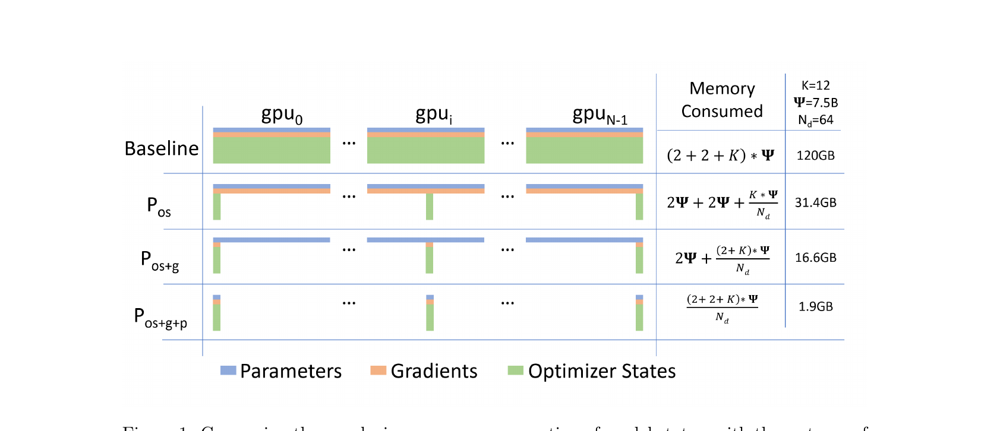
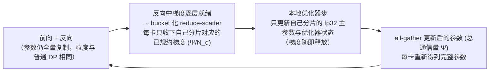
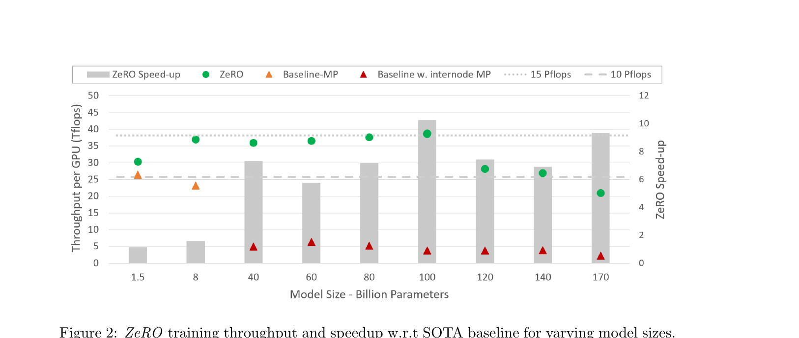
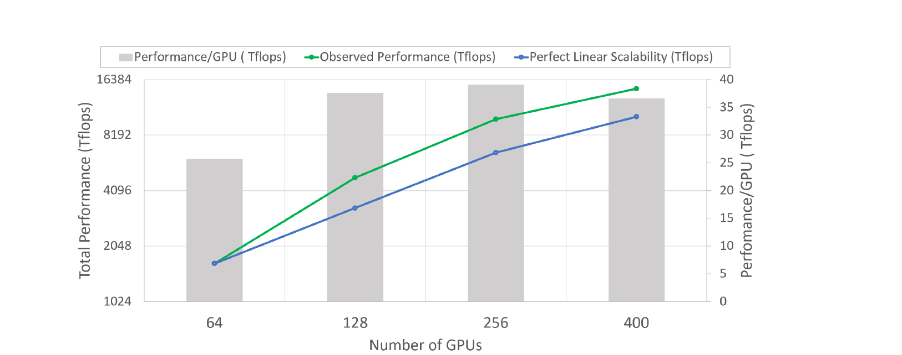

# ZeRO: Memory Optimizations Toward Training Trillion Parameter Models

## 来源信息

| 项 | 内容 |
| --- | --- |
| 标题 | ZeRO: Memory Optimizations Toward Training Trillion Parameter Models |
| 作者 | Samyam Rajbhandari\*, Jeff Rasley\*, Olatunji Ruwase, Yuxiong He（\* 同等贡献） |
| 机构 | Microsoft（{samyamr, jerasley, olruwase, yuxhe}@microsoft.com） |
| 来源 | [arXiv:1910.02054v3](https://arxiv.org/abs/1910.02054v3)（cs.LG; cs.DC; stat.ML），官方 HTML 版同样为 v3 |
| 版本历史 | v1 2019-10-04（已撤回）→ v2 2019-10-07 → v3 2020-05-13（本笔记基于 v3，也是截至阅读时的最新版） |
| 阅读日期 | 2026-10-04 |
| 阅读范围 | v3 全文：正文第 1–11 节 + 附录表格（Table 5–10）；图表经 PDF 页面渲染逐张核对，Figure 1–3 已截图存档于本目录 `assets/` |
| 归档说明 | arXiv 来源，按仓库策略不归档 PDF；仓库清单编号 00002（上游 `paper-is-all-you-need` 有归档 PDF，本仓库只记官方链接）。**经复核：该上游归档是删改学习版**（15 页、隐去作者名、章节重新编号；缺 1T 分析、消融与 Turing-NLG、结论章及附录——Table 2、Figure 6+ 均不在其中），核对时以 arXiv v3 为准 |

---

## 核心结论

一句话：**ZeRO 在数据并行（DP）框架内把「模型状态」从每卡复制一份改为按 DP 度数切分、用时再通信聚合，从而在不牺牲计算/通信效率的前提下拿到接近模型并行（MP）的内存效率。**

- **ZeRO-DP（切模型状态）** 分三步累积启用——优化器状态切分 $P_{os}$、梯度切分 $P_g$、参数切分 $P_p$——每卡模型状态内存分别降到 baseline DP 的 $1/4$、$1/8$、$1/N_d$（$N_d$ 为 DP 度数）；通信量上 $P_{os+g}$ 与 baseline DP 相同（2Ψ）、$P_{os+g+p}$ 最多 1.5x（3Ψ），论文未单独分析只启用 $P_{os}$ 的情况（§4.1、§5、§7）。
- **ZeRO-R（切残余内存）** 处理激活、临时缓冲、内存碎片三项：激活检查点切分 $P_a$（可再卸载到 CPU，$P_{a+cpu}$）、常量大小缓冲区 $C_B$、运行时碎片整理 $M_D$（§4.2、§6）。
- **实测**：实现子集 ZeRO-100B（$P_{os+g}$ + ZeRO-R）在 400 张 V100 上高效训练 170B 模型（比当时 SOTA 大 8 倍）；8B–100B 区间平均吞吐 15 PFlops（>30% 硬件峰值），100B 时 38 TFlops/GPU，训练速度最多提升 ~10 倍；64–400 卡出现**超线性**加速；不借助 MP 即可训练 13B（同一批卡上 baseline DDP 上限 1.4B）；支撑了当时最大的 17B 语言模型 Turing-NLG（§10）。
- **外推**：完整版 $P_{os+g+p}$ 在 1024 张 V100 上可以**装下** 1T 参数模型（16TB 模型状态 ÷ 1024 = 16GB/卡），但这是内存分析结论——论文实测规模只到 170B，**没有 1T 规模的训练实验**；算力缺口意味着 1T 模型端到端训练仍需 >1 年（§9 的锚点：1T 模型单样本计算量约 Bert-Large 的 3000 倍，而 Bert-Large 在 1024 卡 DGX-2H 上训完需 67 分钟；同口径外推 1T 需 140 天）。
- 适用场景：单卡装不下、又想保持 DP 简洁性与扩展效率的大模型预训练；对模型代码零改动（§10.1、§11）。

---

## 问题与动机

### 已有方案的瓶颈（§1–2）

模型规模的增长本身带来精度收益（Bert-large 0.3B → GPT-2 1.5B → Megatron-LM 8.3B → T5 11B），但从十亿级走向万亿级时首先撞上单卡显存墙——本论文要解决的是「如何把模型装进集群」。当时（2019）训练大模型的主流手段各有硬伤：

| 方案 | 内存 | 计算/通信效率 | 易用性 |
| --- | --- | --- | --- |
| 基础 DP | 每卡复制全部模型状态；32GB GPU 上 >1.4B 参数就 OOM | 高（通信量小、计算粒度粗） | 最简单 |
| MP（如 Megatron-LM） | 切分模型状态，省内存 | 每层都要大量通信，跨节点带宽骤降后效率崩坏：论文实测 40B 模型跨 2 个 DGX-2 节点只有约 5 TFlops/V100（<5% 峰值） | 需改模型/算子，支持的算子集有限 |
| PP（G-pipe / PipeDream） | 切层 | 需要与流水线分段数成比例的 batch 来填流水线气泡，或保存陈旧参数副本 | tied-weights、batch-norm 等难实现；影响收敛语义 |
| CPU offload | 省 GPU 内存 | PCI-E 带宽受限，论文引述最多 50% 时间花在 GPU↔CPU 传输 | — |
| 内存高效优化器（粗粒度统计量） | 省优化器状态 | — | 改变优化算法，可能影响收敛保证 |

论文的切入点是观察到**DP 的内存效率差来自冗余**：模型状态被完整复制到每张卡，而其中大部分在任一时刻并不被用到（例如某层的参数只在处理该层时需要）。

### 内存到底花在哪（§3）——这是全文的记账基础

以混合精度（fp16/32）+ Adam、模型参数量 $\Psi$ 为例：

| 组成 | 精度 | 字节数 |
| --- | --- | --- |
| 参数（params） | fp16 | $2\Psi$ |
| 梯度（gradients） | fp16 | $2\Psi$ |
| fp32 主参数副本 | fp32 | $4\Psi$ |
| Adam 动量（momentum） | fp32 | $4\Psi$ |
| Adam 方差（variance） | fp32 | $4\Psi$ |
| **合计** | | $\mathbf{16\Psi}$，其中优化器状态 $K\Psi$，$K=12$ |

也就是说 1.5B 的 GPT-2 权值本身只占 3GB，训练却至少要 24GB 模型状态；再叠加激活与临时缓冲，完整训练远超单张 32GB 卡的容量（§3）。论文随后指出（§2.3）：Adam 这类自适应优化器是达到 SOTA 精度的关键，但每个参数都要额外维护一阶/二阶统计量，内存代价高昂——ZeRO 的价值之一就是让这些优化器在大模型上继续可用。**残余状态**（residual states）同样不可忽视：

- **激活**：1.5B GPT-2、序列长度 1K、batch 32 约需 60GB（激活量与「层数 × hidden dim × seq length × batch」成正比，见脚注 3）；激活检查点（activation checkpointing）按平方根量级压缩到约 8GB，代价是约 33% 重算。但 100B 模型即便做检查点，batch 32 仍需约 60GB。激活压缩、live analysis 等与本文互补的路线见 §2.2.1。
- **临时缓冲**：为提升 all-reduce 带宽，梯度常被 fuse 进一个扁平 fp32 缓冲，其大小随模型线性增长——1.5B 模型即 6GB（§3.2），3B 模型 12GB（§6.2）。
- **内存碎片**：短生命周期与长生命周期张量交错，导致内存分配器找不到连续内存；论文观察到最坏情况下**还剩 >30% 空闲显存却 OOM**。

---

## 方法与贡献

论文把内存优化拆成两组互补手段：ZeRO-DP 针对模型状态，ZeRO-R 针对残余内存。两者合称 ZeRO。注意 §4 特别强调**效率是硬约束**：若不要求效率，把状态全丢进 CPU、或无限制增大 MP 度数都能省显存，那样的方案没有意义（§4）。

### ZeRO-DP：三条洞察（§4.1）

1. DP 的扩展效率优于 MP：MP 降低计算粒度又抬高通信开销，跨节点尤其明显；DP 计算粒度粗、通信量小。
2. DP 内存效率差是因为**复制**，MP 内存效率好是因为**切分**。
3. DP 和 MP 都**静态**持有全生命周期所需的状态，但任一时刻并不需要全部状态——例如某层参数只在该层前向/反向时需要。

由此得到设计：**切分模型状态 + 动态通信调度**，保留 DP 的粒度与通信量级。

### 三个阶段（§5）

以下按「每卡模型状态内存」记账（沿用原文符号，$N_d$ 为 DP 度数）：

| 阶段 | 每卡内存 | 大 $N_d$ 时 | 相对 baseline 降幅 |
| --- | --- | --- | --- |
| Baseline DP | $(2+2+K)\Psi = 16\Psi$ | — | 1x |
| $P_{os}$：切优化器状态 | $2\Psi + 2\Psi + \frac{K\Psi}{N_d}$ | $\approx 4\Psi$ | 4x |
| $P_{os+g}$：+切梯度 | $2\Psi + \frac{(2+K)\Psi}{N_d}$ | $\approx 2\Psi$ | 8x |
| $P_{os+g+p}$：+切参数 | $\frac{(2+2+K)\Psi}{N_d} = \frac{16\Psi}{N_d}$ | 线性 | $N_d$ |

1. **$P_{os}$（优化器状态切分）**：把优化器状态均分为 $N_d$ 份，第 $i$ 个 DP 进程只保存、只更新第 $i$ 份对应的参数分片；每步末尾一次 all-gather 把更新后的参数同步回所有进程（这次 all-gather 的通信量记账见下方「通信量分析」的口径说明）。
2. **$P_g$（梯度切分）**：既然每卡只更新自己那份参数，就只需要自己那份**已规约**的梯度。做法是把 all-reduce 换成 **reduce-scatter**：某层梯度在反向传播中一就绪就规约到它该去的进程，规约完即释放。实现上用 bucket 化（把同一分片的梯度攒成桶一次性规约）来重叠通信与计算——论文明确将这一点与 NVIDIA AMP（Automatic Mixed Precision）的梯度 bucket 做法类比（§5.2）。
3. **$P_p$（参数切分）**：每卡只存自己负责更新的参数分片；前向/反向需要别的分片时，由持有者广播/聚合（论文原文在「broadcast」与「all-gather」两种说法间混用，本质是把一次完整 all-gather 摊到各层使用点上按需取用、用完即弃，反向再按逆序来一遍）。相对 $P_{os+g}$ 的 2Ψ，整步通信量增为 3Ψ（=1.5x baseline DP），换来 $N_d$ 倍内存下降。

图 1 给出了三步的可视化与具体数值（7.5B 模型、$N_d=64$、$K=12$）：120GB → 31.4GB → 16.6GB → 1.9GB。

*Figure 1（来源：arXiv:1910.02054v3）：Baseline 每卡复制全部状态；$P_{os}$ 后优化器状态只剩 1/64；$P_{os+g}$ 后梯度也切分；$P_{os+g+p}$ 后全部状态切分，仅 1.9GB。*

一个训练步（$P_{os+g}$）的数据流可以概括为：

*解读（非原文图）：$P_{os+g}$ 把「一次全量 all-reduce (2Ψ)」换成「reduce-scatter (Ψ) + 更新后参数 all-gather (Ψ)」，通信量不变而每卡存储的梯度与优化器状态降到 $1/N_d$。*

### 与 MP 的关系（§1、§9）

- 单论「装下模型」，ZeRO-DP 不弱于 MP（模型不能被 MP 整除时甚至更好），且扩展效率相当或更优、无需改模型。
- 需要 MP 的场合：配合 ZeRO-R 进一步压缩超大模型的激活；或小模型场景下 DP 的聚合 batch 会超过 critical batch size 影响收敛时，用 MP 换取可接受的 batch。
- 两者可组合，每卡内存最多再降 $N_m$ 倍（$N_m$ 为 MP 度数）：论文给的组合方案是每节点内 16-way MP + 跨节点 64-way DP，在 1024 卡上装下 1T 模型。

### ZeRO-R：三项残余内存优化（§6）

1. **$P_a$（切分激活检查点）**：MP 天然要求激活在各 MP 进程上冗余复制（按列切分线性层时每个进程都需要完整输入激活）。ZeRO 只保留切分后的激活检查点，用到时 all-gather 现场重建，激活内存随 MP 度数下降。例子：100B 模型、batch 32、seq 1024、MP=16，每层一个检查点原本约 33GB/卡，$P_a$ 后约 2GB/卡。可行性依据是这类模型的算术强度（每轮计算量 / 每轮检查点数据量）$\ge 10K$ 且随 hidden size 线性增长，检查点的搬运成本可被计算掩盖（§4.2.1）。进一步可 $P_{a+cpu}$ 卸载到 CPU，激活占用趋近于零，代价是额外通信（约为 $P_a$ 的 2 倍 CPU 往返数据量）。
2. **$C_B$（常量大小缓冲区）**：把随模型规模增长的 fused buffer 换成固定大小（足够大以维持集合通信效率）。否则 3B 模型的 fp32 融合缓冲就要 12GB。
3. **$M_D$（碎片整理）**：为激活检查点和梯度**预分配连续内存块**，张量一产生就拷入预分配区。既避免「有显存却 OOM」，也省下分配器找连续空间的时间。

---

## 关键公式与直觉

### 内存公式的直觉

- baseline 的 $16\Psi$ 里，真正每次前向/反向都要用的只有 $2\Psi$ 的 fp16 参数副本；$4\Psi$ 的 fp32 主参数（参数更新实际作用的对象）与 $12\Psi$ 的优化器状态只在更新步骤前后需要，$2\Psi$ 梯度只在反向末尾到更新之间需要——**没有一项是全程必需的**，这是切分可行的根本原因（对应 §4.1 洞察三）。
- $P_{os+g}$ 后每卡常驻 $2\Psi$（完整 fp16 参数）+ 一份被均摊的 $(2+K)\Psi/N_d$。
- $P_{p}$ 后连 $2\Psi$ 也切了，代价是参数要「用时借、用完还」。

### 通信量分析（§7）

约定：通信量按**每个进程发送+接收的元素数**计，且只考虑带宽受限的集合通信。

口径说明：§7 只推导了 $P_{os+g}$（2Ψ，§7.2.1）与 $P_{os+g+p}$（3Ψ，§7.2.2）。§1 的三阶段清单另称 $P_{os}$「4x 内存下降、与 DP 相同的通信量」，而 §5.1 描述的 $P_{os}$ 机制含一次更新后参数的 all-gather；两者只有在梯度规约也按分片进行（reduce-scatter，即 §5.2 的做法）时才自洽。因此笔记把「与 baseline 相同」理解为 $P_{os+g}$ 的结论，$P_{os}$ 单独启用时的通信量论文没有推导。

| 方案 | 通信构成 | 总量 | 相对 baseline |
| --- | --- | --- | --- |
| Baseline DP | all-reduce = reduce-scatter (Ψ) + all-gather (Ψ) | $2\Psi$ | 1x |
| $P_{os+g}$ | reduce-scatter 梯度 (Ψ) + all-gather 更新后参数 (Ψ) | $2\Psi$ | **1x** |
| $P_{os+g+p}$ | reduce-scatter 梯度 (Ψ) + 前向 all-gather 参数 (Ψ) + 反向 all-gather 参数 (Ψ) | $3\Psi$ | **1.5x** |

关键直觉：$P_p$ 看似要频繁广播参数，但把一次 all-gather **摊到前向逐层进行**（用到某层参数时该分片持有者再广播，用完即弃），单位是「每层一份」，整步合计仍是 Ψ，只不过反向还得再来一次——所以只贵 50%。这正呼应第 3 条洞察：状态有**时间局部性**。

**$P_a$ 的通信开销（§8）**：以 Megatron-LM + 激活检查点为基准，一个 transformer block 前向 2 次 all-reduce、重算 2 次、反向 2 次，共 6 次 all-reduce；all-reduce 通信量为 2×消息大小，故每 block 通信 $12 \times batch \times seq \times hidden$。$P_a$ 每 block 只多一次 all-gather（$1 \times$ 消息大小），即 **<10%**（按原文简化表述为 $12 \times seq \times hidden$ 对 $seq \times hidden$ 之比约为 8.3%）。反过来，$P_a$ 把激活内存降到 $1/N_m$，可支撑 batch 最多放大 $N_m$ 倍，而 DP 通信量与 batch 成反比——因此它能把 DP 通信量压下一个量级。

### 容量示例（Table 1 摘要）

每卡模型状态内存（GB，$K=12$；粗体=该组合可装入 32GB V100 集群，本表节选中仅 1024 卡的 $P_{os+g+p}$ 满足）：

| DP 度数 $N_d$ | 1T 模型 $P_{os}$ | 1T 模型 $P_{os+g}$ | 1T 模型 $P_{os+g+p}$ |
| --- | --- | --- | --- |
| 4 | 7000 | 5500 | 4000 |
| 16 | 4750 | 2875 | 1000 |
| 64 | 4187 | 2218 | 250 |
| 256 | 4046 | 2054 | 62.5 |
| 1024 | 4011 | 2013 | **15.6** |

7.5B 与 128B 模型的对应数字见原文 Table 1。$N_d=64$ 时 ZeRO 可训练 $P_{os}$ 7.5B / $P_{os+g}$ 约 14B / $P_{os+g+p}$ 128B 参数量级的模型；$N_d=1024$ 且三阶段全开时可装 1T。论文由此给出的说法是：**只要设备数足够，DP 也能装下任意大小的模型**（§5.3）。

---

## 实验与证据

### 设置（§10.1）

- 硬件：400×V100（25 台 DGX-2），节点间 800 Gbps。
- 并行布置（Figure 2 图注、Table 5）：**ZeRO 一侧 MP 始终 ≤16-way、不跨节点**，跨节点扩展全部交给 ZeRO-DP；**baseline 在 40B 以上必须用跨节点 MP**（图注原文口径；按 Table 5，40B 的 32-way 已跨 2 个节点，60B/80B+/170B 为 64/128/256-way）。因此 Figure 2 比较的实际是「跨节点 ZeRO-DP vs 跨节点 MP」。
- baseline：无 MP 时用 PyTorch DDP；有 MP 时用 NVIDIA 开源 Megatron-LM（2019-09 版本）——论文引述其最新结果只扩展到 16B 参数 / 512 张 V100（§10.1）。
- 被评系统：ZeRO-100B = $P_{os+g}$ + ZeRO-R；PyTorch 实现，接口是包装 `torch.nn.module`，模型代码不改。
- 模型：GPT-2 风格 Transformer，配置见 Table 4–10（附录给出每组实验的层数、隐层、注意力头、batch 等，可复现性好）。

### 速度与模型规模（Figure 2）

*Figure 2（来源：arXiv:1910.02054v3）：绿色 ZeRO 在 8B–100B 区间稳定在同一量级（图中读数约 36–39 TFlops/GPU，论文正文表述为 100B 时 >38）；橙/红为 Megatron-LM（节点内/跨节点 MP），40B 起迅速跌到个位数。*

- ZeRO 在 400 卡上高效训练 **170B** 模型；作为对照，论文称 Megatron 单独无法高效扩展到 **40B 以上**，单台 DGX-2 上可达可接受吞吐的规模只有 **16–20B**（§1、§9）。模型规模提升 >8 倍。
- 8B–100B 平均吞吐 **15 PFlops**（>30% 峰值），100B 时 **38 TFlops/GPU**；同规模最多 **~10x** 加速。
- 基线退化的原因（§10.2）：跨节点后每链路带宽从 300GB/s（NVSwitch）降到 12.5GB/s（InfiniBand EDR），MP 的层间通信代价骤增。
- 100B 之后（120B/140B/170B）ZeRO 吞吐回落（Figure 2 中读数约 28.2/26.9/20.9 TFlops/GPU，论文未给具体数字），论文归因于**显存不足以开更大 batch**（§10.2）。

### 超线性扩展（Figure 3）

*Figure 3（来源：arXiv:1910.02054v3）：60B 模型 64→400 卡。灰柱=每卡吞吐（右轴 0–40 TFlops/GPU），绿线=实测**总**吞吐（左轴 1024–16384 TFlops，对数坐标），蓝线=完美线性扩展参照。绿线与蓝线在 64 卡重合，从 128 卡起高于蓝线；图中读数：每卡约 25.5→37.4→38.8→36.4 TFlops/GPU（对应总吞吐约 1.6→4.8→9.9→14.5 PFlops）。*

- 64→400 卡区间性能**超线性**：卡数翻倍，总吞吐从 64 卡约 1.6 PFlops 升到 128 卡约 4.8 PFlops（约 2.9 倍），此后 256/400 卡约 9.9/14.5 PFlops（均为图中读数）。机制是 $P_{os+g}$ 让每卡模型状态随 $N_d$ 下降，从而能开更大 batch，提高算术强度（§10.3）。
- 注意口径：这是「固定模型、随卡数变多」的曲线，超线性来自 batch 可放大，而非算法本身的免费午餐；每卡吞吐本身在 256→400 卡略有回落（38.8→36.4）。

### 民主化：无 MP 训练 13B（Figure 4）

- 128 卡、纯 DP（MP=1）可训练到 **13B**，论文称平均 >40 TFlops/GPU；而同配置下无 ZeRO 的 DDP 上限是 **1.4B**、吞吐 <20 TFlops/GPU（§10.4，附录 Table 10 给出两个 baseline 配置点，原文标签为 1p16B/1p38B）。
- 读图补注：Figure 4 中吞吐随模型增大明显下滑——13B 单点约 21 TFlops/GPU，40 TFlops/GPU 以上主要出现在 1.5–10B 区间（峰值约 47），9 点均值约 39；「>40 平均」是论文口径，按图略偏乐观（读数为本笔记像素测量，±1–2 TFlops/GPU）。
- 解读：这是「单卡显存约束下的最大可训练模型」对比，不是同一模型的开销对比；论文用它论证**易用性**（不需要 MP/PP、不需要高速节点内互联）。

### 消融：C1–C5 配置（Table 3、Figure 6–8）

| 配置 | ZeRO-DP | ZeRO-R |
| --- | --- | --- |
| C1 | $P_{os}$ | $C_B+M_D$ |
| C2 | $P_{os}$ | $C_B+M_D+P_a$ |
| C3 | $P_{os+g}$ | $C_B+M_D$ |
| C4 | $P_{os+g}$ | $C_B+M_D+P_a$ |
| C5 | $P_{os+g}$ | $C_B+M_D+P_a$ + CPU offload |

- **最大可训练模型**（Figure 6，固定 batch size、MP=16）：C1→C2 由 $P_a$ 带来 40B→60B（激活内存 ÷16）；C2→C4 由 $P_{os+g}$ 带来 →140B（模型状态减半）；C4→C5 由 $P_{a+cpu}$ 再挤出 →150B。
- **缓存显存**（Figure 7）：C1→C2 的下降符合预期；C2 与 C3 之间取决于模型状态与激活的相对大小（可能升也可能降）；C4→C5 的下降只在激活占比大的 100B 上可见，40B 上不明显。
- **吞吐**（Figure 8）：性能提升与显存下降对应（显存换 batch）；**例外**是 C5 在 60B 上反而变慢——CPU 往返传输的代价在模型装得下时不划算，故实现里 $P_{a+cpu}$ 只在收益为正时开启（170B 必须开）。
- 这组消融回答了两个问题：「$P_a$ 是否真能提高可训练规模」与「CPU offload 是否值得」，并给出取舍边界。

### 内存模型验证（Table 2）

- 左侧为内存分析给出的理论上界（baseline/$P_{os}$/$P_{os+g}$/$P_{os+g+p}$），右侧为 **$P_{os}$ 实测**可训练模型规模（论文称该实现为 ZeRO-OS，即只切优化器状态）：64 卡 6.2B、128 卡 12.5B、256 卡 25B、512 卡 50B、1024 卡 100B——逐档约为理论 $P_{os}$ 上界（7.6B/15.2B/30.4B/60.8B/121.6B）的 82%，与论文「分析给出的是现实上界」的结论一致（复核实测换算）。
- 注意：**实测列只覆盖了 $P_{os}$**；$P_{os+g}$/$P_{os+g+p}$ 的规模是分析结果（100B 级实测见 Figure 2 的 $P_{os+g}$ 路线，但未逐档验证）。

### Turing-NLG（Figure 5，§10.6）

- 17B 参数语言模型（截至 2020-05-12 世界最大），全程用 ZeRO-100B 训练，Webtext-103 perplexity **10.21**，持续 **41.4 TFlops/GPU**；Figure 5 给出 300K iteration 的验证 perplexity 曲线，低于 8.3B 的 Megatron-LM。
- 注意这是「更大模型的最终质量更好」的展示，不是 ZeRO vs 同模型 baseline 的收敛对比；不过 ZeRO 不改变优化语义，本身不应引入收敛差异。

### 证据质量提醒（附录末）

附录说明：部分 baseline 实验只用了 384 或 256 张卡（卡数须为 MP 的整数倍，且集群只有 400 张），且 baseline 卡少时通信压力更小（170B 时 baseline 甚至 DP=1、无 DP 通信）。**这些安排对 baseline 有利，结论是在此前提下的实测**；比较口径为每卡吞吐（per-GPU throughput），论文称仍属同口径比较。

另注（复核时发现）：v3 附录表格的图号标注与内容存在错位——Table 7 的内容对应 Figure 6（各 ZeRO 配置下的最大模型），Table 8 对应 Figure 7，Table 9 对应 Figure 8，Table 10 对应 Figure 4（DP-only 扫描）；Table 5、6 的标注正常。按图表号检索实验配置时需以内容为准。

---

## 工程视角

### 落地形态与接口

- PyTorch 实现：用户用接口**包装模型**即可，不需要改模型结构；可与任意 MP（含 Megatron-LM）组合（§10.1）。
- 开源状态（论文写作时）：ZeRO 已作为 DeepSpeed 的一部分开源（脚注 2：github.com/microsoft/deepspeed）；论文称本文描述的全部实现计划于 2020 年 5 月底发布，并在之后再扩展到 $P_{os+g+p}$（参数切分）以支持 1T 参数（§1、§11）。

### 实现要点（按数据流）

1. **反向中的梯度规约**：以 bucket 化的 reduce-scatter 替代 all-reduce；按分片边界规约，边算边通信。
2. **更新后的参数发布**：每步 all-gather 一次（$P_{os+g}$）；若启用 $P_p$，则改为前向逐层 all-gather/broadcast、反向再一遍。
3. **内存生命周期管理**：梯度规约后立即释放；参数分片用完即弃；激活检查点按需重建；预分配连续缓冲区承接激活检查点与梯度（$M_D$）。
4. **缓冲区控制**：融合缓冲使用常量大小（$C_B$），不随模型增长。

### 成本与依赖

- **显存成本**：$P_{os+g+p}$ 下模型状态约 $16\Psi/N_d$；激活可再降到约 $1/N_m$（$P_a$）乃至近零（$P_{a+cpu}$）。
- **通信成本**：主要由集合通信带宽决定；$P_{os+g+p}$ 比 baseline 多 50%，$P_a$ 多 <10% 的 MP 通信。
- **依赖与前提**：高质量的集合通信实现（解读：论文未点名具体通信库，实践中对应 NCCL 级 all-gather/reduce-scatter）；分析假设带宽受限（大消息），未计入延迟与同步；$P_{a+cpu}$ 依赖 CPU↔GPU 带宽；大 batch 需在 critical batch size 以内（§1 脚注 1）。

### 典型失败/退化模式

- **模型装得下时开 $P_{a+cpu}$ 反而变慢**（Figure 8 的 60B）。
- **batch 已很小、DP 通信是瓶颈**时，应通过 $P_a$ 扩 batch 而不是加卡；反之若 CPU 传输比 DP 通信更贵，$P_{a+cpu}$ 不划算（§8 的决策依据）。
- **超大 batch 影响收敛**：超线性扩展靠「卡变多→每卡显存宽松→batch 可放大」，但 batch 放大有收敛上限（critical batch size）。论文认为在这一代模型与 ≤1K 卡的规模下 batch 仍足够小（§10.3 脚注 5）；往更大 batch / 更小模型的方向继续放大时这个前提才会先失效。
- **桶大小/缓冲区大小是显存与通信效率的旋钮**：太小损失带宽，太大吃掉省下的显存（$C_B$ 的动机）。

---

## 局限与待确认问题

**作者明说的**：

- 完整版 ZeRO 的 1T 能力是**内存分析**结论；算力不足使 1T 端到端训练仍不现实（同样硬件效率下 140 天，含数据量增长则 >1 年，需 exa-flop 级系统）（§9）。
- 论文实现只覆盖 $P_{os+g}$，$P_p$ 未实现、未评测（§1 称计划 2020 年 5 月底发布本文全部实现，之后再扩展到 $P_{os+g+p}$）。
- $P_{a+cpu}$ 存在性能回退场景，只能按需开启。

**读者视角的判断（非作者结论）**：

- 超线性扩展是「固定模型、增加卡数→batch 可放大」的产物，其可持续性依赖收敛侧仍处于小 batch 区间；论文未给出大 $N_d$（如 1024 卡）下收敛曲线的实验。
- 通信分析理想化：全部按带宽受限估计，忽略 latency、同步与负载不均；未给出 1.5x 通信量在真实集群上的端到端代价分解。（v3 删去了 v2 曾有的通信延迟小节，只保留了「消息足够大时受带宽约束」这一论证；对中等规模模型/小消息，延迟项是否可忽略没有实验证据。）
- Table 2 的实测仅覆盖 $P_{os}$；$P_{os+g}$ 与 $P_{os+g+p}$ 的规模数字均为分析值。
- 与 MP 的公平对比受硬件限制（baseline 卡数更少、跨节点 MP 效率本就差），论文自己也承认这点（有利 baseline），但「ZeRO 优于跨节点 MP」的直接证据仍局限于这台 400 卡集群与这些模型配置。
- 论文未讨论 $P_p$ 在真实实现中的参数 all-gather 与计算重叠质量、通信与计算比例失衡等工程细节——这些在后续工作（ZeRO-Offload/ZeRO-Infinity/ZeRO++）中被继续处理。

**未核实事项**：本笔记未运行任何代码、未复现实验结果；DeepSpeed 后续版本中 ZeRO 的实际默认行为（如 stage 3 的实现细节）未与论文逐项比对，仅在下方补充背景中标注了官方文档的映射关系。

---

## 补充背景（外部资料，非原文内容）

- DeepSpeed 官方文档（[deepspeed.ai/tutorials/zero](https://www.deepspeed.ai/tutorials/zero/)，访问于 2026-10-04）确认了本论文三阶段的工程命名：**Stage 1 = 优化器状态切分（$P_{os}$）**、**Stage 2 = 梯度切分（$P_{os+g}$）**、**Stage 3 = 参数切分（$P_{os+g+p}$）**，且 Stage 3 另含可卸载到 CPU/NVMe 的 infinity offload engine（对应 ZeRO-Infinity）。仓库清单中的 00017 ZeRO-Offload、00019 ZeRO-Infinity、00031 ZeRO++ 是本工作的直接后续，阅读时可对照「通信-显存权衡」这条主线。
- 版本提示：本文正文基于 arXiv v3（2020-05）；v1（2019-10-04）已撤回；实测比对 v2 与 v3 后确认两者内容差异较大——v2（17 页）已描述 $P_{os}$/$P_g$/$P_p$ 三阶段与常量缓冲区这一项（5.4 节），但**实现与评测只有 ZeRO-OS（仅 $P_{os}$）**，规模最大到 80B–100B；当时还没有 $P_a$（激活检查点切分）、$M_D$（碎片整理）与 ZeRO-R 这个命名，也没有 170B、超线性扩展、13B 民主化与 Turing-NLG 等结果，但含一节 v3 中没有的「通信延迟」讨论（结论是大模型消息足够大、通信受带宽而非延迟约束）。因此本笔记中的数字全部取自 v3，不能与 v2 混用。
