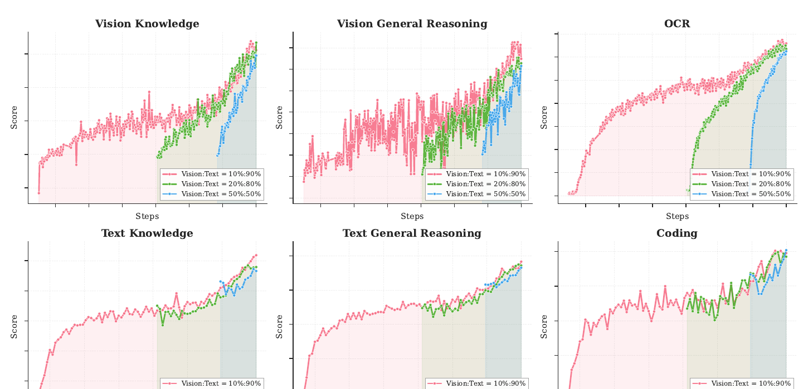
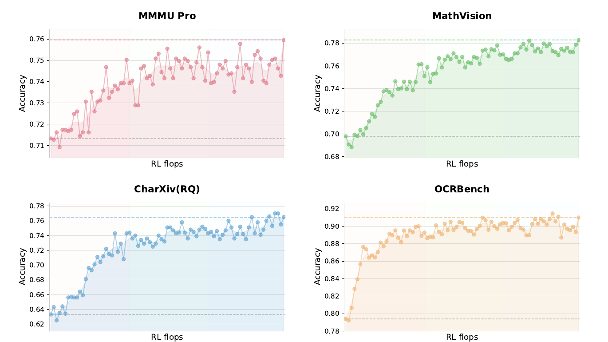
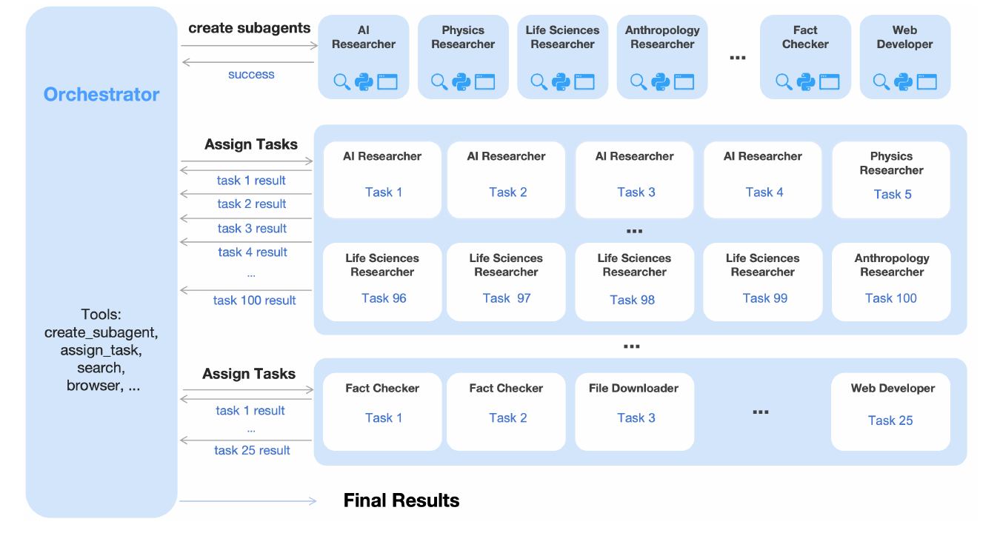
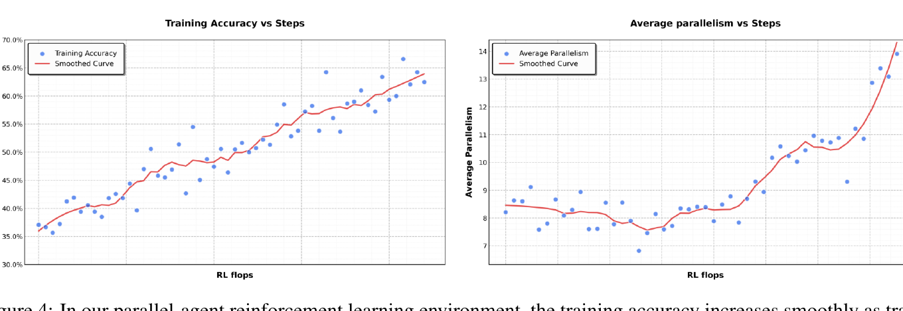
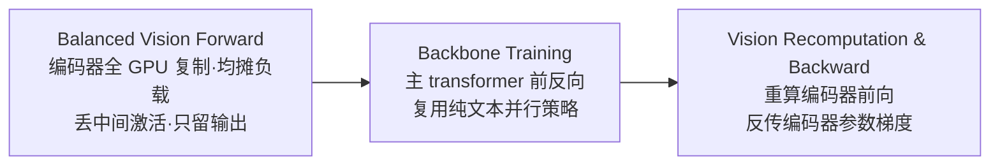
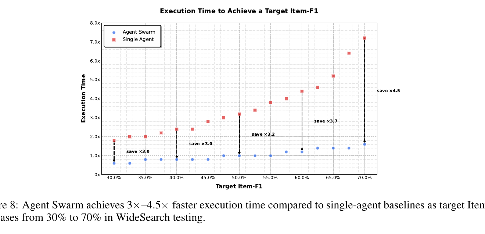

# Kimi K2.5: Visual Agentic Intelligence

## 来源信息

| 项 | 内容 |
| --- | --- |
| 标题 | Kimi K2.5: Visual Agentic Intelligence（标记为 Technical Report of Kimi K2.5） |
| 作者 | Kimi Team（arXiv 提交人 Yulun Du；附录 A 按姓氏字母序列出全部作者，PDF 元数据共 337 个署名条目） |
| 机构 | Kimi Team（论文无 affiliation 行；模型 checkpoint 发布于 Hugging Face `moonshotai` 组织：<https://huggingface.co/moonshotai/Kimi-K2.5>，本机无法访问验证该链接，字符串与论文脚注一致） |
| 来源 | [arXiv:2602.02276v2](https://arxiv.org/abs/2602.02276v2)（cs.CL; cs.AI; cs.LG），v2 日期 2026-08-07；arXiv 页面许可 CC BY-NC-ND 4.0 |
| 版本历史 | v1 2026-02-02 → v2 2026-08-07（本笔记基于 v2，为截至阅读时的最新版；论文未说明 v2 相对 v1 的改动） |
| 阅读日期 | 2026-10-05 |
| 复核记录 | 2026-10-05 依 check-paper-note 对 v2 重新获取原文逐项复核（含独立子 agent 审计）：表 1–6 与正文数字全部比对通过（PDF 版式文本 + 渲染页）；Figure 2/4/7/8 读数改用像素测量重测并修正（含 Figure 4 并行度区间由错误读数改为 ~8.4→~14.3）；修正 PARL 奖励的公式编号、Toggle 证据归属、Figure 7 的 x 轴口径（log(steps)）与 Figure 9 子图数表述；补记 LongBench v2 与 computer-use 评测口径 |
| 阅读范围 | v2 全文 31 页：正文 §1–6 + 附录 A–F（含 12 张图、表 1–6、全部评测配置与系统提示词）。表格数字经 PDF 版式文本逐项核对；Figure 2/3/4/8/9 已渲染截图存于 `assets/` |
| 归档说明 | arXiv 来源，按仓库策略不归档 PDF；仓库清单编号 00156（上游 `paper-is-all-you-need` 有归档 PDF，本仓库只记官方链接） |

---

## 核心结论

一句话：**K2.5 = Kimi K2（1T MoE 语言底座）+ 原生多模态（MoonViT-3D 视觉编码器，约 15T 图文混合 token 联合预训练）+ Agent Swarm（用 PARL 训练并行多智能体编排）**。论文的两个主张是「文本与视觉联合优化让两个模态互相增强」和「并行 agent 编排把任务复杂度从线性串行变为并行处理」。

- **文本-视觉联合优化**（§2）：在固定视觉-文本 token 总预算下，**早期融合 + 较低视觉比例**（消融中最低一档为 10%:90%）优于传统的「后期注入 + 高比例」（Table 1）；后训练采用 **zero-vision SFT**（只用纯文本 SFT 数据激活视觉工具使用）与**按能力（而非模态）组织的联合多模态 RL**；作者称视觉 RL 反过来提升了文本指标（MMLU-Pro 84.7→86.4、GPQA-Diamond 84.3→86.4、LongBench v2 56.7→58.9，Table 2）。
- **Agent Swarm / PARL**（§3）：一个**可训练 orchestrator** + 一组**冻结 subagent**（取自固定中间 checkpoint）；奖励 = 任务结果分 + 子代理实例化奖励 + 子任务完成率奖励（后两项系数退火到 0）；用 **critical steps**（关键路径式步数）而不是总步数约束预算，使「有效并行、缩短最长分支」才被激励。
- **结果**（§5，Table 4/6）：Agent Swarm 把 BrowseComp 从单 agent 的 60.6% 提到 **78.4%**（超过 GPT-5.2 Pro 的 77.9%）、WideSearch 72.7%→**79.0%**；WideSearch 上达到同一目标 Item-F1 的墙钟时间最多省 **4.5×**（Figure 8）。视觉/视频/文档理解多项为全表最优（论文加粗口径），如 LongVideoBench 79.8、LVBench 75.9、OCRBench 92.3、InfoVQA 92.6、HLE-with-tools 50.2。
- **落地形态**：开源后训练 checkpoint；同时支持 thinking/instant 模式、chat/agent 形态（引言一句话带过，无实验）。适合场景：多模态 agent 应用（搜索、GUI 操作、文档/长视频理解、可并行分解的重型任务）；纯编码与纯推理赛道相对 Claude/GPT/Gemini 只是「接近」，不是领先（见「实验与证据」）。

---

## 问题与动机

### 顺序 agent 的瓶颈（§1、§3）

现有 agentic 模型（含 Kimi K2-Thinking）本质是**串行**执行「思考→调工具→再思考」。步数可以做到几百步，但**推理时间是线性增长**：任务越复杂（大量信息搜集、多分支推理），延迟越不可接受；同时上下文不断累积，单个 agent 的推理深度与工具调用预算被耗尽。§3 开头把问题定义为：任务复杂度和异构性上来之后，串行范式同时撞上**延迟墙**和**上下文墙**。

顺带给出了一个有用的视角（§5.2 末）：已有上下文管理手段（Hide-Tool-Result、Summary、Discard-all）都是**反应式**的——溢出后才压缩/丢弃历史，会牺牲结构信息与中间推理；Agent Swarm 想做的是**主动式上下文管理**（context sharding 而非 context truncation），长任务被拆成语义隔离的并行子任务，每个 subagent 有各自的局部上下文，只有任务相关输出回传 orchestrator。

### 多模态「后融合」的代价（§2）

主流做法是把视觉当作语言能力之上的**事后插件**（late fusion，在训练后段按 50%+ 比例注入视觉 token）。K2.5 的实验（Table 1、附录 B.1）给出相反的观察：固定总 token 预算时，早期、低比例的融合反而最强；晚融合在视觉数据刚引入时会出现文本能力的 **"dip-and-recover"**（先掉后恢复），作者解释为模态域漂移打断了已经成型的语言表征空间（附录 B.1，Figure 9）。

附带问题：**预训练好的 VLM 不会自发地做视觉工具调用**（cold-start），而人工标注/提示工程构造的视觉 CoT 数据多样性差（局限于裁剪、旋转、翻转等原始操作）。

---

## 方法与贡献

论文结构上把贡献分为两块（§2 联合优化、§3 Agent Swarm），§4 给方法与基础设施，§5 给评测。下面按机制组织。

### 1. 原生多模态预训练：早期融合 + 低视觉比例（§2.1、§4.3、附录 B）

消融设计（Table 1）：固定视觉+文本总 token 预算，对比三组「注入时点 × 视觉比例」——Early（训练 0% 处注入，10%:90%）、Mid（50% 处，20%:80%）、Late（80% 处，50%:50%）。测量 6 项能力：

| 配置 | 视觉知识 | 视觉推理 | OCR | 文本知识 | 文本推理 | 代码 |
| --- | --- | --- | --- | --- | --- | --- |
| Early，10:90 | **25.8** | **43.8** | **65.7** | **45.5** | 58.5 | **24.8** |
| Mid，20:80 | 25.0 | 40.7 | 64.1 | 43.9 | **58.6** | 24.0 |
| Late，50:50 | 24.2 | 39.0 | 61.5 | 43.1 | 57.8 | 24.0 |

作者结论：「视觉比例本身影响很小，早期融合 + 低比例在固定预算下更好」。据此 K2.5 全程以恒定比例混合图文 token（§1：constant ratio throughout the entire training process；论文未给出生产配方中的具体比例，表中最低一档为 10:90）。



*Figure 9（arXiv:2602.02276v2，CC BY-NC-ND 4.0）：6 个子图（每图 3 条曲线，对应 10:90 / 20:80 / 50:50 三种配置）分别对应上表 6 项能力；据 §B.1 描述，文本三项（下排）中 Mid/Late 配置在视觉数据引入后出现先掉后升（"dip-and-recover"），Early（10:90）曲线最平稳。*

**架构**（§4.2）：三件套 = MoonViT-3D 视觉编码器 + MLP projector + Kimi K2 MoE 语言模型。
- 语言底座 = Kimi K2（1.04T 总参数 / **32B 激活** / 384 专家 / 每 token 激活 8 个 / sparsity 48），文本预训练 15T token，MuonClip 优化器 + QK-Clip；细节引 K2 技术报告。
- MoonViT-3D：从 SigLIP-SO-400M 初始化，承接 Kimi-VL 的 native-resolution 路线与 NaViT 的 **patch n' pack** 策略（原分辨率切 patch、展平、拼成 1D 序列，从而混训不同分辨率）。视频方向把该思想推广到时间维：**最多 4 个连续帧打包成一个时空体积**，同一套注意力在时空上共用；过 MLP projector 前做**轻量时间池化**，得到 **4× 时间压缩**——同一上下文窗口内可处理 4× 长的视频，且图像/视频编码器**完全共享权重**、共享 embedding 空间，不需要专门的视频模块。

**三阶段预训练**（Table 3）：

| 阶段 | ViT Training | Joint Pre-training | Joint Long-context Mid-training |
| --- | --- | --- | --- |
| 数据 | Alt text、合成 caption、grounding、OCR、视频 | 上述 + 文本/知识/交错图文、视频、OS 截图 | 上述 + 高质量文本与多模态、长文本、长视频、推理、Long-CoT |
| 序列长度 | 4096 | 4096 | 32768 → 262144 |
| token 量 | 1T | 15T | 500B → 200B |
| 训练部分 | ViT | ViT & LLM | ViT & LLM |

细节：ViT 阶段只保留**交叉熵 caption loss**（相比 Kimi-VL 去掉了对比损失），两小步——先对齐到 Moonlight-16B-A3B（约 1T token），再用很短一阶段只训 MLP projector 去桥接 1T LLM；联合预训练从「接近训练末端的 K2 checkpoint」续训 15T 图文 token（4K 序列长度）；第三阶段用 YaRN 逐段外推上下文（32K→256K），并混入更高质量 mid-training 数据。

### 2. Zero-Vision SFT：只用文本 SFT 激活视觉能力（§2.2）

做法：后训练 SFT 阶段**不放任何人工视觉轨迹**，全部用纯文本 SFT 数据；视觉操作通过 IPython 里的程序化操作代理（如用二值化估计物体尺寸、计数），相当于把传统视觉工具（裁剪/旋转）泛化成通用代码操作。作者的观察（只有定性描述，见「局限」）：
- 纯文本 SFT 就足以「点亮」视觉推理与工具使用；配合后续视觉 RL，视觉基准指标持续上升（Figure 2，下）；
- 相反，「文本+视觉」混合 SFT 在视觉 agentic 任务上**更差**，作者归因于缺乏高质量视觉数据——因为联合预训练已经建立了图文对齐，能力可以自然跨模态泛化。



*Figure 2：从 minimal zero-vision SFT 起点做视觉 RL。像素测量曲线首末点：MMMU-Pro ≈0.71→0.76、MathVision ≈0.70→0.78、CharXiv(RQ) ≈0.63→0.77、OCRBench ≈0.79→0.91。*

### 3. 联合多模态 RL：按能力组织，跨模态互惠（§2.3、§4.4.2）

- **视觉 RL 的任务域**：visual grounding & counting；chart/document understanding；vision-critical STEM（明确需要视觉输入才可解）。用 outcome-based（可验证结果）奖励，产生的轨迹再喂给拒绝采样微调（RFT），形成自改进数据管线。
- **跨模态迁移**（Table 2）：视觉 RL 之后文本指标不降反升——MMLU-Pro +1.7、GPQA-Diamond +2.1、LongBench v2 +2.2。作者的机制解释（标为"Analysis suggests"，非实验证明）：视觉 RL 提升了「结构化信息抽取类」问题的校准，降低了类似视觉化推理（计数、OCR）查询上的不确定性。
- **联合 RL 的组织原则**：不按输入模态分域，而**按能力分域**（knowledge、reasoning、coding、agentic…），每个域专家同时吃纯文本与多模态查询，GRM 也跨模态统一优化，从而让任一模态上学到的能力天然迁移到另一模态。

### 4. Agent Swarm 与 PARL（§3）

架构（Figure 3）：**可训练 orchestrator + 冻结 subagent**（subagent 从固定的中间策略 checkpoint 实例化）。刻意**不做端到端共优化**，理由是两条：credit assignment 模糊（结果对不代表每个 subagent 都对，错也不代表全错）与训练不稳定；把 subagent 输出当作环境观测而非可微决策点，只更新 orchestrator。



*Figure 3：Orchestrator（左，工具含 create_subagent / assign_task / search / browser）动态创建领域 subagent（AI/Physics/Life-Sciences/Anthropology Researcher、Fact Checker、Web Developer…），再把任务切成并行子任务分派（图中示例一次分派 100 个子任务）。*

**PARL 奖励**（§3，原文该式未编号）：

$$r_{\mathrm{PARL}}(x,y)=\lambda_1 \cdot r_{\text{parallel}} + \lambda_2 \cdot r_{\text{finish}} + r_{\text{perf}}(x,y)$$

- $r_{\text{perf}}$：任务级结果奖励（主目标）；
- $r_{\text{parallel}}$：实例化奖励，对抗 **serial collapse**（局部最优：总是单 agent 干活）；
- $r_{\text{finish}}$：子任务完成率，对抗 **spurious parallelism**（奖励黑客：疯狂 spawn subagent 但不做有意义的分解）；
- $\lambda_1,\lambda_2$ 随训练**退火到 0**，保证最终只优化主目标。

**Critical steps 资源约束**（§3）：把「并行组里最慢的那个 subagent」当作该阶段时长，总步数按关键路径累计：

$$\text{CriticalSteps}=\sum_{t=1}^{T}\Big(S_{\mathrm{main}}^{(t)}+\max_i S_{\mathrm{sub},i}^{(t)}\Big)$$

其中 $S_{\mathrm{main}}^{(t)}$ 是主 agent 在第 $t$ 阶段自己的步数（通常为 1），$S_{\mathrm{sub},i}^{(t)}$ 是第 $i$ 个 subagent 的步数。以 critical steps 而非总步数计预算/评测，意味着「狂开子任务但没缩短最长分支」几乎没有收益，只有**均衡的分解**能真正降低关键路径——这是全文里我认为最精巧的设计：奖励结构使得「并行」必须是有信息价值的。

**Prompt 构造**：合成两类压力 prompt——wide search（许多独立信息源的并行探索）与 deep search（多推理分支+延迟聚合），外加真实工作负载（长文档分析、大批量下载）；**不显式要求并行**，只让任务分布在串行预算下天然完不成，从而让「并行分解」在 RL 探索中自发出现。

**训练与实现**：先用小尺寸 subagent 训 orchestrator，再过渡到大模型；RL 框架支持动态调整 subagent 与 orchestrator 的推理实例配比。训练动态（Figure 4，像素测量）：训练准确率由 ~37% 平滑升至 ~64%（散点范围约 36%~67%）；平均并行度从 ~8.4 起步、中段回落到 ~7.5 后再度攀升，末段达 ~14.3（散点最低 6.8、末点 13.9）。



*Figure 4：左=训练准确率随 RL flops 上升（轴标注为 RL flops）；右=平均并行度随训练上升，中段有回落。*

**工具接口**（附录 E.8，原文 prompt 摘录）：`create_subagent(name, system_prompt)` 与 `assign_task(agent, prompt)`；步数预算：BrowseComp orchestrator≤15 步、subagent≤100 步；WideSearch 均为 100；In-house Bench orchestrator≤100、subagent≤50。

### 5. 后训练 RL 算法与 token 效率（§4.4.2）

**目标函数**（式(1)）：对每个问题采 $K$ 条回复，逐 token 计算：

$$L_{\mathrm{RL}}(\theta)=\mathbb{E}_{x\sim\mathcal{D}}\Big[\frac{1}{N}\sum_{j=1}^{K}\sum_{i=1}^{|y_j|}\mathrm{Clip}\big(\tfrac{\pi_\theta(y_j^i|x,y_j^{0:i})}{\pi_{\mathrm{old}}(y_j^i|x,y_j^{0:i})},\alpha,\beta\big)\,(r(x,y_j)-\bar r(x))-\tau\big(\log\tfrac{\pi_\theta}{\pi_{\mathrm{old}}}\big)^2\Big]$$

关键点：Clip 是**基于 log-ratio 的梯度掩码**（比值在 $[\alpha,\beta]$ 外的 token 梯度置零，不看 advantage 符号，区别于 PPO），用于抑制训练/推理框架不一致带来的 off-policy 漂移；另加 $\tau(\log\text{-ratio})^2$ 惩罚项。$\bar r$ 为 batch 内平均奖励（类似 GRPO 的基线）。作者称该机制对长程多步工具使用推理的稳定性是必需的；优化器仍用 MuonClip。

**奖励构成**：可验证任务用规则奖励；另加 budget-control 奖励鼓励 token 效率；通用任务用 **GRM**（多种 rubric：helpfulness、response readiness、contextual relevance、细节程度、产物美观度、严格指令遵循；多套 rubric 并存以抗 reward hacking）；视觉任务专用奖励 = grounding 用 IoU 软匹配 F1、点定位用高斯加权距离、多边形分割栅格化后算 IoU、OCR 用归一化编辑距离、计数用绝对差；视觉谜题用 Kimi K2 当 LLM verifier。

**Toggle：token 效率与推理能力的双目标交替优化**（§4.4.2）：

- 动机：刚性 token 预算训练会**长度过拟合**——模型学不会在更高算力下花更多 token 解题；
- 机制：每 $m$ 次迭代在两种模式间切换。Phase 0（预算受限）：仅在**该题平均正确率超过阈值 $\lambda$** 时才施加预算约束；Phase 1（标准缩放）：只给最大 token 上限，鼓励用推理时算力换质量；
- 预算 $=\text{Percentile}(\{|y_j|: r(x,y_i)=1\},\rho)$（原文式(2)），即**正确回复** token 长度的 $\rho$ 分位数，训练开始时算一次后固定；
- 实测（在 **K2 Thinking** 上，Figure 5 及对应正文）：输出长度平均降 **25~30%**，性能影响可忽略；只在数学/代码上训的模型在 GPQA、MMLU-Pro 上也有 token 降幅（域泛化）。

### 6. 训练基础设施（§4.5、附录 C、D）

- **Decoupled Encoder Process（DEP）**：多模态训练中视觉编码器若与文本 embedding 同放 PP Stage-0，会因图片数量/分辨率波动造成负载与峰值内存剧烈波动，被迫定制 PP 配置。DEP 利用编码器「前向起点、反向终点」的拓扑位置，把每个训练步拆成三步：① Balanced Vision Forward——编码器小，**在所有 GPU 上复制**、按负载（图片/patch 数）均摊全局 batch 的视觉前向，丢弃中间激活只留最终输出，结果 gather 回 Stage-0；② Backbone Training——主 transformer 的前反向，此时可完全复用纯文本训练已验证的并行策略，梯度累积在编码器输出处；③ Vision Recomputation & Backward——重算编码器前向并反传求其参数梯度。收益：负载均衡 + 编码器与主干优化解耦，多模态训练效率达纯文本的 **90%**。
- **并行配置**（附录 C）：NVIDIA H800 集群，节点间 8×400 Gbps RoCE；16-way PP（虚拟 stage）+ 16-way EP + ZeRO-1 DP，节点数须为 32 的倍数；EP all-to-all 用交错 1F1B 与计算重叠；LayerNorm/SwiGLU/MLA up-projection 做选择性重算，不敏感激活压到 FP8-E4M3，其余 offload 到 CPU 并重叠传输。
- **Agentic RL 环境**（附录 D）：Gym 风格接口；插件化 Toolset / Judge / prompt 模块；每个 agent 任务是一个异步协程，可递归触发子任务 rollout（天然支持 PARL、Agent-as-Judge）；Rollout Manager 单次 RL 最多编排 **100,000 个并发任务**，支持 partial rollout；严格 **Token-in-Token-out** 并记录 log-prob 做训推不一致校正；黑盒环境经 LLM Gateway 代理。
- **数据侧**（附录 C.1）：原生格式存视觉数据 + 对象存储；支持动态 shuffle/混合/tokenize/loss mask/packing、几何变换下保持 2D 坐标与朝向元数据、完全确定性可断点续训。



*DEP 三步流程（依据 §4.5.1 正文自绘，非原文插图）。*

---

## 实验与证据

### 评测配置（§5.1.1、附录 E）

- 默认：temperature 1.0，top-p 0.95，上下文 256k；推理类最长 completion 96k；答案方差大的用多次平均——AIME/HMMT Avg@64、GPQA Avg@8、图像/视频 Avg@3、编码 Avg@5、Seal-0 与 WideSearch Avg@4。
- 视频采样：短视频（VideoMMMU/MMVU/MotionBench）128 帧、空间分辨率最高 896；长视频（Video-MME/LongVideoBench/LVBench）**2048 帧**、448 分辨率——这是论文「超 2000 帧」说法的来源。
- 对照模型均取各家高性能推理配置（Claude 扩展思考、GPT-5.2 xhigh、Gemini 3 Pro high、DeepSeek-V3.2 thinking、Qwen3-VL thinking）；带 `*` 的数字是作者**自行复测**，其余取自公开报告/榜单。
- 若干对结果解读重要的评测条件（附录 E.2/E.3/E.5/E.6/E.7/E.9）：
  - **GPT-5.2 在视觉评测中约 10% 请求失败**（重试 3 次无输出），失败计为错答——作者自己声明 GPT-5.2 视觉分数可能是保守下界；GPT-5.2 API 不稳定，WideSearch 等昂贵评测被跳过。
  - 编码类评测：SWE-Bench 三个变体的**峰值出现在 non-thinking 模式**；Terminal Bench 2.0 也跑在 non-thinking（因为 thinking 模式的上下文管理与 Terminus-2 的会话状态处理不兼容）。
  - BrowseComp 有/无上下文管理两套设置；HLE 工具版用 Hide-Tool-Result 策略；GPT-5.2 的 65.8 为公开报告值（Table 4 中不带 `*`，非作者复测）。
  - LongBench v2：输入统一截断到约 128k；因 GPT-5.2-xhigh 不遵守多选题输出格式，改报 GPT5.2-high 的结果（Table 4 的 54.5*）。
  - OSWorld 中 Claude Opus 4.5 **只给 computer-use 工具**（不含 browser tools），偏离其 System Card 配置；WebArena 用 GPT-4o 判分；GDPVal-AA 引用 Artificial Analysis 官方榜单，截至 2026-01-28。
  - Computer-use 通用口径：`max_steps_per_episode=100`、temperature 0（OSWorld）/ 0.1（WebArena）、所有模型 one-shot、agent 上下文含最近 3 张历史图像。

### 主结果（Table 4，K2.5 列）

| 能力域 | 代表分数 | 同表对照 |
| --- | --- | --- |
| 推理/知识 | HLE-Full 30.1（无工具；文本子集 31.5、图像子集 21.3）；HLE w/ tools **50.2**；AIME 2025 96.1；HMMT Feb 95.4；IMO-AnswerBench 81.8；GPQA-D 87.6；MMLU-Pro 87.1；SimpleQA Verified 36.9；AdvancedIF 75.6；LongBench v2 61.0 | GPT-5.2：AIME 100、GPQA 92.4、HLE 34.5；Gemini 3 Pro：HLE 37.5、MMLU-Pro 90.1、SimpleQA 72.1。K2.5 仅在 **HLE w/ tools** 一项为全表最优 |
| 编码/软件工程 | SWE-bench Verified 76.8；SWE-bench Pro 50.7；SWE-bench Multilingual 73.0；Terminal Bench 2.0 50.8；PaperBench 63.5；CyberGym 41.3；SciCode 48.7；OJBench 57.4；LiveCodeBench v6 85.0 | Claude Opus 4.5：SWE-V 80.9、Terminal 59.3、PaperBench 72.9、CyberGym 50.6；Gemini 3 Pro：SciCode 56.1、LiveCodeBench 87.4。**K2.5 在编码榜无一项最优**，属于「有竞争力的第二梯队」 |
| Agentic 搜索 | BrowseComp 60.6（有 ctx 管理 74.9；Agent Swarm **78.4**）；WideSearch 72.7（Swarm **79.0**）；DeepSearchQA **77.1**；FinSearchComp T2&T3 **67.8**；Seal-0 **57.4**；GDPVal-AA 41.0 | 单 agent 口径下 BrowseComp 低于 GPT-5.2 的 65.8；上 Swarm 后反超（GPT-5.2 Pro 77.9）。DeepSearchQA/FinSearchComp/Seal-0 均全表最优 |
| 图像理解 | MMMU-Pro 78.5；CharXiv(RQ) 77.5；MathVision 84.2；MathVista **90.1**；SimpleVQA **71.2**；WorldVQA 46.3；ZeroBench 9 / w/ tools 11；BabyVision 36.5；BLINK **78.9**；MMVP 87.0；OmniDocBench 1.5 **88.8**；OCRBench **92.3**；InfoVQA **92.6** | Gemini 3 Pro 在 MMMU-Pro 81.0、MathVision 86.1、BabyVision 49.7、MMVP 90.0 领先（多为基础感知/学科题）；K2.5 的强项是 OCR/文档/图表与部分知识题 |
| 视频理解 | VideoMMMU 86.6；MMVU 80.4；MotionBench **70.4**；Video-MME 87.4；LongVideoBench **79.8**；LVBench **75.9** | Gemini 3 Pro 在 VideoMMMU 87.6、Video-MME 88.4 领先，GPT-5.2 在 MMVU 80.8 领先；但长视频两项（>2000 帧）K2.5 拉开差距（LVBench 75.9 vs 73.5\*；LongVideoBench 79.8 vs 77.7\*） |
| Computer use | OSWorld-Verified 63.3；WebArena 58.9 | Claude Opus 4.5 66.3 / 63.4 领先；K2.5 大幅领先 Qwen3-VL（38.1）与 OpenAI Operator（42.9 / 58.1） |

论文加粗（global SOTA）的 K2.5 项集中在：HLE w/ tools、BrowseComp（三种口径）、WideSearch(Swarm)、DeepSearchQA、FinSearchComp、Seal-0、MathVista(mini)、SimpleVQA、ZeroBench（与 GPT-5.2 并列）、BLINK、OmniDocBench、OCRBench、InfoVQA、MotionBench、LongVideoBench、LVBench。**摘要「在编码、视觉、推理、agentic 各域取得 SOTA」的措辞比表格呈现的更强**：编码与纯推理没有加粗项（解读/核对结论，非作者原话）。

### Agent Swarm 的证据（Table 6、Figure 7/8）

- 性能：BrowseComp 78.4（单 agent 60.6，+17.8 绝对）、WideSearch 79.0（72.7，+6.3）、In-house Swarm Bench 58.3（41.6；该基准含 WildSearch、Batch Download、WideRead（>100 文档）、Long-Form Writing（>100k 词）四个域）。
- 延迟：WideSearch 上「达到同一目标 Item-F1」的墙钟时间，目标从 30%→70% 时单 agent 从 ~1.7× 涨到 ~7.2×，Swarm 则维持 0.6×~1.6×（像素测量 ≈0.6×→1.6×，与原文口径一致）；图上标注的节省倍数为 ×3.0/×3.0/×3.2/×3.7/×4.5，对应 30%/40%/50%/60%/70% 目标点（Figure 8）。
- 上下文管理对比：Figure 7 在 BrowseComp 上比较 Agent Swarm 与 Discard-all，x 轴为 log(steps)（10²–10³ 步；正文表述为 critical steps）。同等性能下 Swarm 所需步数显著更少——达到 75% 时约 200 步 vs 约 780 步（像素测量，约 3.8×），且准确率上限更高（图中末段读数约 78.4% vs 75.0%，与 Table 4 的 78.4/74.9 一致）。
- 动态性：Figure 6 词云显示实际涌现出的异质 subagent 类型（Biography Researcher、Verification Specialist、Timeline Researcher、Cross Reference Analyst、Historical Researcher…），说明专业化是学出来的而非预定义。



*Figure 8：WideSearch 上达到同一目标 Item-F1 的执行时间；红=单 agent，蓝=Agent Swarm，标注为各目标点的节省倍数。*

### 证据强度与内部一致性检查（解读，非作者结论）

- §1 说 WideSearch item-F1「从 **72.8%** 到 79.0%」，而 §5.2 与 Table 6 均为 **72.7%**——引言与正文/表格不一致，按表格应以 72.7 为准。
- §5.1.2 称 ZeroBench「9% 和 11% 大幅领先竞品」（substantially ahead of competing models），但同表 Gemini 3 Pro **有工具版 12% 高于 K2.5 的 11%**（无工具版 8% 低于 K2.5，GPT-5.2 无工具版 9% 与之并列）——「大幅领先」的表述与自家表格不符。
- 引言（§1）强调「视觉到代码生成（image/video-to-code）SOTA」（摘要未提此项，只说「在各域取得 SOTA」），但这一项**不在 Table 4**，只说是「internal evaluations」，无公开数字与基准名。
- Toggle 的有效性实验在 **K2 Thinking** 上做（Figure 5），不是 K2.5；Table 5 只是 K2.5 与 K2 Thinking/Gemini/DeepSeek 的推理 token 用量横向对比，未声明 K2.5 训练中是否/如何应用 Toggle。

---

## 工程视角

### 复现与使用要点

- 权重已开源（HF `moonshotai/Kimi-K2.5`，仅后训练 checkpoint），底座 K2 的架构/训练细节需查 K2 技术报告；MoonViT 部分从 SigLIP-SO-400M 初始化。
- 若复刻 Agent Swarm 形态，最小接口就是两个工具：`create_subagent(name, system_prompt)` 与 `assign_task(agent, prompt)`（schema 见附录 E.8）；系统提示词骨架也给了（E.6 研究型 / E.8 swarm 型 / E.7 GUI agent 型）。步数预算是重要产品参数：orchestrator 步数少（15~100）、subagent 步数多（50~100）意味着 orchestrator 的职责是「想清楚怎么拆」，不是「自己干」。
- 评测复刻时注意三个易被忽略的设定：256k 上下文、编码类跑 non-thinking、视频 2048 帧/448 分辨率。
- 训练侧最有复用价值的两个想法（解读）：DEP 的「编码器全复制 + 三相位重算」对任何「小前置模块 + 大主干」的多模态训练管线都成立；PARL 的 critical-steps 约束可直接搬到任何树状/图状 agent 编排训练里当资源口径。

### 成本与规模

- 训练规模：ViT 阶段 1T token + 联合 15T token + 长上下文 500B→200B token；底座 1T 参数 MoE（32B 激活）；H800 集群、16-way PP + 16-way EP + ZeRO-1，节点数 32 的倍数。
- 推理侧成本被两块设计直接攻击：MoonViT-3D 的 4× 时间压缩（长视频进同一上下文）与 Agent Swarm 的并行墙钟节省（×3~×4.5）。
- Table 5 给出 token 效率画像：K2.5 比前代 K2 全面更省（7 行里 6 行更少，唯一例外 GPQA 14k vs 13k）；但相对 Gemini-3.0 Pro / DeepSeek-V3.2 在**每一行**都用了更多 token（AIME 25k vs 15k/16k、HMMT Feb 27k vs 16k/19k）。**解读**：K2.5 的分数有相当一部分来自更长的推理，推理侧 token 效率没有追平 Gemini 3 Pro；论文把 token 效率单列为 Toggle 课题，与此一致。

### 失败模式与设计取舍（原文点名的 + 我的归纳）

- **Serial collapse**：不加 $r_{\text{parallel}}$ 时 orchestrator 退化为单 agent——并行不会自发出现，需要奖励塑形。
- **Spurious parallelism**：只鼓励并行会诱导「狂开 subagent」的奖励黑客，需 $r_{\text{finish}}$ 与 critical-steps 双重约束。
- **长度过拟合**：刚性预算训练导致模型在更高算力下不会用额外 token（Toggle 的动机）。
- **反应式上下文管理的代价**：truncation 牺牲结构信息；Swarm 的选择是 context sharding。
- **zero-vision SFT 依赖前置条件**：作者明确说它成立「likely because joint pretraining already establishes strong vision-text alignment」——没有联合预训练时该结论未必可迁移（解读）。
- 一个可移植的教训：主奖励之外给辅助塑形奖励时，**务必退火**（$\lambda_1,\lambda_2\to 0$），否则最终策略会被代理指标带偏。

### 伪代码（解读，非作者实现）

```python
# Agent Swarm 编排循环（按 §3 与附录 E.8 重构的示意，非原文代码）
def orchestrate(task):
    subs = {}
    while steps_left(orchestrator) > 0:
        action = orchestrator.step(task)           # LLM 决策：直接调工具 or 并行分派
        if action.kind == "create_subagent":
            subs[action.name] = SubAgent(action.system_prompt)   # 冻结，从固定 checkpoint 实例化
        elif action.kind == "assign_task":          # 可一次多条，并行执行
            results = run_parallel([subs[a.agent].run(a.prompt) for a in action.tasks])
            # 只有子任务结论回传 orchestrator，子代理内部轨迹留在局部上下文
            task = task.update_with(results)
        else:                                        # search / browser / code 等普通工具
            task = task.update_with(action.execute())
    return task.final_answer()
# 训练时：只有 orchestrator 被 RL 更新；critical-steps 计预算；奖励见 r_PARL（λ 退火）
```

---

## 局限与待确认问题

**作者明确承认的**：
- GPT-5.2 视觉评测约 10% 失败计错、WideSearch 等评测因 API 不稳定被跳过——对照数字有系统性噪声。
- zero-vision SFT 优于 mixed SFT 的结论是「preliminary experiments」，且机制解释为**猜测**（缺高质量视觉数据）。
- 视觉 RL 提升文本的机制是「Analysis suggests」，无因果实验。
- 编码类评测在 non-thinking 模式下报分，与 thinking 模式的对照模型不完全同口径（Terminal Bench 作者自述为技术不兼容，SWE 系列是「峰值出现在 non-thinking」）。
- K2.5 相对 v1 的变更未在报告中说明。

**读者（本笔记）判断，论文无相应实验**：
- **消融混淆**：Table 1 三行同时改了「注入时点」与「视觉比例」（0%↔10%、50%↔20%、80%↔50%），无法分离两个因素；「比例影响很小」的推断建立在 3 个配置点上，且未见方差/多次运行。§2.1 行文的「mixes with a constant ratio」也未给出生产配方的比例与调度。
- **跨模态迁移缺对照**：Table 2 的 +1.7/+2.1/+2.2 是「视觉 RL 前后」，没有「等量文本 RL/继续 RL 前后」的同成本对照，收益有多少来自「视觉」、多少来自「继续 RL 本身」无法区分；MMLU-Pro 后测值 86.4 也低于最终模型在 Table 4 的 87.1，说明该表是训练中途快照，且未说明选点规则。
- **Agent Swarm 的对照公平性**：Table 6 中 GPT-5.2 Pro 的 77.9 是否在同步数/同工具预算下取得未说明；swarm 评测的步数预算（orchestrator 15 步等）如何影响与单 agent（无此约束）的可比性也不清楚。
- **内部基准不可复现**：In-house Swarm Bench 与 image-to-code SOTA 声明均无公开数据、指标定义或评审协议。
- **GRM 细节缺失**：rubric 数量、训练数据、跨域权重、与规则奖励的混合比例都没给。
- **多处数字/表述不一致**（72.8/72.7；ZeroBench 表述）提示报告在终稿校对上有瑕疵，引用其数字时应以表格为准并交叉核对。
- **可复现性**：训练数据配比只给了域级描述（附录 B），15T 联合 token 的视觉:文本比例、SFT 数据规模、PARL 与 Toggle 的具体超参（$\lambda$、$m$、$\rho$ 等）均未公布——开源的是权重，不是训练过程。

---

## 附：一页速查

- **基座**：Kimi K2（1.04T/32B 激活 MoE，384 专家，MuonClip+QK-Clip）
- **视觉**：MoonViT-3D（SigLIP-SO-400M 初始化，原生分辨率 + NaViT packing，4 帧时空打包，4× 时间池化压缩，图文共享权重）
- **预训练**：1T（ViT）→ 15T 图文混合（4K 序列）→ 500B→200B 长上下文（32K→256K，YaRN）
- **后训练**：zero-vision SFT → 按能力分域的联合多模态 RL（token-clip 目标 + GRM + 规则奖励 + Toggle 效率控制）
- **Agent Swarm**：PARL（orchestrator 可训、subagent 冻结、λ 退火）+ critical steps + create_subagent/assign_task
- **招牌数字**：BrowseComp 78.4（+17.8 vs 单 agent）、WideSearch 79.0 / 省时 4.5×、HLE w/ tools 50.2、LVBench 75.9、LongVideoBench 79.8、OCRBench 92.3、SWE-bench V 76.8、OSWorld 63.3、Toggle 省 token 25~30%
