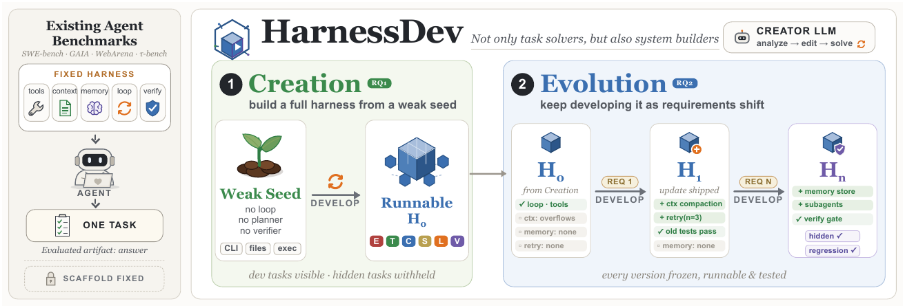
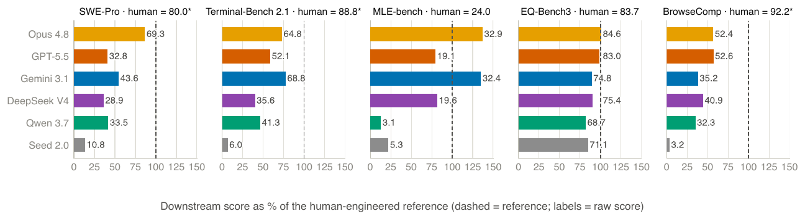
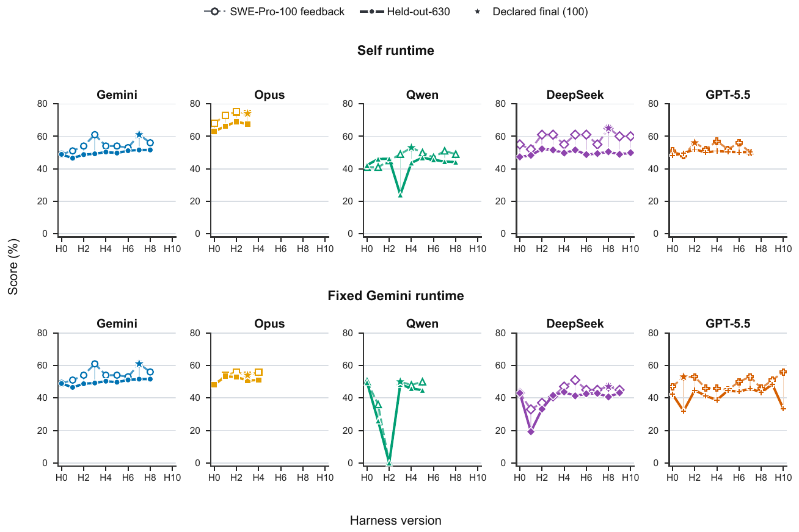

# HarnessDev: Can LLMs Create and Evolve Their Own Agent Harness?

## 来源信息

| 项 | 内容 |
| --- | --- |
| 标题 | HarnessDev: Can LLMs Create and Evolve Their Own Agent Harness? |
| 作者 | 19 位作者；论文按 Contributions 分列：核心贡献者 Yuhao Wu、Jingyuan Zhang、Jiajun Shi，通讯作者 Yuhao Wu / Shen Yan / Wenhao Huang（ByteDance）、Ge Zhang（umich）、Wenxuan Zhang（SUTD） |
| 机构 | ByteDance Seed（第一机构）；其余署名单位：Singapore University of Technology and Design、Georgia Institute of Technology、M-A-P、TokenWave.AI（论文首页） |
| 来源 | [arXiv:2609.01437v1](https://arxiv.org/abs/2609.01437)（cs.SE，交叉列表 cs.CL；2026-09-01 提交，截至 2026-10-09 无后续版本；正文日期写 September 2, 2026）；全文 41 页 |
| 项目页 | <https://self-developing-agents.github.io/>（自述为「Self-Developing Agents」三基准之一，另两篇同页发布：Aspire [arXiv:2608.31111](https://arxiv.org/abs/2608.31111)「Can Models Self-Evolve from Vague Goals?」、S³Gym [arXiv:2608.31100](https://arxiv.org/abs/2608.31100)「Can LLMs Turn Self-Testing and Self-Judging into Self-Improvement?」；站点叙事是「半环 → 闭环 RSI」） |
| 阅读日期 | 2026-10-09 |
| 仓库编号 | 00189（清单行内标题/年份/单位已核对一致） |
| 许可 | [CC BY-NC-ND 4.0](https://creativecommons.org/licenses/by-nc-nd/4.0/)（arXiv abs 页 "view license" 指向，2026-10-09 核验；**不是** arXiv 默认的 nonexclusive-distrib） |
| 阅读范围 | v1 全文 41 页。**已读**：主文 §1–§6（含 Related Work、Limitations、Ethics）、附录 A–D（候选系统、实验配置、接口规范、评测角色）。**仅抽样**：附录 E（RQ1/RQ2 系统提示词，pp.26–31，约 5 页）只读了 RQ1 提示词的总纲与术语表；附录 F–I 的四条开发/演进轨迹逐条注释只读了部分步骤（F 的 01–03 步与 06/07 步片段、G 第 03 步、H 末步、I 末两步，其余只看了步骤标题）。**已渲染页（200 dpi）逐项核对**：Table 3/4（p.8）、Table 5（p.9）、Table 6/7（p.12）逐格；式 (1)（p.4）、式 (2)（p.11）逐符号；Figure 1（p.2）、Figure 4（p.9）、Figure 8（p.14）看图并与正文对照。**像素测量**：Figure 8 的 Qwen 自运行面板（200 dpi 渲染，定标：网格线 y=704 px ↔ 0 分、53 px ↔ 20 分；实线+填充三角为 Held-out-630 序列，其 H3 处顶点读数 ≈23 分，±2）。**未逐张检查**：Figure 2/3/5/6/7/9/10 只按正文与图注引用，未从图中读数 |
| 配图 | `assets/` 下 3 张（Figure 1/4/8），自 v1 PDF 200 dpi 渲染页裁剪：裁剪框先按行/列像素剖面标出内容范围（含图内标题、图例、坐标轴标签与图内说明行），成品逐张回看确认边缘干净、无缺元素。复核时重裁两处：Figure 8 首版漏掉底部 "Harness version" 轴标签、Figure 4 首版漏掉图内底部说明行（"Downstream score as % …"），均已下延重裁并重验。许可 CC BY-NC-ND 4.0，引用请注明出处 |
| 归档说明 | arXiv 来源，按仓库策略不归档 PDF；清单编号 00189 的编号单元格指向上游归档仓库的 `papers/00189-HarnessDev.pdf`（上游已有归档），本次阅读用的是 arXiv v1 官方 PDF（临时文件用后已清理） |
| 复核记录 | 2026-10-09 依 check-paper-note 复核（基准：重新下载 arXiv v1，sha256 `1231454f0ae5ccffdb3d031dc8f42eae0cbbaeb61dcd25dddb1855074697dfc0`、1,800,192 B、41 页，与阅读时一致；另核上游归档 `papers/00189-HarnessDev.pdf` **与 v1 字节一致**（同 sha256）；按编号与按标题检索 arXiv 均只有 v1）。手段：Table 3/4/5/6/7 与式 (1)(2) 在 200 dpi 渲染页复核，另经 PDF 文本层逐行交叉比对；三张配图与重新渲染同坐标裁剪**像素差为 0**、边缘 4 px 环全白；Figure 8 的 Qwen 自运行面板按定标锚点（200 dpi，网格线 y=704 px ↔ 0 分、53 px ↔ 20 分）复跑：H3 顶点最深像素 row=644 → 22.6 分、标记质心 ≈23.8 分（独立审计读数 23.6，一致）；否定性断言检索词：`77.8`、`harness defects`、`120-step`、`clearest example`、`confidence interval`、`variance`、`creator tokens`，项目页 curl 全页仅 arxiv.org 外链；含独立子 agent 审计（未改文件）。本轮修正：①「§6.2 结论重复」→ §6 开头段（p.15），并说明该处自带 code/search 限定（原表述把 §6 开头误当成 §6.2）；②附录 E 页数「约 15 页」→ 约 5 页（pp.26–31）、附录 F–I「约 14 页」→ 约 10 页（pp.31–41）；③阅读范围抽样枚举补 F 的 06/07 步与 G 第 03 步（正文引用到了）；④Figure 8 读数 H4「约 41」→ 约 43（复测取标记质心，原值把 H3→H4 的上行线画段计入簇心）；⑤Figure 4 配图重裁、补入图内底部说明行；⑥「cs.SE」补交叉列表 cs.CL；⑦Table 6 补说明：Seed 无 RQ2 轨迹。**未修**：77.8% 的归因口径原文未给，只能照记。 |

---

## 核心结论

一句话：**这篇把评测对象从「模型在给定 harness 里答题的成绩」换成「模型能否从零造出并且持续改进 harness 这个可运行系统本身」**——结论是：2026-09 的前沿模型能从弱种子造出跑得起来的 harness，但在 code 与 search 上仍大幅落后人类工程版；演化（Evolution）阶段能在可见反馈集上涨分，涨分却**不稳定，且向留出任务、向「换一个执行模型」的迁移都很有限**。

三条主张（作者，摘要与 §1）：

1. **评测缺口**：agent 能力越来越依赖模型权重之外的执行基础设施（harness）；现有 agent 基准都把 harness 当实验配置固定住，只测「模型解题」，不测「模型搭系统」。这篇按软件工程意义上的 develop（开发=从零构建 + 持续维护）把评测拆成 Creation 与 Evolution 两个阶段（§1、§2）。
2. **Creation：能造，但质量按 harness 类型严重分化**。全部 6 个创建模型都能从弱种子建出可运行 harness（种子本身在五个基准上全 0 分），但相对人类工程版的差距因域而异：写作接近/个别超过参照，机器学习实验部分超过，**搜索与研究差距最大、code 也仍落后**；执行成本差异巨大且高成本不保证高分（§4.2）。
3. **Evolution：能改，但不可靠**。用下游执行反馈演化自己的 harness，五个自运行谱系的可见反馈分全部上涨（+3.0～+13.9），留出集只涨 +1.43～+4.44；**固定执行模型（Gemini）后四个谱系里只有 Opus 的留出分改善，其余三个退步**（Qwen −1.11、DeepSeek −2.38、GPT-5.5 −10.32）；64 次官方版本切换中反馈与留出同向仅 34 次（53.1%），9 个申报版本里只有 2 个是留出最优（§4.3、Table 6）。

**适合谁看**：做 harness 自演化 / 自进化 agent（RSI）的人——这篇不提供新方法，提供的是**评测坐标系 + 一整组反证**（涨跌交替、留出迁移有限、换执行器即失效、状态组件写成死代码）；以及做 agent 评测方法论的人——它把「创建者 / 执行者 / 评测者」三角色分离、Self-Eval 与 Unified-Eval 双视角、每个冻结版本都跑留出集的做法，是可以直接搬到自建评测里的模板。

*图 1（原文 Figure 1，p.2）：基准的两阶段设计。左：传统 agent 基准固定 harness、只评「一个任务的答案」；中：Creation 阶段创建者从「弱种子」出发构建可运行 harness $H_0$（种子无循环/无规划器/无验证器，只暴露被动原语）；右：Evolution 阶段创建者用自己的 $H_0$ 与下游执行反馈反复修订（图中示例更新：上下文压缩、重试、子 agent、验证门、记忆存储），每个版本都冻结、可运行、经过测试。裁剪自 v1 PDF。*

---

## 问题与动机

### harness 这一层为什么重要

- 同一组权重换 harness 成绩差异巨大：论文开头点名 GPT-5 在 Terminus 2 里解出 Terminal-Bench 2.1 的 35.2%，在 Codex CLI 里是 49.6%（§1，引用自官方榜单 [45]）。随着 agent 进入更多领域，专用 harness 的需求只会增长，而这类系统需要的是**持续开发**而不是一次性实现。
- 但现有基准（SWE-bench、GAIA、WebArena、τ-bench、AgentBench）都把 harness 当实验配置的一部分：便于控制变量，却把真实部署中工作量最大的那一层（工具/上下文/状态/生命周期/验证接口的构建与维护）从评测里隐掉了（§2、§5）。

### FDE 类比：被基准默认掉的三件事（§2）

论文用 forward-deployed engineer（FDE，Palantir 带火的岗位）来类比这层工作，并指出 FDE 现场要补的三块结构，恰好是基准设计的三个前提：

| 现实部署中要做的 | 基准通常默认已有 |
| --- | --- |
| 把模糊的业务意图翻译成目标、约束与成功判据 | 任务、评分器、奖励都已定义 |
| 自己构造反馈信号（测试、评审、轨迹）才能判断有没有变好 | 反馈信号现成且可靠 |
| 把工具、上下文管理、状态、生命周期、验证接口建起来并维护 | 执行系统已存在 |

HarnessDev 只做第三层（系统集成）；前两层由同项目组的 Aspire 与 S³Gym 分别研究（项目页）。

### 为什么「改自己的 harness」不同于普通改代码

模型改普通程序时，目标行为由外部给定、成功可局部验证；而改自己的 harness 是**在改自己行动的底座**——这个改动会改变模型在此后所有任务中观察、规划、恢复的方式（§1）。因此有效的 harness 改进要求模型能从执行轨迹里**认出自己的行为缺陷**、诊断所在系统的结构性瓶颈、并做出能累积为可复用能力的定向修改，而不是一次性修修补补。

### 评测一个生成 harness 比评测一个答案难在哪（§1）

论文列了四种失真方式，并由此确定两个评测轴：harness 可能**过拟合到写它的模型**（executor 依赖）、**背下开发样例**、**一项能力提升的同时另一项悄悄退步**、或**靠 benchmark-specific 改动刷反馈集分但不迁移**。所以：

- **Capability**：在留出的下游任务上跑，报任务成功率；
- **Efficiency**：冻结后的 harness 在部署时消耗的**执行模型 token**。

---

## 方法与贡献

### 两个阶段（RQ1/RQ2，Table 1）

| 设置 | 起点 | 开发信号 | 产出 |
| --- | --- | --- | --- |
| Creation（RQ1） | 弱种子 $H_{seed}$ | 规格文档 + 1–3 个开发用例 | 最终 harness $H$（冻结后评测） |
| Evolution（RQ2） | 创建者自己的 RQ1 $H_0$ | 指定反馈集上的下游执行结果 | 一对冻结候选 + 创建者申报的最终版本 |

**弱种子 $H_{seed}$**（§3.2，附录 C.1）：一个可运行的兼容层，不是解题 agent。它解析任务与模型配置、暴露**被动**低层工具（paths/files/search/process/artifact io 原语）、写好审计输出（`result.json`、`trajectory.jsonl`、`response.md`、stdout/stderr 日志），并配好 LLM 网关；但它**没有** agent 循环、任务分解、工具策略、上下文管理、持久任务状态、验证器、重试/恢复逻辑或停止规则，最多发一次连通性探测。未经修改时它在五个下游基准上全部得 0 分——因此任何非零 Creation 分数都只能来自创建者新增的执行逻辑。这个设计是为避免两个极端：空仓库会把「设计 harness」与「搭脚手架」混在一起，成熟 agent 又会把要考的规划/验证结构直接送出去。

**Evolution 协议**（§3.2）：

- 反馈集 = 100 个 SWE-Pro 任务 + 全部 89 个 Terminal-Bench 任务；
- 官方候选必须**成对**提交：同一 commit 的完整 100 任务 SWE-Pro 评测 + 完整 89 任务 Terminal-Bench 评测，两腿都结算才算进入官方轨迹（同 commit 的基建修复可合并；探针、半截腿、停止的运行、无效实例都排除）；
- 预算：$H_0$ 之后 **10 对完整评测**；两对之间最多用两次**固定子集探针**（两个基准各取相同的前 5 个任务），探针只作诊断、永远不算官方分；
- 结束方式是创建者**申报一个非 $H_0$、且拥有完整官方对的 commit**；
- **留出**：所有官方版本事后在 630 个 SWE-Pro 实例（与反馈集不相交）上补测，分数从不回传给创建者，也不影响编辑、停止或申报。

### 覆盖范围（Table 2，共 2,207 个下游实例）

| 域 | 基准 | 任务数 | 主指标 |
| --- | --- | --- | --- |
| Code | SWE-bench Pro（简称 SWE-Pro，public split） | 731 | 任务成功率 |
| Code | Terminal-Bench 2.1 | 89 | 任务成功率 |
| Data analysis | MLE-bench | 75 | medal 率 |
| Writing | EQ-Bench3 | 46 | rubric 分 |
| Research | BrowseComp | 1,266 | 准确率 |

（2,207 = 731+89+75+46+1,266，本笔记复算；Evolution 的反馈任务取自同一批基座，不重复计数。Evolution 目前只做 code harness。）

### 评测的双视角与三角色分离（§3.1、§3.4、附录 D）

角色分离是本文方法论的骨架，写成式 (1)：

$$(L_C, D) \to H, \qquad (H, L_E, x) \to y \xrightarrow{J} \text{score}$$

- $L_C$（creator LLM）在开发环境 $D$ 里产出 harness $H$；$H$ 冻结后，执行模型 $L_E$ 在它里面跑下游任务 $x$，评测器 $J$ 给结果 $y$ 打分。
- **Self-Eval**：$L_E = L_C$（创建者用自己的 harness 跑），对应真实部署形态，测的是「模型—harness 协同设计」；
- **Unified-Eval**：所有 harness 用同一个固定 $L_E$（本篇用 Gemini 3.1 Pro）跑，剥离执行模型的差异，测 harness 是否是可迁移的软件资产。
- 人类工程系统只作**外部参照**（不是统一执行器下的配对对照，见「局限」），图 4 里只能当距离刻度看。

### 约束合规与审计（§3.4）

创建者可见的规格明确禁止：硬编码实例特定解、从任务标识/文件名白名单/已知答案推导 patch、查阅隐藏测试/答案/补丁/评分器内部与官方评测反馈、以及绕开统一 provider 接口自己接 LLM。两条设计让约束**可查**而不是口头约束：

1. **评分路径与 harness 隔离**：harness 自报的状态永不进入打分——SWE-Pro 的分数只来自任务工作目录里真实的 repository diff，Terminal-Bench 只来自最终环境状态，所以没有 harness 能靠「声称成功」拿分；
2. **全量留档**：每次运行保留轨迹、结果、指标产物与冻结的 harness 源码，支持事后审计「交付的代码」与「代码实际执行了什么」。作者报告对本篇全部运行做过审计，结果是**零违规**（null result），也没有运行因这些原因被剔除。

### 实验设置（§4.1、附录 B）

- 6 个创建模型：Opus 4.8、GPT-5.5、Gemini 3.1 Pro、DeepSeek V4 Pro、Qwen 3.7 Max、Seed 2.0 Pro（官方 API 或 OpenRouter）；
- 开发环境 $D$：Claude Code 2.1.177（GPT-5.5 用 Codex 0.144.3）；各模型的温度/top-p/max output 见附录 Table 8（如 Opus temp 1.0；Qwen temp 0.6、top-p 0.95、top-k 20；输出上限 65k–131k token）；
- RQ1 对每个「创建者×基准」独立创建并评测 **3 个** harness，报 avg@3；
- 人类参照取自各基准官方榜单/系统报告里可核验的最高系统级成绩（附录 Table 9 列出配对：SWE-Pro 用 Claude Fable 5 的 80.0、Terminal-Bench 用 GPT-5.6 Sol 的 88.8、MLE-bench 用 MLEvolve+Gemini 3.1 的 24.0、EQ-Bench3 用 Kimi Writer+Opus 4.8 的 83.7、BrowseComp 用 GPT-5.6 Sol 的 92.2；其中三个带 \* 的值取自 OpenAI GPT-5.6 发布报告、**未在本地复跑**）。

### 贡献与证据的边界

作者声称的贡献是「**基准**」：把 agent 自建的执行 harness 变成一个可测量对象（冻结、可检视、可测试、可复用）。它不提出新的 harness 演化算法；演化阶段用的是现成的 coding agent（在开发者环境里看反馈改代码）。证据边界因此很清楚：所有关于「模型能不能演化 harness」的结论都是**描述性**的（每格一条轨迹），不是方法间的对照实验。

---

## 关键公式与直觉

本笔记只解释两条式子；论文其余部分基本是协议与统计口径。

### 式 (1)：三角色分离（p.4）

$$(L_C, D) \to H, \qquad (H, L_E, x) \to y \xrightarrow{J} \text{score}$$

直觉：把「造 harness 的模型」（$L_C$）、「造 harness 用的开发环境」（$D$，Claude Code 这类）、「跑任务的模型」（$L_E$）、「打分器」（$J$）四样东西分开记账。这样 Creation 的分数不会把 $D$ 的辅助或 $L_E$ 的能力算进 harness 质量；Unified-Eval 下同一 harness 换执行者复跑，差异就只剩「harness 与模型的兼容性」（论文找到了大量此类差异，见「实验」）。

### 式 (2)：反馈对的同等权重组合（p.11）

$$\bar{P}_t = \tfrac{1}{2}\left(P_t^{\text{SWE100}} + P_t^{\text{Term89}}\right)$$

$P_t$ 是版本 $t$（完成了完整正式评测的冻结版本）在两个基准上的百分制得分；$\bar{P}_t$ 是论文用于叙述的「pair 分」。选这两个基准做演化反馈的原因在协议里：SWE-Pro 可切出互不相交的反馈/留出子集（100 / 630），Terminal-Bench 全部 89 个任务都当反馈（因此**没有**留出腿）。式中两项等权、均为百分数——读 Table 6 时注意「feedback pair」一列是这两项的平均，而「held-out」列只是 SWE-Pro-630 一项。

---

## 实验与证据

### Creation（RQ1）：能造出来，但差距按域分化

**Self-Eval 总表**（Table 3，p.8，逐格核对；本表按原文列序省略了每个基准的 token 列——原文 tok. 是「每个 harness 的平均执行 token，百万」）：

| 创建者（Self-Eval） | SWE-Pro | Term.-2.1 | MLE-bench | EQ-Bench3 | BrowseComp | Avg. |
| --- | --- | --- | --- | --- | --- | --- |
| 种子 $H_{seed}$ | 0.0 | 0.0 | 0.0 | 0.0 | 0.0 | 0.0 |
| Opus 4.8 | **69.3** | 64.8 | **32.9** | **84.6** | 52.4 | **67.8** |
| GPT-5.5 | 32.8 | 52.1 | 19.1 | 83.0 | **52.6** | 55.1 |
| Gemini 3.1 Pro | 43.6 | **68.8** | 32.4 | 74.8 | 35.2 | 55.6 |
| DeepSeek V4 Pro | 28.9 | 35.6 | 19.6 | 75.4 | 40.9 | 45.2 |
| Qwen 3.7 Max | 33.5 | 41.3 | 3.1 | 68.7 | 32.3 | 44.0 |
| Seed 2.0 Pro | 10.8 | 6.0 | 5.3 | 71.1 | 3.2 | 22.8 |
| 人类工程版 + 配对模型 | 80.0\* | 88.8\* | 24.0 | 83.7 | 92.2\* | 86.2 |

（Avg. 是 SWE-Pro / Terminal-Bench / EQ-Bench3 / BrowseComp 的**无权重均值，不含 MLE-bench**；本笔记复算 Opus 行：(69.3+64.8+84.6+52.4)/4 = 67.775 ≈ 67.8 一致。MLE-bench 一列是 medal 率、EQ-Bench3 是 rubric 分、BrowseComp 是准确率。MLE-bench 单元覆盖 33 个 physical cells、2,475 个结果。）

**Unified-Eval（固定 Gemini 执行）**（Table 4，p.8，省略 token 列）：

| 创建者（Unified-Eval） | SWE-Pro | Term.-2.1 | MLE-bench | EQ-Bench3 | BrowseComp | Avg. |
| --- | --- | --- | --- | --- | --- | --- |
| Opus 4.8 | 33.0‡ | 52.4 | 16.9 | 74.2 | 53.6 | 53.3‡ |
| GPT-5.5 | 27.8 | 49.4 | 16.0 | 46.5 | 55.4 | 44.8 |
| Gemini 3.1 Pro | 43.6 | 68.8 | 32.4 | 74.8 | 35.2 | 55.6 |
| DeepSeek V4 Pro | 29.2‡ | 38.2‡ | 9.8 | 72.9 | 54.8 | 48.8‡ |
| Qwen 3.7 Max | 41.3 | 48.6 | 16.0 | 71.5 | 49.9 | 52.8 |
| Seed 2.0 Pro | 15.6 | 13.1 | 13.3 | 73.1 | 17.3 | 29.8 |

（‡：该单元含一个崩塌的 R3 复本；去掉后 Opus 的 SWE-Pro 敏感性均值为 49.1，DeepSeek 的 SWE-Pro/Terminal 为 43.8/57.3。GPT-5.5 的 EQ-Bench3 是 avg@3=46.5；剔除其首个 0 值 harness 后均值 69.7。Gemini 行复用 Self-Eval 对照、不算新单元。）

**要点**（§4.2）：

- **差距分化**：写作 harness 接近参照（Opus 84.6 vs 83.7）、机器学习实验两侧超过（Opus 32.9 / Gemini 32.4 vs 24.0），**搜索与研究差距最大**（最好 52.6 vs 92.2），code 仍落后（69.3 vs 80.0）。表 3 的 Avg. 也给出整体距离：Opus 67.8 vs 人类 86.2。
- **同一模型的独立创建之间差异很大**，所以报 avg@3：最典型的反例是一个 Opus code harness 在 Self-Eval 下不错、换 Gemini 后几乎崩塌——原因是它把 **120 步上限硬编码**在了原执行器上。附录 G 记录的 Opus RQ1 轨迹第 03 步给出了这类实现的写法（`max_steps=120`、6,600 秒时间预算、150,000 token 软上下文上限；论文未说明 §4.2 点名的 harness 是否就是该产物）。Data 域也出现过度严格的停止规则导致的塌陷。
- **换执行者会重排**：Qwen、Seed、DeepSeek 在 Gemini 下多个 Data/Search 设置变好（Qwen 在 BrowseComp +17.6、MLE-bench +12.9），而 Opus 与 GPT-5.5 通常在自己当执行者时更强（Opus Self→Unified 的 SWE-Pro 从 69.3 → 33.0、写作 84.6 → 74.2；它搜索 harness 的**重复查询率从 10.1% 涨到 88.2%**，说明去重、复核与终止规则是针对原模型调的）。
- **成本极不均匀**：MLE-bench 上 token 用量差约 **19 倍**，而高成本不保证高分（Figure 9 图注：GPT-5.5 以 29.3M token 拿到 19.1 medal 率，DeepSeek V4 以 208.4M token 拿到 19.6）。
- **失败归因**：**77.8% 的失败 Data 任务被归因于 harness 缺陷**（§4.2，p.7；论文未在正文展示该归因的分解口径）——瓶颈不只是执行模型的能力。

*图 4（原文 Figure 4，p.9）：各创建者 Self-Eval 成绩相对人类工程参照的百分比（虚线=参照，柱上标签=原始分）。五个面板依次 SWE-Pro（人类 80.0\*）、Terminal-Bench 2.1（88.8\*）、MLE-bench（24.0）、EQ-Bench3（83.7）、BrowseComp（92.2\*）。注意图注的限定：人类参照来自不同的 harness–模型组合、并非同一执行器下的配对对照，超过 100% 只意味着超过那个外部参照，不代表超过人类能力。裁剪自 v1 PDF。*

### Creation 的机制层证据：harness 里有多少是「活着」的（§4.2、Figure 5）

- 18 个 code harness **全部**实现了显式执行循环；工具、生命周期、验证「完整」的分别有 13/18、13/18、15/18。**状态与记忆是最明显的缺口**：11/18 定义了 State 类，但各只有 1 个暴露了状态保存接口、各只有 1 个实现了周期 checkpoint——**26,679 条记录轨迹里一次 checkpoint 事件都没有出现**。
- Code 的 108 个组件实例中：72 个在真实运行里被触发、18 个只有部分证据、**18 个从未被观察到，且全部属于状态与记忆**。Code 之外同样：Writing 的 587 个特性里 124 个被确认是死代码、Data 有 36 个机制落在死路径上。
- **测试数量本身是弱信号**：自测数与下游分的 Spearman 相关只有 0.13–0.26（不显著），而「修订调用」达到 0.57（p ≤ .0005）——有帮助的是「读失败→做定向修改→重新验证」这个闭环，不是测试的堆量。
- 验证多为语法级：2,325 个执行的 Data 任务里 441 个产出 degenerate 提交，没有任何 harness 检出。
- 实现策略各异（Opus 常常重写执行栈；GPT-5.5 加一个大型单体 agent；DeepSeek/Qwen/Seed 在种子上扩模块；Gemini 主要原地改 runner）；18 个 code 产物合计新增 17,111 行净代码（本笔记复算 Table 5 六行之和 2,470+3,537+1,006+3,242+3,562+3,294 = 17,111 ✓），但**代码量与成绩无预测关系**：Gemini 改得最少（1,006 行）却拿到最好的 Terminal-Bench（68.8）。

### Evolution（RQ2）：涨分涨在可见集，迁移有限

**主结果**（Table 6，p.12，逐格核对）：

| 设置 | 创建者 | 反馈 pair $H_0 \to H_{dec}$ | 留出-630 $H_0 \to H_{dec}$ | 留出 final gap |
| --- | --- | --- | --- | --- |
| Self | Gemini 3.1 Pro | 59.9 → 68.7（+8.8） | 48.89 → 51.59（+2.70） | 0.00 |
| Self | Opus 4.8 | 71.1 → 74.1（+3.0） | 63.02 → 67.46（+4.44） | 1.59 |
| Self | Qwen 3.7 Max | 41.8 → 55.7（+13.9） | 42.22 → 43.65（+1.43） | 3.17 |
| Self | DeepSeek V4 Pro | 47.2 → 60.6（+13.4） | 47.30 → 50.48（+3.17） | 1.75 |
| Self | GPT-5.5 | 59.2 → 65.1（+5.9） | 48.25 → 52.06（+3.81） | 0.00 |
| Fixed Gemini | Opus 4.8 | 58.8 → 68.6（+9.7） | 48.10 → 50.79（+2.70） | 2.54 |
| Fixed Gemini | Qwen 3.7 Max | 62.1 → 63.2（+1.1） | 49.52 → 48.41（**−1.11**） | 1.11 |
| Fixed Gemini | DeepSeek V4 Pro | 47.3 → 53.8（+6.5） | 43.02 → 40.63（**−2.38**） | 3.02 |
| Fixed Gemini | GPT-5.5 | 56.6 → 59.1（+2.4） | 42.22 → 31.90（**−10.32**） | 16.51 |

（feedback pair 是两个基准百分比的均值；held-out 只用 SWE-Pro-630；final gap = 该谱系留出最高分 − 申报版本的分。九个谱系共 **73 个官方版本、64 次相邻官方切换**。另外，六个创建者里 **Seed 2.0 Pro 没有 RQ2 轨迹**，所以表中没有它的行——见 Figure 5 图注。）

**编辑行为**（Table 7，p.12，节选「累计 diff 与主要编辑焦点」）：

| 设置 | 创建者 | 官方切换 | $H_0 \to H_{dec}$ 累计 diff | 主要编辑焦点（该条轨迹内观察，非模型的一般属性） |
| --- | --- | --- | --- | --- |
| Self | Gemini 3.1 Pro | 8 | 11 文件，+692/−38 | 工具输出、编辑、超时、patch 清理 |
| Self | Opus 4.8 | 3 | 8 文件，+450/−18 | 完成门、自审、进程恢复 |
| Self | Qwen 3.7 Max | 8 | 9 文件，+1101/−106 | 空响应/解析恢复、自动提交点 |
| Self | DeepSeek V4 Pro | 10 | 9 文件，+1730/−58 | 完成逻辑、工具扩展、工作区预分析 |
| Self | GPT-5.5 | 7 | 4 文件，+496/−49 | 终态复核门、产物跟踪 |
| Fixed Gemini | Opus 4.8 | 4 | 3 文件，+227/−21 | 完成前验证、scratch 文件清理 |
| Fixed Gemini | Qwen 3.7 Max | 5 | 4 文件，+219/−96 | 上下文与消息消毒重写 |
| Fixed Gemini | DeepSeek V4 Pro | 9 | 8 文件，+476/−12 | 消息协议恢复、工作区发现 |
| Fixed Gemini | GPT-5.5 | 10 | 6 文件，+297/−34 | 探针、分支回滚、终态复核 |

编辑结构统计（§4.3）：64 次切换中 **58 次改执行/控制流、37 次改工具、17 次改生命周期恢复、16 次改上下文，只有 4 次改 state，没有任何一次改独立 verifier**；申报版本的中位数改动是 8 个文件、+476/−38 行。

**不稳定与选择失效**（§4.3）：

- 64 次切换的分解：8 次两个基准同时退步、16 次单基准退步、3 次交叉权衡、7 次无可测变化、**27 次涨分落在重复运行噪声带内**、只有 2 次有超出噪声带的明确正向证据、1 次不含可执行代码改动。同一 commit 的 pair 分波动约 **±4.75 分**——小涨分不能从分数单独归因于代码改动。
- **反馈与留出同向仅 34/64（53.1%）**；9 个申报版本里**只有 2 个**是留出最优（例如 GPT-5.5 固定 Gemini 谱系：最优留出比申报版高 16.51 分）。创建者一般选可见反馈分最高的邻近版本，但这个选法对留出几乎无效——反复优化一个带噪分数会放大过拟合。
- **新增代码不一定是活代码**：169 个新函数/类中 113 个从入口可达、31 个只经死代码可达、25 个无调用者。
- **诊断是整条链最弱的一环**：专用轨迹接口只被调用过 2 次；显式检查过的反馈任务只覆盖 0.5%–40.2%（依谱系而变，反馈任务共 189 个）；创建者更依赖自写脚本和小探针，而两者都可能与全量评测相悖——一个 GPT-5.5 候选通过全部 5 个 Terminal 探针，全量只拿到 0.584（§4.3 原文数值）。
- **正面案例**：Opus 发现「100 次运行 99 次自报成功、实际只有 48 次通过」的偏差，定位到过早结束，加了完成检查。反面案例：Qwen 的消息消毒器反而破坏了 Gemini 合法的 tool-result 序列。（附录里还有两次有代表性的申报决策：附录 I 的 Opus 估计「一次完整评测的噪声约 ±3~4 个任务」，主动放弃剩余 7 对预算；附录 H 的 GPT-5.5 确认 T2 仍是真 argmax 后不再为采样更高分提交候选。）

*图 8（原文 Figure 8，p.14）：九个谱系的 SWE-Pro-100 反馈轨迹（虚线+空心标记）与冻结后 630 任务留出轨迹（实线+填充标记）叠放；星号是创建者申报的版本。上排自运行、下排固定 Gemini。**图中读数**：Qwen 自运行面板里留出曲线在 H3 处出现深 V 回落（H2 约 44 分 → H3 顶点 **≈23 分** → H4 回升到约 43 分；200 dpi 像素测量，网格线定标 53 px ↔ 20 分，取标记质心，±2）——这正是「演化不单调」的直观例子。裁剪自 v1 PDF。*

### 附录 F–I：四条开发轨迹的逐条注释（抽样阅读）

论文末尾从 p.31 中段到 p.41 用约 10 页放了 4 条真实轨迹（F/G = GPT-5.5 与 Opus 的 RQ1 Creation；H/I = 两者的 RQ2 Evolution），每条按 `Observation / Diagnosis / Plan / Modification` 分步注释，带真实 diff 片段。抽样看到的例子：F 里 GPT-5.5 把解析、分派、状态、验证、终结收进一个 1,245 行的 `agent.py`（把可靠性逻辑集中成单一控制面，便于从轨迹直接修）；F 的后续步骤记录了两类只有跑起来才暴露的问题——多对象 JSON 输出被截断、`source` 命令与 shell 的选择不匹配。H（GPT-5.5 的 RQ2）以「T7 结算后 13 秒确认 T2 仍是真 argmax、不为了刷分再提交候选」收尾（该段末尾的注记还写着它"从未修好自己 54% 的工具调用拒绝率"）。I（Opus 的 RQ2）的收尾更典型：创建者估计「一次完整评测的噪声约 ±3~4 个任务」，判定再提交一个小改动只是在采样而不是在演化，于是**主动放弃剩余 7 对预算**（10 对里只用了 3 对），申报 SWE 74.0 / Terminal 74.157 的 T3——pair = 74.08，与本笔记复算 Table 6 的 74.1 一致。

---

## 工程视角

### 接口与契约（附录 C）

一个可接受的 harness 实现六个功能模块（原文列出的方法签名）：

| 模块 | 接口（原文） |
| --- | --- |
| `execution.py` | `run(task) -> Result`；`step(state, observation) -> Action` |
| `tools.py` | `register(toolspec) -> None`；`call(name, **params) -> Observation` |
| `context.py` | `build(task, history, state) -> Prompt`；`compress(messages) -> Messages` |
| `state.py` | `save(checkpoint) -> None`；`load(id) -> State`；`resume() -> State` |
| `lifecycle.py` | `beforeAction(action) -> Action \| Abort`；`afterAction(action, result) -> None`；`onFailure(error) -> Recovery`；`onTimeout() -> Graceful` |
| `evaluation.py` | `evaluate(result, criteria) -> Score`；`recordTrajectory(step) -> None` |

所有方法返回 JSON 可序列化对象。**统一审计契约**（`result.json` / `trajectory.jsonl` / `response.md` / 运行日志）不强制单一文件格式，但**域的最终产物必须是对应评分器可读的**：code 要真实仓库改动 + patch；数据分析要可读提交；写作要最终面向用户的 prose；搜索要带检索证据的答案。只产出公共 JSON 与日志 = 不完整的执行（种子就是这个下场，五个基准全 0）。冻结后的 harness 由 runner 注入的运行时基底承载，创建者只对 `harness/` 负责。

### 复现与资源（附录 B）

- MLE-bench 下游：每任务独立容器，1×A800-SXM4-80GB、14 vCPU、227 GiB 内存；墙钟 36,000 s = 34,200 s 给生成的 harness + 1,800 s 保留给固定 grader；500 步上限；数据下载不计入任务时钟；
- RQ2 code 基准：同一 500 步上限，7,200 s 限制；
- **只有执行 token 被计入成本比较**（创建者与 judge、探针的 token 排除）；创建 harness 的开销不在报告口径内——拿这套结果做成本判断时要自己补这一项。

### 工程上最有用的失败模式清单（来自 §4.2/§4.3）

1. **硬编码与执行器绑定的常量**（步数/输出上限、去重与终止规则）：换执行模型就从"能用"变"崩塌"（Opus 的 120 步上限、重复查询率 10.1%→88.2%）；
2. **状态/记忆写了不触发**：声明在代码里、运行时零事件（0/26,679 条轨迹有 checkpoint）——「代码里有」不等于「运行时活着」；
3. **验证停在语法层**：非法提交无人检出（441/2,325）；
4. **上下文压缩破坏协议**：DeepSeek 的固定 Gemini 重写因压缩后 tool-message 配对断裂而大面积回滚——工程上应把"压缩前后消息协议一致性"当作回归测试项；
5. **探针 ≠ 全量**：5 任务探针全过、全量 0.584；任何用小子集做门禁的流程都要防这一点；
6. **自报成功 ≠ 真成功**：99/100 自报成功 vs 48/100 实测——harness 的完成判定需要与评分路径隔离（本文的评分隔离设计值得抄）；
7. **申报版本选择**：按可见分选版本对留出的有效率约等于抛硬币（53.1% 同向、2/9 最优）——需要版本化 + 回滚 + 留出核验（项目页也把教训写成「Keep changes only with versioning and rollback」）。

### 安全边界（Ethics statement）

Creation 与下游任务跑在容器里，但**容器是为复现而配的，不是为隔离而配的**；论文明确提醒复用这些生成 harness 的人应把它们当作不可信代码、做更严格的隔离。

---

## 原文自身的表述张力

1. **「写作持平/超过、MLE 超过」的概括与自己的 Table 3 不符——只在最强创建者上成立。** 摘要（p.1）写 "matching or exceeding the selected references on writing and machine-learning experimentation"，§1（p.3）写 "model-built harnesses match the reference on short-form writing and exceed it on machine-learning experimentation"；同一概括在 §6 开头段（p.15）也出现，但那里带上了 code/search 的限定（"…but remain far behind in search and research and still trail it in code"），且 §6.2 结论段（p.16）并未重复该概括。按 Table 3 逐项核对：EQ-Bench3（人类 83.7）**只有 Opus 84.6 超过**，GPT-5.5 83.0 低 0.7，Gemini 74.8 / DeepSeek 75.4 / Qwen 68.7 / Seed 71.1 低 9–15 分；MLE-bench（人类 24.0）**只有 Opus 32.9 与 Gemini 32.4 超过**，GPT-5.5 19.1、DeepSeek 19.6 低 4–5 分，Qwen 3.1、Seed 5.3 则差一个量级。§4.2 的概况措辞同样更谨慎（"Writing harnesses approach the reference"）。
2. **「留出涨分变小」有一个明确反例。** §4.3 开头："All five self-runtime creators improve on the visible feedback pair, but the gains shrink on held-out tasks." 按 Table 6，Opus 自运行是反馈 +3.0 < 留出 +4.44（唯一反例；该句的下一句恰好自己点出 "Opus 4.8 has the largest held-out improvement at +4.44 points"）。
3. **一个未给口径的百分比**：§4.2（p.7）"77.8% of failed Data tasks are attributed to harness defects" 在正文与附录都没有展示归因方法或分解表（本笔记只能按原文数字引用，无法复算）。

（以上三条均针对 v1；若后续版本修订，以新版为准。）

---

## 局限与待确认问题

**作者明确讨论的**（§6.1）：

- 四个域覆盖不了全部真实部署；人类基线不齐、不保证最优；Unified-Eval 减少但不能完全消除执行器差异（harness–模型交互复杂）；
- 行为比较是描述性的，且受基准覆盖限制；Evolution 每个「创建者×运行时」格只有**一条**轨迹（另有 1 个主运行格未完成），冻结后的留出只覆盖 SWE-Pro——**不支持不确定度估计或总体层面的比较**；
- 开发环境 $D$ 在两阶段都固定；「演化后的 harness 自己当开发环境继续演化」留给未来工作；
- 明确不主张启发式学习可以替代参数训练（本文测的是模型外部的学习）。

**本笔记补充的判断**：

- 人类参照是外部成绩（各自 harness+模型的配对），不是统一执行器对照 → "距离"只能当刻度；且其中 3 个带 \* 的分数未本地复跑；
- avg@3（3 个独立创建的均值）没有给出置信区间或方差报告，创建者之间的 5 分以内差距不宜过度解读；
- 「创建 harness 的成本」完全没有进成本口径（创建者 token、开发环境 $D$ 的开销），而实践中这可能是主要开销；
- 结论绑定 2026-09 的模型版本（Opus 4.8 / GPT-5.5 / Gemini 3.1 Pro / DeepSeek V4 Pro / Qwen 3.7 Max / Seed 2.0 Pro），模型换代后值得重跑；
- 基准本体：附录 C 说参考种子实现、审计脚本与留出 split「将随基准发布」（will be released），截至 2026-10-09 项目页只有三篇论文链接、**没有看到代码仓库**——发布状态未核实。

---

## 与本仓库其他条目的关系（本笔记补充，非原文内容）

这篇处在仓库 RSI/harness 这条主线的「评测」位置，与几篇已有条目直接咬合：

- **00212 RRSI**（刚读过）：RRSI 的四个 baseline（Meta-Harness / AHE / TTHE / HarnessX）里，Meta-Harness 与 HarnessX 这两个名字也出现在 HarnessDev 的 Related Work（[21] Lee et al. 2603.28052、[10] 2606.14249；本笔记未逐字核对两处是否确为同一篇，仅名字与年份一致）。HarnessDev 引的 "Harness Updating Is Not Harness Benefit"（[24]）与 "Rethinking the Evaluation of Harness Evolution"（[50]）正是「演化涨分≠留出受益」这条质疑线的另两篇。两篇的结论方向一致：RRSI 用正则把涨分约束到可迁移的机制上，HarnessDev 则直接测出「不加约束时留出迁移本来就很弱」。
- **00198 Self-Harness**：被本文引用（[56]），属「从失败推导模型特定编辑 + 回归测试」的方法线；本文的 Creation/Evolution 协议可以直接当它的评测环境看。
- **00199 HarnessX**：被本文引用（[10]，composable/evolvable harness foundry）。
- **00205 Prime Agent**：本文引用的 Continual Harness（[19] Karten et al. 2605.09998）与 Prime Agent 作者有重叠（Seth Karten 等），是「上下文/工作台持续化」这条支线在本文语境里的对应物。
- **00202 Evo-Harness ≠ 本文引的 Evo-Bench**：本文 Related Work 的 Evo-Bench [16]（2608.09096，"Can language models improve agent harness?"）与仓库 00202 的 Evo-Harness（2608.15071）是两篇不同的工作，引用时别混。
- **00192 RSI 导读**：导读的关键限定是「更新产物要被后续任务复用才算 RSI」；本文的机制层证据（state/memory 组件写在代码里但运行时零触发、169 个新函数里 56 个不可达或只有死路径可达）给出了这条限定在真实系统里的**实测形态**——"写下了"离"参与后续任务"还差很远。

---

## 一句话备忘

HarnessDev = 把「AI 自己造 harness」变成可评测对象的两阶段基准：Creation 测「从弱种子能不能造出跑得起来的系统」，Evolution 测「用反馈能不能稳定改好它」；结论是**能造、能改，但改好很难**——留出迁移（53.1% 的切换与可见分同向）、跨执行器迁移（固定 Gemini 下 4 个谱系只有 1 个留出改善）、「选对版本」（9 个申报版本只有 2 个留出最优）三件事上，当前模型的水准都远不到可靠。
