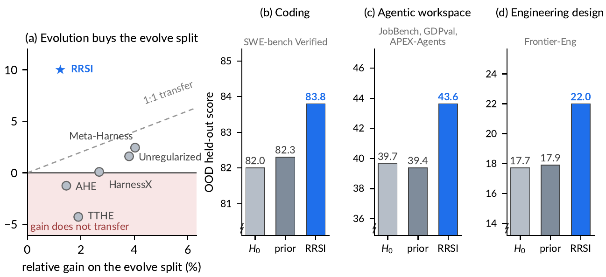
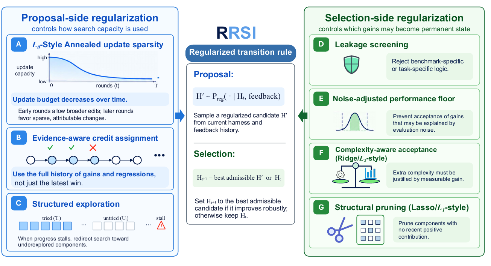

# RRSI: Regularized Recursive Self-Improvement of Agent Harnesses

## 来源信息

| 项 | 内容 |
| --- | --- |
| 标题 | RRSI: Regularized Recursive Self-Improvement of Agent Harnesses |
| 作者 | Peng Xia¹²\*, Rujun Han¹, Zifeng Wang¹, Yanfei Chen¹, Yufan Zhuang¹, Yoonho Lee³, Chengsong Huang⁴, Han Yu¹, Zhongying CuiZhu¹, Yifei Ming¹, Huaxiu Yao², Burak Gokturk¹, Tomas Pfister¹, Chen-Yu Lee¹（¹ Google Cloud AI Research；² UNC-Chapel Hill；³ Stanford University；⁴ Washington University in St. Louis；\* 论文 p.1 页底脚注："This work was done while Peng was a Student Researcher at Google Cloud AI Research."，项目页同样标注） |
| 机构 | Google Cloud AI Research（第一机构） |
| 来源 | [arXiv:2609.24972v3](https://arxiv.org/abs/2609.24972v3)（cs.LG; cs.AI; cs.CL）；v1 2026-09-21 → **v3 2026-10-04**（本笔记基于 v3，为截至阅读时的最新版；论文未说明版本间改动） |
| 代码 | <https://github.com/google-research/rrsi>（Apache-2.0，Python；阅读时 ★1284，创建 2026-09-16、最近推送 2026-09-23；仓库含 `rrsi.py` + `rrsi/` 包 + `domains/` + `tests/`） |
| 项目页 | <https://regularized-rsi.com/>（含 round-by-round 的 Evolution Explorer：每个候选的提案、critic 判定、接受判定与 harness diff） |
| 阅读日期 | 2026-10-07 |
| 仓库编号 | 00212（清单行内标题/年份/单位已核对一致） |
| 阅读范围 | v3 全文 27 页（PDF 页码），含正文 §1–6 + Limitations + 附录 A–F（评测细节、baseline、方法细节与伪代码、超参、可靠性分析、定性案例）。**已渲染页核对**：公式 (1)–(3)（p.3）、(4)（p.5）、(5)–(7)（p.6）、(8)（p.19）、Algorithm 1/2 与 (9)（p.20）、(10)–(14)（p.21）、(15)–(17)（p.22）；Table 1（p.8）、Table 2/3（p.9）、Table 4（p.10）、Table 5（p.23）、Table 6（p.24）、Table 7（p.25）、Table 8（p.26）、Table 9（p.27）逐格核对；Figure 1（p.2）、Figure 2（p.4）、Figure 3（p.8）、Figure 4（p.10）看图核对。**未做像素测量**：Figure 4(a) 是散点图、数据点只标方法名（无数值标签），本笔记只引用正文/表格给出的数值（2.42M / 3.82M / 1.56M），未从图中读数 |
| 配图 | `assets/` 下 2 张（Figure 1、Figure 2），自 v3 PDF 渲染页裁剪（220 dpi）：**裁剪框先校验在图像内，成品逐张回看确认无黑边/越界/截断，并与第二次独立渲染的同区域做像素差比对（差异为空集）**。arXiv 版许可为 [arXiv.org perpetual, non-exclusive license 1.0](http://arxiv.org/licenses/nonexclusive-distrib/1.0/)，**不是 CC 协议**，引用请注明出处 |
| 归档说明 | arXiv 来源，按仓库策略不归档 PDF；清单编号 00212（编号单元格当前指向 arXiv 官方页，归档到上游后再改指 PDF） |
| 复核记录 | 2026-10-07 依 check-paper-note 复核（基准：重取 arXiv v3，968,169 B / 27 页，与本笔记所用版本一致；独立子 agent 审计）。手段：Table 1–9 与公式 (1)–(17) 全部在渲染页逐格/逐符号核对；两张配图与原文同页同区域**像素差为空集**；原有三条"原文张力"用多组关键词在 PDF+HTML 全文独立复检；元数据（14 位作者顺序、四机构上标、版本 v1→v3、许可、仓库 API 值）逐项核对。本轮修正：①§4.2 的「RRSI consistently outperforms…」归属由"Table 1 题注"改回 §4.2 正文断言，并列 held-out 由"其余四项"改为"其余三项"；②Dwork et al. 2015 的引用位置由"§2 末"改为 §3.2/§3.3（§2 末只提出问题、未带引用）；③Figure 1 的 (b–d) 补上被漏掉的 **prior 平均柱**（82.3/39.4/17.9），并把"唯一给出 baseline 与留出的领域"限定为"逐方法对照"；④核心结论的 OOD 最大值由摘要的 +4.3 改为可复算的 **+4.7（JobBench）**；⑤Figure 1 配图**重裁**——首版底边切到题注首行（违反"无截断"），上收 39 px 后重验（像素差一致、坐标轴标签完整）；⑥阅读范围补 (8)（p.19）、(15)–(17)（p.22）与 Figure 2（p.4），并把 Algorithm 1/2 的页码写准；⑦补 OOD 判分口径（GDPval 胜率/三模型评审团、JobBench 双 judge 均分、APEX 固定 480 分母、Frontier-Eng 38/47 计分）与"同窗口同 judge"的公平性声明；⑧"三种失效→对应正则"表标注右列为笔记归纳；⑨新增张力第 5 条（§D.3 称 $w_s,w_c,w_n$ 在 Table 5，但该表没有这三行） |

---

## 核心结论

一句话：**这篇论文把"用 agent 自己跑出来的反馈反复改 harness"这套 RSI 循环的失败模式诊断清楚了——不是搜得不够，而是搜的东西**（有限 evolve set 被反复自适应复用）**会过拟合**——然后用四项来自经典正则化的约束去限制**搜索轨迹**（而非限制编辑空间），在 8 个 benchmark / 3 个领域上换来"evolve 集涨得最少、但留出集涨得最多、token 还更省"的结果。

三条主张（作者）：

1. **问题**：harness 演进（prompts / 控制流 / 工具接口 / 记忆与上下文管理围绕冻结模型的自动改写，见 §2）本质是**在有限 evolve set 上的自适应经验优化**；候选的提出依赖前几轮在同一批任务上的测量，于是会通过三种耦合行为过拟合——**benchmark-specific fitting（写进评测语境的偏方）、noise chasing（追逐评测噪声的赢家）、complexity accumulation（堆复杂度）**（§1）。
2. **方法**：不限制"能改什么"（$\Omega(H)$ 保持开放，9 类组件都可增删改），只在**提议**与**选择**两侧给搜索轨迹加正则（§3）：提议侧对应 $L_0$ / 稀疏更新，选择侧对应 $L_1$ 剪枝与 $L_2$ 收缩——作者反复强调这是**功能类比**，不是在优化带范数惩罚的目标（§3.1、附录 D 开头）。
3. **结果**：evolve 集最多 +6.0 分（Terminal-Bench 2.1），**六个留出 split 无一退步**、OOD 最多 **+4.7 分**（JobBench；摘要写的是 +4.3，见下"原文表述张力"）；且是**所有演化臂里最省 token 的**（2.42M vs 无约束演化的 3.80M，即 ≈−36%）。作者的解释是正则化让"留下的改动"从"拟合评测"转向"可复用机制"。

**适合谁看**：在做 agent harness / 自进化 agent、需要一个**可迁移的筛选器**（而不是更强的 proposer）的人；这篇的贡献几乎全部在"接受与拒绝的准则"上，与"用什么模型当 proposer"正交。



*图 1（原文 Figure 1，p.2）：左 (a) 横轴是 evolve 集上的相对涨分、纵轴是 OOD 留出上的相对涨分（agentic workspace 实例，每个方法一个点；粉色区标注 "gain does not transfer"，灰虚线是 1:1 迁移线）——按图注"prior 方法留不下多少 evolve 涨分，其中几个还落在 $H_0$ 之下"，RRSI 是唯一在分布外继续放大的点。右 (b–d) 是三个领域的留出分，每个面板三根柱：$H_0$ / **四个 baseline 的平均**（82.3 / 39.4 / 17.9）/ RRSI（83.8 / 43.6 / 22.0，均为打印标签）。裁剪自 v3 PDF，许可见来源信息。*

---

## 问题与动机

### 已有做法与本篇的前提

- **harness 决定 agent 能做什么**：论文引用的都是"harness 工程而非新权重"这一叙事（§1、§5），并明确把 harness 演进定位为**agent 系统层面的 RSI**——"用当前系统的反馈改进塑造其后续行为的 harness"。
- **已有方法的共同结构**（§2，式 2）：第 $t$ 轮把当前 harness $H_t$ 在 evolve set 上跑出轨迹 → 汇总成反馈 $\mathcal{F}_t$ → proposer 生成候选 → **在同一批 evolve set 上评估** → 取分最高的当下一轮 incumbent。
- **关键风险**：这套循环对 $\mathcal{D}_{\mathrm{evolve}}$ 的复用是**自适应的**（第 t 轮的候选取决于前几轮在同一批任务上的测量），论文把它类比为"在极其表达力强的搜索空间上做自适应经验优化"——**反复拿同一份留出数据做选择，测量本身会失真**（§2 末提出该问题但未带引用；Dwork et al. 2015 的自适应数据分析结论只在 §3.2 的信用分配与 §3.3 的稳定性接受两处被引）。
- 论文给的**证据**（Figure 1a、Table 1）：Meta-Harness 在 Harvey LAB 的 evolve 集上 93.0（比 RRSI 的 90.5 高），但 OOD 平均只有 40.6；AHE 与 TTHE 的 OOD 平均甚至**低于未演化的 $H_0$**（39.2 / 38.0 vs 39.7）。

### 三种失效行为（作者的诊断，§1）

失效名称与表现为作者原文；**右列的"对应正则"是笔记的归纳**（论文没有给出这张对应表——例如"编辑预算 ↔ benchmark-specific fitting"就是本文的读法，不是原话）。

| 失效 | 表现 | 对应正则（笔记归纳） |
| --- | --- | --- |
| benchmark-specific fitting | 把评测集特有内容（任务名、实体名、任务的评分体系）写进 harness | 泄漏筛查（选择侧）+ 编辑预算（提议侧） |
| noise chasing | 在有限样本的测量噪声里挑"赢家"，把随机波动固化成永久状态 | 噪声地板 $\delta$（选择侧） |
| complexity accumulation | 堆上下文与推理成本换 evolve 分 | 成本准入 $\Delta C \le \beta_0+\beta_1\Delta S$ + 结构剪枝（选择侧） |

---

## 方法与贡献

### 总体形状

把一轮演进写成（附录 D.1，式 8）：

$$\mathcal{H}_t \sim P_{\mathrm{reg}}(\cdot \mid H_t, \mathcal{F}_t, \mathcal{L}_t, b_t, \mathcal{E}_t, \mathcal{B}_t) \subseteq \Omega(H_t), \qquad H_{t+1} = \operatorname*{arg\,max}_{H' \in \mathcal{H}_t \cap \mathcal{A}_t} \hat{S}(H'),$$

即：提议分布 $P_{\mathrm{reg}}$ 受**编辑历史 $\mathcal{L}_t$、退火预算 $b_t$、探索指令 $\mathcal{E}_t$、剪枝目标 $\mathcal{B}_t$** 约束；只有**可准入集合 $\mathcal{A}_t$** 里的候选才能替换 incumbent；若 $\mathcal{A}_t=\varnothing$ 则原地不动。



*图 2（原文 Figure 2，p.4）：左侧 A/B/C 是提议侧正则（退火预算、证据化信用分配、结构化探索），右侧 D/E/F/G 是选择侧正则（泄漏筛查、噪声地板、成本准入、结构剪枝）。裁剪自 v3 PDF，许可见来源信息。*

### 提议侧（§3.2，Algorithm 1）

**A. $L_0$ 式退火编辑预算**（式 4）：一轮里可独立归因的编辑数上限

$$b_t=\Big\lceil b_{\min}+(b_{\max}-b_{\min})\cdot\tfrac{1}{2}\big(1+\cos(\pi t/T)\big)\Big\rceil,$$

从 $b_{\max}$ 退火到 $b_{\min}=1$：早期允许"几个协同改动一起上"以发现新机制，后期只留**单一可归因**的改动。附录 D.2 把它写成 $z_t\in\{0,1\}^{|E_t|}$ 上的基数约束 $\|z_t\|_0 \le b_t$（式 9）——注意约束的是**一轮更新里捆绑的编辑数**，不是 harness 能包含哪些组件。

**B. 证据化信用分配**：每个被评估的候选都记入台账 $\mathcal{L}_t=\{(t_i,\ell_i,h_i,d_i,\Delta S_i,\Delta C_i,a_i)\}$（式 10：轮次、组件、假设、源码 diff、分数变化、成本变化、是否被选为当轮赢家）。proposer 在后续轮次条件于**全历史**：被否掉的机制作为负证据保留，成功的机制保留明确信用。作者的直觉：随着预算退火到 1，捆绑编辑继承的是**候选级**测量，归因会越来越清晰。

**C. 结构化探索**：以 $\sigma_t=\mathbb{1}[\hat S_t-\hat S_{t-w}\le \delta]$ 判定"停滞"（$w$ 轮内进展不超过噪声带），停滞时把 $m_{\mathrm{draft}}$ 个候选槽位留给**从未被测量编辑过的组件** $\mathcal{U}_t=\mathcal{K}\setminus\mathcal{T}_t$（式 13）。可编辑组件词表固定为 9 类（式 12）：

```text
K = {prompt, control_flow, config, output_plumbing, context_mgmt,
     client_tool, skill, memory, subagent}
```

### 选择侧（§3.3，Algorithm 2）

四项**非补偿性**门槛（每项都必须过，不能被别的项补回来）：

| 门槛 | 规则 | 位置 |
| --- | --- | --- |
| **D. 泄漏筛查** | critic 读**候选的 diff**（不是提案说明），拒绝显式编码任务名/实体名/任务特有取值/答案的逻辑，以及"惰性机械"；**在评估之前**执行，使泄漏候选拿不到虚高的 evolve 分数 | 评测前 |
| **E. 噪声地板** | 先反复评估未改动的 $H_0$ 得到经验噪声带 $\delta$；要求 $\hat S(H')\ge S^{\star}-\delta$（式 5），$S^\star$ 为历史最佳且只升不降 | 评测后 |
| **F. 成本准入（Ridge/$L_2$ 式）** | 若 $\Delta S>\delta$：要求 $\Delta C\le \beta_0+\beta_1\Delta S$（式 6、7），$\Delta C$ 是每 trial 策略 token 的**相对**变化，$\beta_0$ 是"零增益时的容忍度"，$\beta_1$ 是"每多一分增益允许多花多少" | 评测后 |
| **F′. 带内规则** | 若增益落在噪声带内（$\Delta S\le\delta$）：不用式 7，改用 $w_s\Delta S-w_c\Delta C+w_n\nu_t(H')>0$（式 17）——**省 token 或触碰未用过的结构组件**才能准入；$\nu_t$ 只统计 `client_tool / skill / memory / subagent` 四类中**从未出现在获胜编辑里**的组件（式 15、16）。coding 实例取 $w_s=0$（带内涨分本身无信用） | 评测后 |
| **G. 结构剪枝（Lasso/$L_1$ 式）** | 组件级近期最好增益 $g_t(\ell)=\max\{\Delta S_i:\ell_i=\ell,\ t-t_i\le n_{\mathrm{prune}}\}$（式 11）；把 $g_t(\ell)\le 0$ 的组件列入删除目标 $\mathcal{B}_t$（式 14），交给 proposer 在后续轮里删 | 每轮 |

最后在可准入候选里取分最高者（Algorithm 2 第 16–18 步），并记 $a_i$ 供后续轮做信用分配。

### 与经典正则化的对应（作者自述的边界）

| RRSI 机制 | 类比 | 作者明说的差异（§3.1、附录 D） |
| --- | --- | --- |
| 退火编辑预算 | $L_0$ 基数约束 | 约束的是**一次更新的活跃编辑数**，编辑池每轮重抽，不是固定参数向量上的 $L_0$ 惩罚 |
| 结构剪枝 | Lasso/$L_1$ 稀疏化 | 删除的是**离散组件**，不是 $L_1$ 惩罚下的连续优化 |
| 成本准入 | Ridge/$L_2$ 收缩 | 抑制的是**整体资源足迹**的增长，不要求删掉任何具体组件；不是平方范数惩罚 |

---

## 实验与证据

### 设置（§4.1、附录 B）

- **8 个 benchmark / 3 个领域**，每个领域**只在一个 suite 上演化**，再原样跑到留出集：
  - **Coding**：Terminal-Bench 2.1（89 个容器化终端任务，任务自带单测，分数精确）→ OOD：SWE-bench Verified
  - **Agentic workspace**：Harvey LAB（法律工作，**固定切成 120 任务 evolve + 40 任务 pristine held-out**；每个任务 20–100 条独立判定的 rubric，一次完整评测约 14,000 条判定）→ OOD：JobBench、GDPval、APEX-Agents
  - **Engineering design**：EngDesign（61 个设计任务，**由各自的冻结模拟器/测试台判分**，无 judge 模型）→ OOD：Frontier-Eng（Medal Score）
- **策略冻结**：全程 Claude Opus 4.8；**proposer、跨轮失败反馈的 analyst、泄漏 critic 也都是 Opus 4.8**。基础 harness：coding 用 Terminus-2，agentic workspace 与 engineering design 用 MCP 工具网关上的 ReAct 循环 + dynamic toolbelt + ReSum 式上下文管理。
- **Baseline**：$H_0$（未演化）+ 4 个近期 harness 演化方法 **Meta-Harness / AHE / TTHE / HarnessX**，全部同 $H_0$、同 policy、同 evolve 集、同候选预算；论文声明所有 arm 与 baseline 在**同一时间窗口、同工具环境、同 judge、同 trial 数**下评测（附录 B 开头）。
- 评测口径：一次评测 = 每个任务 $k$ 次 trial（coding/agentic 用 $k=2$，engineering 用 $k=4$），$T=20$ 或 40 轮，每轮 $m=2$ 个候选（见超参表）。各 OOD 榜的判分方式差别很大，读数字前需注意：**GDPval 是对人工专家交付物的胜率**（185 任务，三名不同来源的模型组成评审团、双向呈现顺序、多数票）；**JobBench 是加权 rubric 分**（judge 取 Gemini 3.5 Flash 与 Claude Opus 4.8 的均分）；**APEX-Agents 用 pass@1、分母固定为全部 480 个任务**（基建失败的 rollout 记失败，防止"崩在难任务上反而好看"）；**Frontier-Eng 的 47 个任务中只有 38 个能计分**（两臂同一批任务，Medal Score）。

### 主结果（Table 1、Figure 3，均在渲染页核对）

**Agentic workspace**（Table 1，p.8；加粗为原文强调列）：

| 方法 | Harvey LAB (Evolve) | Harvey LAB (ID held-out) | JobBench (OOD) | GDPval (OOD) | APEX-Agents (OOD) |
| --- | --- | --- | --- | --- | --- |
| $H_0$（未演化） | 89.4 | 86.9 | 36.0 | 48.8 | 34.2 |
| Meta-Harness | **93.0** | 89.2 | 37.1 | 49.1 | 35.7 |
| AHE | 90.7 | 88.7 | 37.2 | 47.2 | 33.1 |
| TTHE | 91.1 | 88.5 | 35.2 | 47.0 | 31.7 |
| HarnessX | 91.8 | 89.1 | 36.3 | 48.5 | 34.3 |
| **RRSI** | 90.5 | **89.2** | **40.7** | **52.3** | **37.9** |

三个领域的关键数字（Figure 3 的打印标签 + §4.2）：

| split | 角色 | $\Delta$（相对 $H_0$） | 95% CI（配对 bootstrap，Table 6） |
| --- | --- | --- | --- |
| Terminal-Bench 2.1 | Evolve | +6.0 | [+4.3, +9.3] |
| SWE-bench Verified | OOD | +1.8 | [+1.1, +4.0] |
| Harvey LAB | Evolve | +1.1 | [+0.8, +2.1] |
| Harvey LAB ID held-out | 同分布留出 | +2.3 | [+0.9, +3.8] |
| JobBench | OOD | **+4.7** | [+2.9, +7.4] |
| GDPval | OOD | +3.5 | [+1.8, +6.9] |
| APEX-Agents | OOD | +3.7 | [+1.4, +7.5] |
| EngDesign | Evolve | +4.9 | [+1.8, +9.8] |
| Frontier-Eng | OOD | +4.3 | [+1.1, +12.1] |

读法（我的归纳）：**在唯一给出逐方法 baseline 对照的 agentic workspace 领域里，RRSI 是"evolve 涨分最小、留出涨分最大"的那一个**——Harvey LAB 上它只涨 1.1（四个 baseline 涨 1.3–3.6），但三个 agentic OOD 都超过所有 baseline。coding 与 engineering design 没有逐方法的表格对照（Figure 3 只画 $H_0$ 与 RRSI），只有 Figure 1(b–d) 给出的 **prior 平均值**可参照（SWE-bench 82.3、Frontier-Eng 17.9，RRSI 分别为 83.8 / 22.0），所以"以 in-distribution 涨分换 transfer"这个模式在两处**只有单点证据**。

### 消融（Table 2，p.9）

| 变体 | Harvey (Evolve) | Harvey (ID held-out) | OOD Avg. | Tokens/trial (M) ↓ |
| --- | --- | --- | --- | --- |
| $H_0$ | 89.4 | 86.9 | 39.7 | 1.56 |
| 无正则演化（Unregularized） | 92.8 | 88.9 | 40.3 | 3.80 |
| 去掉提议侧正则 | 90.7 | 88.8 | 41.9 | 2.69 |
| 去掉接受侧正则 | 91.5 | 88.7 | 41.0 | 3.59 |
| **RRSI** | 90.5 | **89.2** | **43.6** | **2.42** |

- 两组正则**各自**贡献转移能力：去掉接受侧，evolve 分从 90.5 升到 91.5、OOD 掉到 41.0、token 涨约一半；去掉提议侧在 evolve 上只差 0.2 分，但在 OOD 上掉 1.7 分——**"把搜索引到哪儿"即使什么都没拒绝也在起作用**。
- 两个都去掉：evolve 分 92.8（**全表最高**）、OOD 平均 40.3（离未演化 harness 不到 1 分）、3.80M tokens。

### 稳健性（Table 3、Table 4、Table 7）

- **换 policy 家族**（Table 3）：同一 coding harness 分别用 Claude Opus 4.8 与 Gemini 3.5 Flash 独立演化——Opus：TB2.1 74.2→80.2（+6.0）、SWE 82.0→83.8（+1.8）；Gemini 3.5 Flash：TB2.1 64.6→78.7（**+14.1**）、SWE 76.8→79.0（+2.2）。
- **换到搜索时没用过的弱 backbone**（Table 4）：用 Gemini 3.5 Flash 演化出的 harness，直接跑 Gemini 3.1 Flash Lite：TB2.1 11.2→14.6（+3.4，相对 +30.4%）。
- **搜索本身重复一遍**（Table 7，p.25）：九个 split 中两轮跑的最大分歧是 TB2.1 的 1.8 分，其余 ≤0.6 分；agentic OOD 平均 43.6 vs 43.7。作者的解释是"轨迹的随机性比选评测任务带来的不确定性小"。

### 成本（Figure 4、§4.3）

- RRSI 的最终 harness 是**所有演化臂里最省的**：2.42M policy tokens/trial、26.3 steps/trial；四个 baseline 是 27.3–34.6 steps，AHE 最贵（3.82M，比 RRSI 多 **58%**，且 OOD 平均低 4.4 分）。
- 未演化的 $H_0$ 是 1.56M / 21.2 steps——**演化确实花了额外推理成本**，RRSI 的作用是决定"花多少"。

### 定性证据：留下的东西不一样（Table 9，p.27）

| 方法 | 最终 harness 累积了什么 | 为什么不过/过不了迁移 |
| --- | --- | --- |
| Meta-Harness（93.0 → OOD 40.6） | 730 词的强制工作法，作为常驻系统消息；组织成"条目 × 维度"覆盖矩阵，维度名是 citation / controlling rule / severity / consequence / recommended fix | 不点名任何任务，但**复述了 evolve suite 的评分体系**（"deliverable 按逐条 rubric 打分、只读文件"）——拟合评分器而非任务，evolve 最优、OOD 只 +0.9 |
| TTHE（91.1 → 38.0） | 十个命名协议块共约 8,500 词，做成"不会被压缩掉"的常驻消息；其中约 1,000 词只在交付物是 redline / markup / tracked-changes 时触发 | 那个交付物体裁是 evolve suite 特有的；换个 benchmark 触发不了却每次都要付上下文——**该臂最终比自己的起点还低 1.7 分** |
| **RRSI（90.5 → 43.6）** | 20 轮里从 32 个被评估候选中只接受 **4 处**编辑，全部接在基础 harness 已有的"最终提交前回弹"上：一次覆盖度与深度复查，三个标准库探针（把交付物读回来，指出缺什么——如未展开的算术简写、任一产出文件里缺失的源值） | 探针报告的是"文件的结构性事实"，**既不带 rubric 词汇也不带领域词汇**，所以在 JobBench / GDPval / APEX-Agents 上仍然触发 |

论文还给了 critic 的实际判定风格（§附录 F）：**候选可以在"理由"里点名它想修的任务，但同名内容不能进入 diff**；coding 运行 38 个被筛候选中只有 1 个被直接否决（原因是"声明的组件不是 diff 实际改的"）。

---

## 工程视角

### 一轮 RRSI 的执行序（据 Algorithm 1/2 与 §4.1 整理；这是我的重排，便于实现对照）

1. **分析**：用 Opus 4.8 analyst 在 evolve set 上跑当前 $H_t$，汇总跨轮失败反馈 $\mathcal{F}_t$；
2. **拟题**：算退火预算 $b_t$（式 4）、停滞标志 $\sigma_t$、未探索组件 $\mathcal{U}_t$、剪枝目标 $\mathcal{B}_t$（式 11/13/14），然后由 Opus 4.8 proposer 从约 **80 条编辑的池子**里起草 $m=2$ 个候选（每个候选只是池的一个子集，$L_0$ 约束限其大小）；
3. **筛**（评测前）：Opus 4.8 critic 读 diff，拒绝含 evolve-suite 特有逻辑或惰性机械的候选；
4. **评**：通过筛查的候选在**完整 evolve set** 上并行评估（$k$ 次 trial），得到 $\hat S'$、$\hat C'$；
5. **准入门**：噪声地板（式 5）→ 分支判据（$\Delta S>\delta$ 用式 7，否则用式 17）→ 领域守卫 `DomainGuard`；
6. **选择**：可准入者中取分最高者为 $H_{t+1}$，否则保留 $H_t$；更新 $S^\star$ 并把每个编辑连同 $a_i$ 记入台账。

### 成本与规模（可直接用于估算）

- 一轮 = $m=2$ 个候选 × 完整 evolve set × $k$ 次 trial；agentic workspace 的完整评测一次约 **14,000 条 rubric 判定**（Gemini 3.5 Flash 当 judge），$T=20$ 轮 → 该领域的演化开销主要是"评测"而不是"生成"。
- 超参（Table 5，p.23；**全部在开跑前固定、无 sweep、不看任何留出/ OOD 集**）：

| 超参 | 含义 | Coding | Agentic workspace | Engineering design |
| --- | --- | --- | --- | --- |
| $T$ | 演化轮数 | 20 | 20 | 40 |
| $k$ | 每任务每次评测 trial 数 | 2 | 2 | 4 |
| $\delta$ | 经验噪声容忍带 | 0.017（≈89×2 次里的 3 次通过） | 0.004（≈14,100 条判定里的 60 条） | 0.020（≈61×4 里的 5 次） |
| $b_{\min}$ / $b_{\max}$ | 末轮 / 首轮编辑预算 | 1 / 4 | 1 / 3 | 1 / 4 |
| $w$ | 停滞检测窗口 | 3 | 3 | 3 |
| $m_{\mathrm{draft}}$ | 保留的探索槽 | 1（总 $m=2$） | 1 | 1 |
| $n_{\mathrm{prune}}$ | 剪枝窗口 | 4 | 4 | 5 |
| $\beta_0$ / $\beta_1$ | 基础 / 增益相关成本容忍 | 0.10 / 44.5 | 0.10 / 35.4 | 0.15 / 24.4 |

- $\beta_1$ 的标定方式值得抄：它是把"允许的成本增长"翻译成评测单位——coding 上 7 次通过额外给 $10+7\times25=185\%$ 的增长（而实测 130% 被接受），单次通过只给 35%（同样的成本被拒）。**δ 是唯一"不许调"的超参**（调低就等于用噪声买 evolve 分）。
- 代码仓库根目录为 `rrsi.py`（CLI 入口）+ `rrsi/` 包（`analyst.py` / `critic.py` / `propose.py` / `selection.py` / `schedule.py` / `calibrate.py` / `history.py` / `components.py` / `loop.py` / `evaluate.py` / `domain.py` 等，与论文组件一一对应）+ `domains/`（`coding` / `eng` / `workspace` 三个领域）+ `tests/`，另有 `assets/`、`third_party/`、`pyproject.toml`；项目页提供逐轮的 Evolution Explorer（提案、critic 判定、接受判定、diff）。**本笔记未运行代码**，仓库内容只按根目录清单与 README 描述。

---

## 局限与待确认问题

### 作者明确讨论的（Limitations）

1. 只在**冻结 backbone** 的设定下研究 harness 级 RSI，**不涉及演化过程中更新模型权重**；
2. 仍依赖**有限 evolve set** 与若干正则超参——效果取决于反馈信号质量与搜索预算；
3. 跨领域/benchmark/policy 的迁移已验证，但**更不同的 agent 架构、工具生态与更长程的自改进**仍需更广验证。

### 我的判断（读者视角）

1. **评测构成对结论很关键**：8 个 benchmark 里，Harvey LAB / JobBench / GDPval / APEX-Agents 都靠 **LLM judge**（Harvey LAB 与 APEX-Agents 用 Gemini 3.5 Flash 逐条判定，JobBench 取 Gemini 3.5 Flash 与 Opus 4.8 的均分，GDPval 用三模型评审团），只有 coding 与 engineering design 是确定性判分。作者用"engineering design 是确定性判分、涨分照旧"来反驳"只是学会了讨好 judge"——这个论证有力，但**只覆盖一个领域**；agentic workspace 的四个 benchmark 仍然全部由 judge 打分，而 RRSI 的收益恰恰在这一领域最大（+3.5~4.7）。
2. **"RRSI 更省 token"的因果链**：成本规则（式 7、17）**直接**拒绝贵的候选，所以"更省"部分是设计的结果而非涌现的收益；Table 2 里"去掉接受侧正则 → token 涨一半"正是这一点。把它读成"正则有免费收益"要小心：收益与"不接受某些涨分"是同一件事的两面。
3. **单个 policy 家族占主导**：主实验、消融、可靠性分析**全部**用 Claude Opus 4.8；跨 policy 的只有 coding 领域的两点（Table 3），跨模型迁移只有一个弱 backbone 的一个 benchmark（Table 4）。"不绑定 policy"的证据强度有限。
4. **proposer/analyst/critic 与 policy 同源**：三者都是 Opus 4.8。若换一个更弱的 proposer，式 17 的"结构新颖性"与 critic 的 diff 筛查是否还成立，论文没有实验。
5. **$\delta$ 与评测规模强耦合**：$\delta$ 由 $H_0$ 的重复评测经验估计（agentic 实例 ≈ 14,100 条判定里的 60 条）。任务量小得多、或 judge 方差更大的场景，$\delta$ 的估计本身会不稳；论文未做该敏感性分析（作者明确说 $\delta$ 不许调，但没有给"估不准时会怎样"）。
6. **消融只在一个领域**：Table 2 全部在 agentic workspace 实例上，coding 与 engineering design 没有对应消融。

### 原文自身的表述张力（本笔记核对时发现，非本文结论）

1. **"30% fewer policy tokens" 与本论文的表格对不上**：摘要写 "runs on 30% fewer policy tokens than the unregularized evolution"，但 Table 2（p.9）给出的两个数是 3.80M → 2.42M，即 **≈36%**；项目页也写 **−36%**。30% 在正文、附录里找不到任何可复算的依据。
2. **"up to 4.3 points on the five out-of-distribution benchmarks" 与 JobBench 冲突**：摘要与引言都说 OOD 最多 +4.3，但 Table 1、Figure 3、Table 6（含 95% CI）三处都给出 **JobBench +4.7**，且 §4.2 正文自己也写 "the three out-of-distribution agentic benchmarks gain between 3.5 and 4.7 points"。即"4.3"只对 Frontier-Eng 成立。
3. **"outperforming the average prior baseline by up to 12.5%" 缺了口径限定**：12.5% 对应 APEX-Agents 相对四个 baseline 平均（37.9 vs 33.7，我按 Table 1 复算）；若按全部留出 split 取最大，Frontier-Eng 的相对提升是 **22.9%**（22.0 vs 17.9，项目页用的正是这个数）。两处数字都对，但正文没有说明"12.5% 只限 agentic 三项"。
4. **§4.2 的加粗断言「RRSI consistently outperforms baselines on all held-out datasets」有反例**：该句是 **§4.2 正文**（p.7，紧接 Table 1 之前；Table 1 自己的题注只写 "Comparison with prior harness evolution methods on agentic workspace tasks."），而 Harvey LAB 的 ID held-out 上 **RRSI 与 Meta-Harness 同为 89.2**（并列，不是超过）。表内其余三项 held-out（JobBench / GDPval / APEX-Agents）RRSI 确为各列最高；若按全论文的 OOD 口径，SWE-bench（83.8 vs prior 平均 82.3）与 Frontier-Eng（22.0 vs 17.9）也都在 prior 平均之上。
5. **§D.3 称 $w_s,w_c,w_n$ "are reported in Table 5"，但 Table 5（p.23）里没有这三行**：该表只有 $T,k,\delta,b_{\min},b_{\max},w,m_{\mathrm{draft}},n_{\mathrm{prune}},\beta_0,\beta_1$。三个权重只在正文里定性描述（coding 取 $w_s=0$ 等），实际取值全文未给。

以上五条的**处置**：涉及可复算数字时本笔记一律采用**表格/附录里的值**（如 JobBench +4.7），摘要级表述只在标注差异后引用；36% 与 22.9% 是复算值，分别见本节的第 1、3 条；不把摘要的 30% / 4.3 当成事实基础。

### 尚无实验证据的问题

- **正则化换来的 transfer 上限在哪**：论文只证明"约束搜索 → OOD 更好"，没有回答"如果 evolve set 足够大/足够代表性，正则是否仍然必要"。
- **与"多 evolve set 轮流用"这类朴素替代的对比**：论文把问题归因于"有限 evolve set 的自适应复用"，但没有和"扩大 evolve set""多套 evolve set 轮换""留出集轮换"这些更直接的缓解方式做对照（Dwork et al. 2015 的结论其实指向这类做法）。
- **9 类组件的归纳是否完备**：组件词表（式 12）是实现的先验，`DomainGuard` 的具体检查内容论文没有展开（只在 Algorithm 2 里一句 "per-domain specific checks"、§D.3 一句 "any domain guard $g(H_t,H')$ the instance defines"）。**补充背景**（来自代码仓库 README，非论文正文）：仓库有 `Non-compensatory domain criteria — Domain.guards` 一条线索，engineering 实例的守卫是 "valid-rate drop / no-submission rise"；`rrsi/` 包下 `propose.py`、`critic.py`、`selection.py`、`schedule.py`、`calibrate.py`、`history.py`、`components.py` 与论文组件一一对应。
