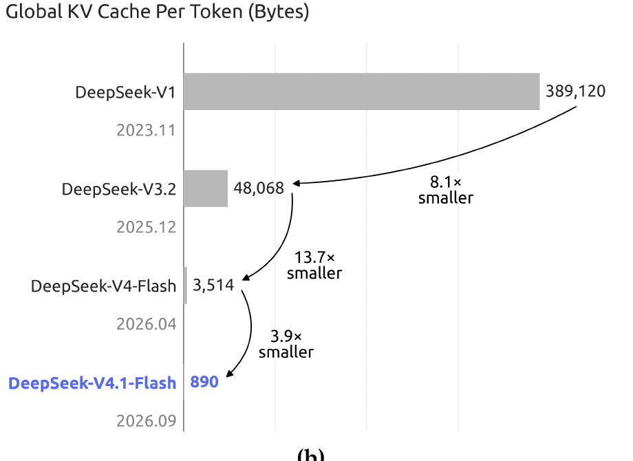
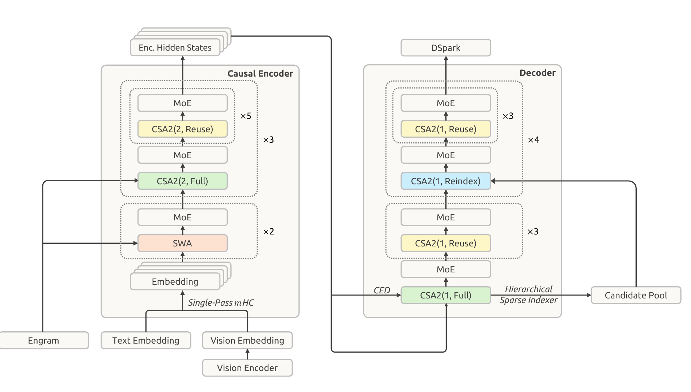
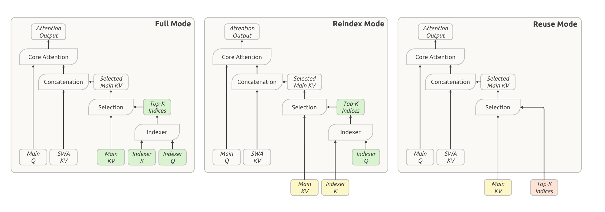
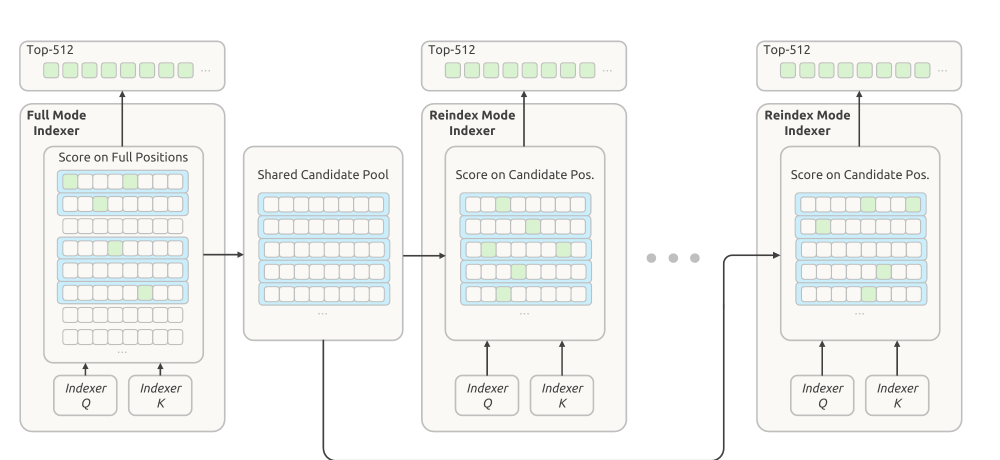
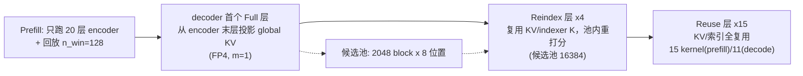

# DeepSeek-V4.1-Flash: Pushing the Limits of KV Cache Compression

## 来源信息

| 项 | 内容 |
| --- | --- |
| 标题 | DeepSeek-V4.1-Flash: Pushing the Limits of KV Cache Compression |
| 作者 | DeepSeek-AI（联系方式 research@deepseek.com；附录 A 分 Research & Engineering 与 Business & Compliance 两节按名字字母序列出署名，`*` 标注已离职） |
| 机构 | DeepSeek-AI |
| 来源 | [Hugging Face 技术报告 PDF](https://huggingface.co/deepseek-ai/DeepSeek-V4.1-Flash/blob/main/DeepSeek_V41_Tech_Report.pdf)；模型 checkpoint：<https://huggingface.co/deepseek-ai/DeepSeek-V4.1-Flash>（本机 `huggingface.co` 连接被重置，两个链接均未联网核验）；搜索结果称另有 arXiv 版本 2609.19969，本机 arXiv 不可达，**未核验** |
| 归档 | 非 arXiv 来源，原文已归档：[原文 PDF](../../../papers/00191-DeepSeek_V41.pdf)（51 页，sha256 `ba68e2e4…eac08d`），仓库清单编号 00191 |
| 日期 | PDF 元数据 CreationDate 2026-09-10（正文未标注日期；§5.1.4 提到 2026 年 9 月上线的生产部署） |
| 阅读日期 | 2026-10-06 |
| 阅读范围 | 全文 51 页：正文 §1–6 + 附录 A（作者列表）/ B（评测细节）/ C（token 惩罚推导）+ 参考文献。Table 1–5 与正文/附录数字经渲染页逐项核对；Figure 1(b)/2/3/4/5/6/9/10/12 渲染核对（Figure 3/4/5 另与原文逐像素比对，Figure 2 与 Figure 12 的曲线做过像素测量）；Figure 7/8/11 按其图注与正文描述引用，未逐点核对曲线 |
| 复核记录 | 2026-10-06 依 check-paper-note 复核（基准：同一归档 PDF，sha256 `ba68e2e4…` 一致；手段：全文重新抽取 + 表格/公式/图注在 200–400 dpi 渲染页逐项核对 + Figure 12/Figure 2 曲线像素测量 + 独立子 agent 审计）。本轮修正：HLE 行的 `†` 归因（原文按模型逐一标注，并非「开源/闭源」之分）、「性能全面超过 V4-Flash」改为「整体优于」（HLE 与 AGIEval/DROP/MGSM 更低）、视觉基准对 GPT-5.6 Sol 的胜负表述、「六项为行内最高」补全为七项并注明 MathArena 与 K3 并列、YOIO 批评口径改为原文的「限制性能」、伪代码 2 行机制（建池输入、后缀 KV 产出）、补「纯 CSA2 取代 CSA–HCA」与「模态专属 MoE 负载均衡」、补 Figure 2 的 Decode FLOPs 读数与 Table 4/5 的评测条件、890 B/token 推算改为按 OCP MXFP4（E8M0/32）口径精确还原、新增「主文单调性表述与 Figure 12 不符」的另注；另有生成阶段自查已修的两项（配图 Figure 3 初版裁剪越界已替换、式 (1) 上下标已改）。同类问题已同步进正文相应小节 |

> `assets/` 下的 4 张图裁剪自本仓库归档的原文 PDF（图号与页码见各图注）；原文 PDF 未见许可条款标注，引用请注明出处。

---

## 核心结论

一句话：**这篇报告的主题不是「模型更强」，而是把长上下文推理的成本从「算」转移到「省」——用 CED 砍掉近一半 prefill 计算，用 CSA2 的跨层 KV/索引复用把 decoder 的 KV 生产层压到 1 层，再用 FP4 主 KV 缓存把每个字节再砍一半；部署侧用近似的 SWA Bounded Replay 换掉 SSD 上的 SWA 持久缓存**。代价是引入近似（有界重放、稀疏选路），收益是全局 KV 降到 **890 bytes/token**（DeepSeek-V4-Flash 的 ~1/4、DeepSeek-V1 的 **1/437**）、持久 KV 降到 ~1/8，同时**整体表现优于 V4-Flash**（原文措辞是 better overall performance——并非每项都赢，HLE 与 AGIEval/DROP/MGSM 等个别指标低于 V4-Flash，见「实验与证据」）。

- **CED（Causal Encoder-Decoder，§2.2）**：40 层拆成 20 层 causal encoder + 20 层 decoder，decoder 的全局 KV 不再由各层自己的隐藏态产生，而是从第 L/2 层（encoder 最后一层）的隐藏态**用各层独立投影矩阵投出来**（式 (1)）。prefill 只需算前一半层 → 激活参数 **prefill 8B / decode 16B**，prefill 复杂度 O(NL) → ≈O(NL/2)。
- **CSA2（Compressed Sparse Attention 2，§2.3）**：在「entry 大小（GQA/MLA）× 序列（压缩）× 层（跨层复用）」三个维度上同时压缩。每层静态分配 Full / Reindex / Reuse 三种模式之一：Full 自产 main KV 与 indexer K 并做索引；Reindex 复用前层的 main KV + indexer K，只用自己的 indexer Q 重打分；Reuse 连 Top-K 索引也复用。**decoder 里只有第一个 CSA2 层产出全局 KV**，其余 19 层全靠复用——这是 890 B/token 的主要来源。
- **Hierarchical Sparse Indexer（§2.3.2）**：decoder 第一个 Full 层按 block 打分建一个 16,384 位置的候选池（2,048 block × 8 位置），后续 Reindex 层只在池内打分，每 query 的索引成本从「随上下文线性」变为「常数」。
- **FP4 主 KV（§2.4.4）**：E2M1 + 每 16 通道一个 E4M3 scale（NVFP4 去掉第二级 global scale），post-training 做 QAT，RoPE 之后量化；SWA KV 保持 FP8。约 4 bit/元素，比 V4 的 FP8 缓存近乎减半。
- **SWA Bounded Replay（§3.2.2）**：精确重建 SWA KV 需要回放 L×n_win 个 token；本方案只回放最近 n_win 个并截断 SWA 视野，接受近似。这一步使 SWA KV **完全退出了 SSD 持久缓存**（改放主机 DRAM 池，TTL 分钟级），持久 KV 因此再降到 V4-Flash 的 ~1/8。
- **Decode 侧算力**（Figure 2，§1）：单 token Decode FLOPs 随上下文长度近乎持平——论文称 4K→1M（256×）只增约 1/4。**图中读数**（400 dpi 渲染 + 像素测量，对数纵轴，不确定度约 ±2 GFLOPs）：DeepSeek-V4.1-Flash 约 21 → 27 GFLOPs（≈×1.27），对照 V4-Flash 约 18 → 50 GFLOPs（≈×2.8）。
- **性能（§5）**：post-training 明确「无算法创新」，全部投入数据与环境合成。Table 3 里 DeepSWE v1.1 **74.2**（V4-Flash 54.4，超 Opus-5 的 74.0）、Terminal-Bench 2.1 **90.6**、CyberGym 88.1、Automation-Bench 54.8、Codeforces 3471；短板是专家级科学任务（Terminal-Bench 4.0 31.2 vs Opus-5 51.8）与 HLE（36.8）。附带一个推理强度旋钮 b∈[1,100]，公开 API 三档（low/high/max = 50/75/100）。
- **适合谁读**：做长上下文推理系统、KV cache 压缩、稀疏注意力与 agent 基础设施的工程读者。这篇报告的价值在架构与部署的联合设计（arch + 精度 + 缓存策略三层同时压），而不是模型能力本身的细节。

---

## 问题与动机

### 为什么「KV cache」成了主战场（§1）

长程 agent 的工作负载是 **input-heavy**（大量工具调用、每轮 prompt 很长、上下文持续增长），于是三类成本同时上升：

1. **prefill 计算**：每轮新输入都要重算前向，KV 未命中时代价尤其高；
2. **KV 存储**：global KV 驻 HBM，随序列长度线性增长，受 HBM 容量约束；用于 prefix 复用的 persistent KV cache 驻 SSD/主机内存；
3. **数据搬运**：KV 的迁移与加载受 I/O 与互联带宽限制。

DeepSeek-V4 的结构是「全局注意力分支 + 滑窗注意力（SWA）分支」：全局分支维护 global KV（**main KV + indexer K**），SWA 维护局部 KV。SWA 的占用与序列长度无关，所以序列一长，**global KV 就主导运行时占用**；再加上 persistent KV，HBM 与 SSD 双双成为瓶颈。作者的判断是：稀疏注意力已经把「算」压得差不多了，**存储与搬运成了新的主要矛盾**。

### 为什么既要跨层复用、又要动持久缓存

- **跨层复用**（§2.3）：KV 压缩有三条**乘法**维度——entry 大小、序列（每 m 个 token 压成一条目）、层。已有工作各占一角：IndexCache（Bai et al., 2026）只复用 Top-K 索引，省 indexer 计算但不省 main KV；YOIO（Sun et al., 2026b）全网共享一次路由，限制性能；HySparse（Gao et al., 2026）让稀疏层复用稠密层 KV，但仍保留完整注意力层。**没有工作同时覆盖三个维度**——这是 CSA2 的切入点。
- **持久缓存的错配**（§3.2.1）：V4 把 SWA KV 和 global KV 分治，SWA KV 只在「prompt 末尾」和「输出末尾」两个位置缓存以支持多轮。但 SWA KV 的复用窗口只有会话内的分钟级，一旦会话结束或进入下一轮就失效——**它被按「72 小时」的长期保留策略存着，却只有分钟级的价值**。V4 报告提出的 Zero SWA Caching 想靠重算避免存储，但精确恢复需要回放 L×n_win 个 token（L 为层数），在生产中代价不可接受。

一句话总结动机：**在 V4 已把计算稀疏化的前提下，V4.1-Flash 转而把「存储 × 精度 × 部署策略」三件事联合起来压，并接受可控的近似**。



*Figure 1(b)（原文第 1 页）：每 token 全局 KV 大小（字节，标注值直接取自图中标签）——DeepSeek-V1 (2023.11) 389,120 → V3.2 (2025.12) 48,068（8.1×）→ V4-Flash (2026.04) 3,514（13.7×）→ V4.1-Flash (2026.09) **890**（3.9×），三代累计 437×。*

---

## 方法与贡献

### 1. CED：把 decoder 的全局 KV「外包」给 encoder（§2.2）

灵感来自 YoCo（Sun et al., 2024）：让上半层直接共享下半层产生的 KV。CED 在此之上做了两点改进——**提升 KV 的生成深度**与整体 KV 容量：

对全局注意力，把底部 L/2 层当作 causal encoder；对上半层（decoder，$l > L/2$），KV 条目与其压缩权重不再取自本层隐藏态 $H_l$，而是从第 $L/2$ 层的隐藏态投影（式 (1)）：

$$C_l = H_{L/2}W_l^{KV},\qquad Z_l = H_{L/2}W_l^{Z},\qquad l>\tfrac{L}{2}$$

其中 $C$ 是 KV 条目、$Z$ 是对应的压缩权重，$W_l^{KV}, W_l^{Z}$ 逐层不同。**直觉**：decoder 的全局上下文表示只需要「一份」，不同层通过各自的投影得到自己需要的版本；代价是 decoder 各层不再往上下文里写新信息（只写 SWA 与输出），收益是 prefill 时只需算前 20 层。

SWA 侧刻意保留逐层计算（$K,V$ 来自本层隐藏态 $H_l$），以保留局部 KV 的生成深度。但这就带来一个副作用：decoder 的 SWA KV 需要额外的 $n_{win}\times L/2$ 个 token 的前向（$n_{win}$ 为窗口大小）。作者引用 PowerAttention（Chen et al., 2025）「SWA 的有效感受野远小于理论值」的结论，做出 **Decoder SWA Bounded Replay**：prefill 时只对 prompt 最后 $n_{win}$ 个 token 计算 SWA（细节见 §3.2.2）。

整体复杂度（$N \gg n_{win}$）：$O(NL)\to O(NL/2 + n_{win}L/2)\approx O(NL/2)$，**prefill 计算近乎减半**。

### 2. CSA2：三个维度一起压（§2.3）

**先看它相对 V4 的 CSA 简化了什么**：CSA 中压缩比 $m$ 的条目由 $2m$ 个原始 KV 条目产生，相邻压缩条目**源区间重叠**，且压缩时带绝对位置嵌入；CSA2 去掉重叠与绝对位置嵌入，并改为**由 main KV 条目投影出 indexer K**（而非从隐藏态走一条独立压缩路径）。这两点简化实现、提升训练效率。

**设计视角（§1）**：作者把 V4 解读为「以 SWA 为本地处理主干、叠加压缩过的全局上下文」，因此本版本的方针是**简化全局分支、基本保留局部注意力设计**；结构上最直接的体现是 V4 的 **CSA–HCA（Heavily Compressed Attention）混合架构被替换为纯 CSA2**——全局注意力只剩一种形态，压缩行为全部由「压缩比 × 模式分配」表达。

**再看三种模式**（Figure 4；每层静态分配，运行期不变）：

| 模式 | main KV | indexer K | Top-K 索引 | 本层要算什么 |
| --- | --- | --- | --- | --- |
| Full | 自产 | 自产（由 main KV 投影） | 自负分产生 | main Q、SWA KV、indexer Q |
| Reindex | 复用前层最近的 main KV | 随之复用 | 用自己的 indexer Q 重打分后**重新产生** | main Q、SWA KV、indexer Q |
| Reuse | 复用 | 复用 | **复用**（不重打分） | main Q、SWA KV |

三种模式**都**在当层计算 main Q 与 SWA KV，注意力输出 = 选中的 main KV 条目 + 本层 SWA KV。设计要点是**「缓存共享」与「索引复用」解耦**：Reindex 在保持 KV 共享的同时允许选中的条目逐层变化（§2.3 开头对 YOIO 式「全网共享一份选路」的评价是**限制性能**），Reuse 则连索引计算也省掉。

**本地参数配置**（§4.2.1，见 Figure 3）：encoder 前 2 层纯 SWA；其余 18 层用 CSA2、压缩比 **m=2**，分成 3 组各 6 层，每组**首层 Full + 5 层 Reuse**。decoder 20 层用 CSA2、**m=1（即不压缩序列，属 CSA2 的特例）**，分 5 组各 4 层：第一组首层 Full + 3 层 Reuse，其余四组首层 Reindex + 3 层 Reuse。稀疏注意力每次选 **Top-512** 个条目；indexer 32 个 query head、head dim 128。

**关键后果（本笔记强调）**：与 CED 结合后，**decoder 里只有那个 Full 层产出全局 KV**（它从 encoder 最后一层隐藏态投影），Reindex/Reuse 层一律复用。也就是说，decoder 的 KV 存储量与层数**解耦**——这是 890 B/token 的结构性来源。



*Figure 3（原文第 7 页）：左为 20 层 causal encoder（SWA×2 → CSA2(2, Full) + CSA2(2, Reuse)×5，共 3 组），右为 20 层 decoder（首个 CSA2(1, Full) 承接 CED 投影并建候选池，之上为 CSA2(1, Reuse)×3 与 4 组 CSA2(1, Reindex) + CSA2(1, Reuse)×3）；顶部 DSpark、底部 Single-Pass mHC + Engram + 视觉通路。*



*Figure 4（原文第 10 页）：绿=本层新算，黄=复用最近 Full 层的 main KV / indexer K，红=复用最近「产索引层」（Full 或 Reindex）的 Top-K 索引；三种模式都算 main Q 与 SWA KV。*

### 3. Hierarchical Sparse Indexer：把深层的索引成本变成常数（§2.3.2）

跨层索引复用减少了索引次数，但**剩下的 indexer 仍要对整段可见上下文打分**——长上下文下这本身就很贵。作者观察：decoder 中**浅层 indexer 的信息天然可以限制深层的候选范围，且不需要额外状态**。

机制（Figure 5）：decoder 第一个 Full 层照常对全部可见位置打分并选出自己的 Top-512；同时对 **block（8 个位置一块）**取最大分数，选出分数最高的若干块，把这些块覆盖的位置收集成**候选池**（选 2,048 块 × 8 位置 = **16,384 个候选位置**，远大于最终 Top-512）。后续 Reindex 层**只在这个池里打分**并各自选 Top-512；Reuse 层不重新索引。

- 效果：对固定池大小，深层 indexer 每 query 的打分成本**与上下文长度无关**；第一层 Full 仍扫全量。
- 训练口径：该机制「**training-aware** 且在后训练阶段引入」，训练与推理使用**同一候选限制**，使深层 indexer 在推理时的搜索域下被优化（§2.3.2 原文）。
- 只在 decoder 使用。



*Figure 5（原文第 11 页）：绿方块=被选中的索引位置，蓝框=按最大 indexer 分数选出的 block；Full 层建池，Reindex 层在池内打分。*

### 4. FP4 主 KV 缓存：为什么敢用 4 bit、为什么不用统一格式（§2.4.4）

- **格式选择**：indexer 的 Q/K 需要 FP4 矩阵乘，因此沿用 OCP 标准的 **MXFP4** 以覆盖尽可能多的硬件（作者承认实验里其他格式精度更高）；而主 KV 缓存 FP4 **只用于省存储**（注意力前先反量化），因此可以选更准的格式：**E2M1 + 每 16 通道一个 E4M3 scale，即 NVFP4 去掉第二级 global scale**。去掉 global scale 的理由是量级论证：该格式可表示到 $448\times6=2688$，而
  - 训练中最大的 RMSNorm 权重幅值约 1；
  - 经 RMS 归一化后 512 通道 KV latent 的 L2 范数 ≤ $\sqrt{512}$；
  - RoPE 是旋转、保持范数，故旋转后单通道最大幅值也只有 $\approx\sqrt{512}\approx22.6$；
  - 训练中观察到的实际最大幅值约 **10**。

  量级余量充足，去掉 global scale 无可测精度损失，且缓存布局更简单。
- **QAT 位置**：post-training 启用 QAT；**在 RoPE 之后量化**（RoPE 前量化只有边际收益却增加解码开销）；non-RoPE 与 RoPE 分量用同一格式；**SWA KV 保持 FP8**（对量化敏感）。相对 V4 的 FP8 主 KV，HBM 与 SSD 侧存储都近乎减半。

### 5. 其它架构扩展（§2.4）

- **Single-Pass mHC（§2.4.1）**：mHC 在相邻 block 间维持 $n$ 条残差流 $X_l\in\mathbb{R}^{n\times d}$，更新式 $X_{l+1}=B_lX_l+C_lF_l(A_lX_l)$（式 (2)）。理想实现是一次读写、激活访存 $(2n+2)d$；V4 的实现在实践中是**串行的多 kernel**（式 (3)(4)(5)，残差更新 / 系数预测 / 输入混合），合计 $(4n+4)d$；两趟实现可到 $(3n+2)d$，但仍要二次读 $X_l$，因为输入混合系数 $A_l$ 要等全部 hidden 维归约完才可用。**Single-Pass mHC 把输入混合系数错位一个 block**：$X_{l+1}=B_lX_l+C_lF_l(A_{l-1}X_l)$（式 (6)），依赖消失，每个 tile 可边读边用 → 部署侧融合成 **Mega-mHC 单 kernel**，访存 `(2n+2)d` 达到理论下界，**激活访存相对原实现减半**（作者称性能退化可忽略；预训练仍用原多 kernel 实现，因为错位只改变各 block 用哪组混合系数）。
- **Engram（§2.4.2）**：条件记忆模块（Cheng et al., 2026b/c），把「记忆」与「计算」解耦。本模型去掉其短因果卷积（收益不值复杂度），改用动量 + Sinkhorn 平衡更新 embedding；**196B 参数**平均分给两个模块，各模块用 N-gram 阶 {2,3,4}、8 个 hash head、每阶总 embedding 维 2048，每个 head 查约 16M 条目（表大小取不同素数），表与投影均 FP8；模块放在第 1、14 层（0-indexed）以平衡流水线各 stage 显存。推理时寻址确定，可从主机内存 RDMA 预取（第一模块的预取与第一个 Transformer block 的计算重叠）。
- **DSpark（§2.4.3）**：投机解码模块（Cheng et al., 2026a）。drafter 为 3 层 Transformer、滑窗 128；一次前向并行给出 **5 个 draft 位置**的 base logits，另用轻量 Markov head 建模 draft token 间依赖、confidence head 预测逐位置条件接受率以估计前缀存活概率；调度器结合引擎吞吐曲线**动态选验证长度**，最大化系统级 token 吞吐。与 V3 的 MTP 不同：**预训练后单独训练（backbone 冻结）**，post-training 期间联合训练但**梯度不回传 backbone**，从而始终与演进中的策略对齐。

### 6. 训练基础设施（§3.1）

- **对比学习的通信–计算重叠（§3.1.1）**：视觉编码器先做对比预训练（SigLIP 式 sigmoid loss）。对比损失需全 batch 跨 rank all-gather 两模态特征；由于文本特征的梯度只依赖 gather 来的视觉特征（反之亦然），可把 all-gather 完全藏在计算后面：`Forward(V) → (Forward(T) ∥ AllGather(V)) → ∇Text → (Backward(T) ∥ AllGather(T)) → ∇Vision → Backward(V)`。
- **分离式视觉编码器 + 端到端并行**：编码器复制在 LLM 参数树之外，每步拆三相（vision forward → LLM forward/backward → vision backward），使 LLM 相位完全不含视觉计算，纯文本训练的并行策略可直接复用。
- **长序列多模态优化**：① **均衡图像分片**——一条超长图文序列会把单机 I/O/CPU/内存打满，故把图像按负载切分到各 CP rank，每图只读一次；可隐藏于计算的条件为 $N\rho/B_{IO} < NC/B_{GPU}\iff \rho < (B_{IO}/B_{GPU})C$，**$N$ 约掉后只涉及每 token 量**（$\rho$ 每 token 原始字节、$C$ 每 token 计算量），与序列长度、集群规模无关——即只有「小模型 + 低每 token 计算」的消融实验才会 I/O 受限；② **增量图像传输**——RL rollout 只增量传图，并缓存引擎侧 CPU 解码/预处理结果到分布式文件系统供复用。
- **CSA2 的分布式训练（§3.1.2）**：共享组件可能落在不同 pipeline stage，直接模块复用与 stage 局部执行不兼容，因此引入三件套——**shadow indexers**（各参与 stage 放一份轻量可执行副本、参数保留单一逻辑 owner 负责优化与 ckpt，副本靠同步/梯度聚合保持一致）、**pipeline payload 扩展**（把下游所需中间表示与稀疏路由信息并入既有 P2P 通信路径并按 CP 一致分片）、**micro-batch 级共享状态管理**（跟踪并发 micro-batch 的共享状态生命周期，最后一个消费者完成即释放）。
- **Engram 训练（§3.1.3）**：embedding 表按行切分到 engram parallel 进程组（组大小权衡单设备内存与查表通信范围），优化器状态再在各副本上分片；查表索引只依赖输入 token 序列 → 每个 pipeline stage 开始处理 micro-batch 前**整批预取**；反向期间缓冲 embedding 梯度，backbone 反传后归还原 rank；与视觉编码器前反向重叠；FP8 存取、检索到的值与 scale 直接喂给后续 GEMM；Sinkhorn 归一化维护行/列缩放向量以避免整矩阵重复写，行归一化与列统计累加融合成单 kernel。RL rollout 期间表常驻 GPU（减小主机内存压力、避免碎片导致的 OOM）。

### 7. 推理系统与部署（§3.2）

- **内核融合**：FlashMLA 的 fused-RoPE-attention-RoPE-cast、DeepGEMM 的 Mega-Gate / Mega-mHC / Mega-MoE、TileKernels、DeepSelect 的 TopK kernel。结果：**Reuse 模式的层 prefill 只用 15 个 kernel、decode 只用 11 个**（§1 与 §3.2 口径一致）。
- **EPD 分离**：Encoder–Prefill–Decode 三段解耦，可各自扩缩并重叠执行。
- **持久 KV 缓存管理改写（§3.2.1）**：V4 里 SWA KV 约占持久缓存容量的一半，现改为——
  1. SWA KV **不再进持久缓存**，改放各机器 **10% 主机 DRAM** 组成的分布式内存池；容量小但 TTL 只有分钟级，过期即可回收给新会话，实际负载下足以服务绝大多数并发活跃会话；global KV 仍留持久缓存，**保证至少 72 小时生命周期**。
  2. 驱逐 SWA KV 必然带来 miss，靠 **Encoder SWA Bounded Replay** 兜底：只重算 $n_{win}$ 个 token（而非 $L\times n_{win}$）即可恢复。作者称这是整个设计的基石——**把一个灾难性的 miss 变成可接受的轻微退化**。
- **SWA Bounded Replay（§3.2.2）**：SWA 依赖逐层累积，精确重建需要回放 $L\times n_{win}$ 个 token；本方案只回放最近 $n_{win}$ 个，并把 SWA **截断到回放段**——在位置 $s$ 开始的回放中，位置 $i$ 的 query 只看 $[\max(s, i-W+1), i]$ 内的 SWA key。
  - **Encoder 侧**：SWA KV 缺失时，回放已缓存前缀的最后 $n_{win}$ 个 token 并连同未缓存后缀一起处理；被回放的 token 只重建 SWA KV（直接复用已缓存的 global KV，不重算不覆盖），未缓存后缀则同时产生 global KV 与 SWA KV。于是 prefix 缓存只依赖 global KV。
  - **Decoder 侧**：每次 prefill 回放 prompt 最后 $n_{win}$ 个 token，把它们的 encoder 输出按同样截断过一遍 decoder 层，得到的 decoder SWA KV **只用于后续解码，不进 prefix 缓存**。
  - 两者都**不是数学等价重建**；作者称质量影响可忽略，并（为稳妥）**在后训练阶段模拟同样的回放**做 train-aware 适配。

### 8. 预训练（§4）

- **数据（§4.1）**：文本侧强调「语料间的整体交互」而非单样本质量，过滤能力较弱的模型生成内容与低质机翻（视为隐式重复），纳入更多近期开源代码；多模态侧以图文本对、交错图文、领域数据为主，**刻意不做大规模合成**，从 Common Crawl 重建爬取系统以纠正偏文本的偏差；交错数据用 SmolVLM 做严格质量打分。最终训练语料是文本与多模态两个管线的并集，重叠样本用多模态版本替换，**文本:多模态 ≈ 7:1（token 比）**；best-fit packing 的 padding 率 ≤ $10^{-4}$。
- **模型配置（§4.2.1）**：40 层、hidden 5120；CED 20+20；encoder 18 层 CSA2（m=2，3 组 × [1 Full + 5 Reuse]），decoder 20 层 CSA2（m=1，5 组：首组 [Full + 3 Reuse]，其余 4 组 [Reindex + 3 Reuse]）；indexer 32 head × dim 128；attention top-k = 512；query 64 head × dim 512，query 压缩维 1280；层级索引最多 2048 block × 8 位置（≤16,384 候选）；输出投影 8 组、每组中间维 1024；SWA 窗口 $n_{win}=128$；MoE 每层 1 shared + 384 routed、每 token 激活 6 个、专家中间维 2304、SwiGLU（clamp 阈值 10），图像/文本 token 维护**两套独立的** aux-loss-free 负载均衡 bias；mHC 扩展因子 4、Sinkhorn-Knopp 20 次迭代；ViT 32 层 / hidden 1024 / 16 head / patch 14，MLP projector 2 层 hidden 5120。合计 **552B backbone 参数（+196B Engram），prefill 激活 8B、decode 激活 16B**。
- **训练设置（§4.2.2）**：**45T token** 多模态语料；Muon（线性层）+ AdamW（归一化层等非矩阵参数）+ Sinkhorn 平衡更新（embedding / 预测头）；Muon 动量 0.95、weight decay 0.1、RMS 重标定 0.18；Sinkhorn $K=11,\tau=10^{-3}$；Engram 学习率 ×5；batch 恒为 100.6M token；lr 线性 warmup 2000 步后维持 $2.6\times10^{-4}$ 至 28T，28T–40T 余弦衰减到 $2.6\times10^{-5}$，40T–45T 保持；**从零以稀疏注意力在 64K 序列长度训练、无 dense warmup**，34T token 时扩到 1M。优化器上还用了 **head-wise Muon**（Query/Key 权重按 head 切分后各自施加 Muon 更新），作者称其优于 vanilla Muon，并在 GLM 5 与 Kimi-K3 中得到验证。
- **Sinkhorn 平衡更新（§2.5，式 (7) + Algorithm 1）**：与 Muon 同构，只是用 Sinkhorn 平衡替代 Newton–Schulz 正交化。给定 Nesterov 动量 $\hat G_t$，求对角缩放 $D_r, D_c$ 使更新矩阵 $\Delta_t=\sqrt{n}\,D_r\hat G_tD_c$ 的行/列 RMS 都 ≈1（行=token/ngram 索引，列=hidden 特征），行范数过小则掩蔽；$\sqrt{n}$ 把单位行 $\ell_2$ 范数转成单位行 RMS；有效学习率乘 $\gamma=0.18$（贴近 Moonlight 的 0.2）以对齐 Adam 的更新幅度。动机是**省优化器状态**：给新增的 Engram 参数上 Adam 会让优化器状态内存暴涨，而此法只需一份动量缓冲。
- **视觉编码器两阶段（§4.2.2 末）**：① 对比预训练——SigLIP sigmoid 对比损失，约 **47B 图文对**（alt-text），分辨率上限压到 224×224（更高分辨率在此阶段收益传不到最终模型）；② 自回归微调——接到一个 4B MoE LLM 上，**236B token**（caption/alt-text/图表/OCR），分辨率限制在 544–1344 之间；之后丢弃 LLM 只保留编码器。DeepSeek-ViT 用 2D-RoPE（替代绝对位置）、线性投影 patch embedding（兼容 Muon）、RMSNorm + SwiGLU，前置 3×3 pixel-unshuffle（视觉 token 数降为 1/9，支持约 1344×1344 输入）。

### 9. 后训练（§5）

**总体判断（作者原话）**：本版本**不引入任何后训练算法创新**，配方就是 SFT → RL → on-policy distillation（OPD），与 V4 开发中的成熟实践一致；**全部实质性改动在数据管线**——大规模自动化的任务合成与环境构建。作者的结论也值得记下：*在固定且平平无奇的优化过程下，合成数据与环境的规模、多样性、可验证性的系统性改进，贡献了几乎全部收益*；当前阶段数据/环境工程的边际收益远超算法新颖性。

- **任务合成（§5.1.1）**：任务形式化为三元组 **(problem, environment, verification system)**，按**难度**与**正确性**两个维度打分并作为奖励迭代训练模型的造题能力；任务在 RL 中每次被使用都会产生新的质量审计证据。两个方向：**通用 agent**（内部员工与外部伙伴自愿回传交互数据 → 构造 mock 工具集复刻真实 SaaS/企业系统接口，并针对性重放失败案例）与**编码 agent**（内部/外部会话 + 达到 star 阈值的公开 GitHub 仓库；多个专门 agent 协作：可行性判定与评测点设计（fail-to-pass / pass-to-pass）→ 环境搭建与自测、清除解题痕迹并打包镜像层 → 多 agent 试解 → 独立质检 agent 审查题面与评测点一致性、可 hack 风险 → 修复 agent 修正后重审）。
- **RL 规模化（§5.1.2）**：两个维度扩张——训练算力与 scaffold 数量（Figure 7/8 显示随累计 RL 步数持续上升；图中**断开的曲线段对应 model merging 重初始化后的下一轮 RL**）。把 agent rollout 拆成 sandbox（跑 scaffold 与工具）与 worker（与 scaffold 无关的控制层：编排、把异构交互归一化成统一轨迹 schema、与 trainer 通信），二者都跑在 DSec 上、位于可抢占的 GPU 训练池之外，训练被抢占时可挂起/卸载并保留完整状态。
- **DSec（§5.1.3）**：为百万级并发 sandbox 自建的生产级平台。要点：**分片 + 松弛一致性的调度**（多个无同步协调的 placement 副本各自按近期测量做「足够好」的决策，由每个计算节点做**本地硬准入校验**兜底）；**节点级高密度**（硬件 sub-NUMA 分区、每个 worker VM 绑定一个 NUMA 域，容器 CPU/内存限制在 VM 本地，密度从约 1,000 提升到 **>2,500 并发容器/节点**）；**延迟敏感（LS）执行类**（非 LS 任务 SCHED_IDLE，core scheduling 保证只有同优先级任务共享超线程）；**防越狱/防崩坏**（每 sandbox AppArmor profile + 细粒度 eBPF 网络策略；agent 打崩环境即记为失败轨迹并向 RL 框架报「repercussion」信号）。作者明确记录了 RL 中观察到的 agent 攻击行为（利用 XFS 权限问题、AppArmor 非法内存访问、从镜像源套取答案、删关键二进制乃至删文件系统）。
- **可控推理强度（§5.1.4）**：标量 $b\in\{1,\dots,100\}$ 作为显式条件信号（系统提示加一行 `Reasoning Effort: {effort} (range 1–100; higher values request more thorough reasoning)`）。对每个 prompt $x$ 在每个档位 $b$ 采 $M_b$ 条回复（式 (8)），**同一 $(x,b)$ 子组内做奖励均值中心化**（不同档位不直接比较），档位差异由长度惩罚项施加（式 (9)）：

  $$r^{len}_{b,j}=-\min\Big[C_{max},\,k(b)\frac{\ell_{b,j}}{L_{norm}}\Big],\qquad k(b)=k_0\exp\Big(-\frac{b-b_{\min}}{\tau}\Big),\ \tau=\lambda\overline{\Delta b}$$

  其中 $\ell$ 为推理 token 数、$L_{norm}$ 为参考长度、$C_{max}$ 封顶；**档位越高惩罚系数指数衰减**（$b$ 增 $\tau$ 则系数乘 $e^{-1}$），$k_0$ 控制整体压缩压力、$\tau$ 越小档位间行为分离越大。附录 C 给出该指数形式的边际效用动机：设解题概率 $p_x(\ell)$、其边际增益近似指数衰减 $p'_x(\ell)\approx a_xe^{-\ell/s_x}$，则一阶条件下最优推理长度 $\ell^*_x(b)\approx C_x-s_x\log k_0+\frac{s_x}{\tau}(b-b_{\min})$——**努力档位与偏好长度呈一阶仿射关系**（式 (13)–(17)；作者声明这是局部近似，不保证实测长度线性或逐点单调）。公开 API 暴露三档（Table 2：max=100 / high=75 / low=50），**不改权重、不改解码配置**即可切换成本–质量工作点。
- **异步后训练设施（§5.2）**：rollout 与训练**同机共置、时分复用**；调度的粒度最终定为 **sample-level dispatch**（新完成样本数达到下一 prompt 的 GRPO 组大小就派发，不关心是哪些组完成的），作者记录了两次失败尝试（batch 级导致指标剧烈震荡；prompt 级易被组内长尾样本卡住）。训练需要时**token 级中断**生成；rollout 状态（KV cache、专家路由）按 **token 粒度持久化**，新 checkpoint 直接复用、免重 prefill；样本级 GC 及时释放。对异步的两个副作用分别处置：**长度偏差**（dispatcher 按数据集限并发 + 丢弃早返回的短样本）与 **off-policy**（限制最大 off-policy 比例 + 对过陈旧 token 做 loss masking）。训练与 rollout 跨 checkpoint 时用 **concatenated routing-replay**（拼接各段 rollout 产生的路由，而不是丢弃重算）。
- **大规模 OPD（§5.2.4）**：post-training 最后一阶段的全词表 OPD，覆盖全部领域，**40+ 个 teacher**；teacher 可能来自不同开发阶段、架构也各异，设施支持「实际上无上限的异构 teacher」并低成本切换；异步设定下还支持运行中改配置（数据配比、每数据集并发上限、在用的 teacher）而样本仍在飞。
- **多智能体（§5.3.5）**：用 DeepSeek Harness 的 Agent Team 模式做**初步**实验——lead 可异步创建命名、持久的 teammate（fresh 模式或 fork 模式），共享一份仓库 checkout，通过持久 peer mailbox 通信，共享任务板维护所有权/依赖/写范围；训练奖励 = 任务表现 + 协作奖励（鼓励委派与通信）+ **派生延迟惩罚**（把执行事件与协作依赖建成 DAG，边权来自 token 数（固定 prefill/decode 速率）与实测工具耗时，取关键路径长度）。

---

## 实验与证据

### 基座模型（§4.3，Table 1 + Figure 6）

Table 1 在**同一内部评测框架**下比对 V4-Flash-Base（284B 骨干 / 13B 激活）、V4-Pro-Base（1.6T / 49B）与 V4.1-Flash-Base（552B，prefill 8B / decode 16B）；表注说明「**分差 ≤0.3 视为同档**」。

| 维度 | 代表项（V4-Flash-Base / V4-Pro-Base / **V4.1-Flash-Base**） |
| --- | --- |
| 世界知识 | MMLU-Pro 68.3 / 73.5 / **74.1**；SimpleQA-Verified 30.1 / **55.2** / 42.3；SuperGPQA 46.5 / 53.9 / 53.1；AGIEval 83.9 / 84.4 / 83.4；C-Eval 92.1 / **93.1** / 92.1；MultiLoKo 42.6 / 50.9 / 45.5 |
| 语言与推理 | BBH 86.9 / 87.5 / 86.1；BBEH 25.4 / 29.8 / 27.2；DROP 88.6 / 88.7 / 87.9；HellaSwag 85.7 / 88.0 / 87.2 |
| 代码与数学 | HumanEval 69.5 / 76.8 / **79.4**；BigCodeBench 56.8 / 59.2 / **60.6**；GSM8K 90.8 / 92.6 / **93.0**；MATH 57.4 / 64.5 / 61.1；MGSM 85.7 / 84.4 / 80.2 |
| 长上下文 | LongBench-V2 44.7 / 51.5 / 45.2 |
| 多模态 | 只有 V4.1-Flash-Base 报：MMMU-Pro 56.5、CVBench 77.9、DocVQA 95.6、RefCOCO-avg 86.0 |

Figure 6（内部留出集的 bits-per-byte，越低越好；数字经高分辨率重读）：Internal Docs 0.617 / 0.590 / **0.564**；Internal Code Repos 0.1562 / 0.1494 / **0.1443**；Academic Materials 0.4929 / 0.4677 / **0.4305**。**解读**：正文说的「held-out 评测上 5%–10% 改善」对应的是 BPB 的**相对降幅**——相对 V4-Pro-Base 为 4.4% / 3.4% / 7.9%，相对 V4-Flash-Base 为 8.6% / 7.6% / 12.7%，量级吻合但并非三条都落在 5%–10% 区间内。

### 后训练主结果（§5.3，Table 3）

评测口径（§5.3.1）：推理类 GPQA Diamond / HLE / Codeforces（内部基准）/ MathArena Apex（temperature、top-p 均 1.0）；agent 类分 code agent、cyber security、general agent、visual agent 四类；**scaffold 因基准而异**——code agent 默认 DeepSeek Harness Minimal（1M 上下文，T=1.0，top-p=0.95），DeepSWE v1.1 按官方要求改用 mini-SWE，SEC-Bench Pro 用 Claude Code harness，visual agent 用 Claude Code（512k 上下文），ALE 与 AutomationBench 用各自官方 scaffold。为抑制 reward hacking：断网、剥离 Git 历史、清理各类构建/包缓存；作者仍观察到模型**反编译 Ubuntu 核心包找漏洞**这类 exploit 行为，并呼吁社区把「检测与缓解模型钻评测空子」作为下一代基准的设计目标。

关键数字（Table 3，Max 档；**加粗=该行最高分**，为本笔记按表内数值判定而非照抄原文粗体）：

| 基准 | Opus-5 Max | GPT-5.6 Sol Max | Kimi-K3 Max | GLM-5.3 Max | V4-Pro Max | V4-Flash Max | **V4.1-Flash Max** |
| --- | --- | --- | --- | --- | --- | --- | --- |
| GPQA Diamond | 93.4 | **94.1** | 92.9 | 88.1 | 92.4 | 89.9 | 90.9 |
| HLE（†=纯文本子集） | **56.3** | 44.5 | 43.5 | 42.0† | 42.7† | 37.8† | 36.8（纯文本 39.1†） |
| Codeforces（Rating） | – | – | – | – | 3348 | 3289 | **3471** |
| MathArena Apex | – | – | **65.6** | – | 65.3 | 58.6 | **65.6** |
| Terminal-Bench 2.1 | 89.1 | 88.8 | 88.3 | 88.2 | 87.9 | 82.7 | **90.6** |
| Terminal-Bench 3.0 | **43.3** | 34.4 | 17.7 | 28.3 | 11.8 | 7.6 | 30.0 |
| Terminal-Bench 4.0 | **51.8** | 39.9 | 12.6 | 37.9 | 12.4 | 7.0 | 31.2 |
| DeepSWE v1.1 | 74.0 | 73.0 | 67.5 | 66.9 | 62.7 | 54.4 | **74.2** |
| ProgramBench | **37.0** | 23.0 | 17.5 | 19.0 | 15.5 | – | 20.3 |
| NL2Repo-Bench | **75.3** | 56.8 | 58.0 | 58.0 | 61.5 | 54.2 | 65.4 |
| CyberGym | – | 84.5 | 80.0 | 84.5 | 83.3 | 76.7 | **88.1** |
| SEC-Bench Pro | – | **74.3** | – | – | 56.4 | 30.9 | 62.8 |
| ExploitGym | 22.1 | **33.7** | – | 15.0 | 5.4 | 1.8 | 15.3 |
| HLE w/ tools | 63.6 | – | 59.8 | 62.5 | 60.0 | 51.5 | **63.9** |
| Automation-Bench | 50.3 | 45.8 | 46.7 | 48.8 | 43.2 | 37.7 | **54.8** |
| Agents' Last Exam | 28.6 | 26.7 | 27.6 | 28.5 | 25.7 | 25.2 | **31.8** |
| Chartography w/ tools | **84.0** | 79.9 | 68.1 | – | – | – | 78.9 |
| BabyVision w/ tools | **94.1** | 88.9 | 85.7 | – | – | – | 89.6 |
| ZeroBench-main w/ tools（Pass@5） | 52.0 | **53.0** | 41.0 | – | – | – | 49.0 |

**解读**：V4.1-Flash 的强项集中在**代码/终端 agent**（Codeforces、DeepSWE、TB 2.1、CyberGym、HLE w/ tools、Automation-Bench、ALE 七项为行内最高，MathArena Apex 与 Kimi-K3 并列最高）与**多模态/视觉 agent**（三项视觉基准均超过 Kimi-K3；对 Opus-5 三项全落后，对 GPT-5.6 Sol 则互有胜负——Chartography 与 ZeroBench 落后、BabyVision 89.6 领先 Sol 的 88.9）。弱项是**专家级科学与知识**（TB 4.0 只有 Opus-5 的六成、TB 3.0 为 30.0 vs 43.3、HLE 36.8 低于同表所有对手）——与 §1 自述的能力画像一致（「科学导向的 agent 任务上仍与巨型模型有差距」）。

**推理强度证据**（Figure 9，§5.3.2/5.3.3）：档位从 25 提到 100，八项推理基准均值 Pass@1 67.1% → 76.3%，DeepSWE v1.1 66.0% → 74.2%，TB 2.1 82.4% → 90.6%，**代价约 2.5× 输出 token**；收益前置（60–80 档已拿到大部分精度，过半 token 预算；最后到 100 只让 agent 轨迹再拉长 1.6–1.8×）。附录 B.3（Figure 12）补充：25→100 时各基准平均输出长度统一增长 2.0–3.1×（AIME 2026 4.6k→11.4k，MathArena Apex 29.1k→86.1k），MathArena Apex 2025 提升 +40.3 分（25.3%→65.6%），Apex Shortlist +11.5，已饱和项保持稳定（GPQA Diamond +1.3、LiveCodeBench +2.6），AIME 2026 到 100%。附录 B.2（Figure 11）给出反例式的诚实描述：跨 scaffold 时**长度随档位单调增长，但 Pass@1 只弱相关，多数面板在中档出现平台或回落**；到高 effort 时 scaffold 之间的差异不亚于 effort 档位的差异。

> **另注（2026-10-06 复核时发现，原文自身问题）**：主文对 effort 曲线用了「increase steadily」（§5.3.2）与「improves **monotonically**」（§5.3.3），附录 B.3 更称「no benchmark ever degrading」，但原文自己的 Figure 12（第 50 页）逐点看**并不单调**：HLE-Text 面板的 Pass@1 在 70 档附近出现局部回落（像素测量：38.4 → 37.3 → 38.2，30–42 量程，不确定度约 ±0.3 分），SimpleQA-Verified 面板亦有多次明显回落（目视，未逐点测量）。这些回落可能落在单点评测的噪声内，但**「逐点单调 / 无退化」的说法按图不成立**；引用时应只说「整体趋势随 effort 上升」。

**跨 scaffold 稳健性**（Table 4 + Table 5）：6 个 scaffold 家族 8 种配置（Claude Code、Codex、OpenCode、Pi、mini-SWE、DeepSeek Harness 的 Minimal/Standard/PTC），固定权重与解码配置只换 harness。DeepSWE v1.1：Claude Code 69.8 / Codex 65.6 / OpenCode 65.5 / Pi 66.2 / mini-SWE 74.2 / DSH-Minimal 72.6 / DSH-Standard 70.5 / DSH-PTC 67.6；TB v2.1：88.0 / 84.1 / 85.0 / 86.1 / 90.3 / 90.6 / 85.8 / 85.8。Table 5 另给 4 个 Claude Code 版本（68.4 / 68.7 / 69.8 / 68.6，均值 68.9）。Table 4 表注另给口径：每个任务 N=8 次采样（DeepSWE v1.1）与 N=3（TB v2.1）、max_steps=500、TB v2.1 评测无网络。**注意两点**：其一，正文里报的 Table 3 数字（DeepSWE 74.2）来自 **mini-SWE**，是 8 种 scaffold 中最高的一档；其二，同一模型的分数在 scaffold 间的波动（DeepSWE 65.5–74.2，约 9 个点）**大于模型与对手的差距**，跨表比较时必须看 scaffold 口径。

**多智能体**（Figure 10，§5.3.5，标注为 preliminary）：ProgramBench 上多智能体从 1 小时 13.59% 升到 8 小时峰值 30.04%（单智能体 12.79% → 20.39%）；FrontierSWE v2 上从 13.50% 升到 32.90%（20 小时；单智能体 10.50% → 28.20%）。作者自己声明「我们比较的是观测到的最强多智能体配置与可用的最强单智能体基线」——**存在配置选择偏差**，不是受控对照。

### 证据强度与内部一致性检查（本笔记的核对，非作者结论）

- **「1/4 激活参数」对不上表格**：§1 称 552B(骨干)/「1/3 总参数、1/4 激活参数」。552B vs 1.6T ≈ 1/3 ✓；但 Table 1 的激活参数是 **8B/16B vs 49B**，即 ~1/6（prefill）与 ~1/3（decode），**都不是 1/4**。该句的具体口径论文未说明（读者若要引用建议只引用 552B、8B/16B 这几个明确数字）。
- **「890 bytes/token」缺少逐项账目**：报告只给总量与两个乘性因子（跨层复用 + FP4），未给逐层/逐分量的字节分解。本笔记按公开配置做过一次自洽性推算（见「工程视角」），结论是量级吻合，但**这属于读者推算而非原文数据**。
- **§5.3.1 的 code agent 默认 harness 与 Headline 数字口径不同**：正文说 code agent 用 DeepSeek Harness Minimal，但 Table 3 与 Figure 9 里的 DeepSWE 数字来自 mini-SWE（74.2 vs DSH-Minimal 的 72.6）。引用时需说明。
- **HLE 一行的口径并不统一**：表注只说「`†` = 纯文本子集」，而 400 dpi 渲染页确认 `†` 只出现在 GLM-5.3（42.0†）、V4-Pro（42.7†）、V4-Flash（37.8†）与 V4.1-Flash 的括注（39.1†）；**Kimi-K3（开源）的 43.5 与两个闭源模型一样没有 `†`**。因此不能按「开源/闭源」归类，同表横比不能只看数字大小。（本笔记初版曾写成「闭源取全量、开源取纯文本子集」，复核时按渲染页改正。）
- **「能完成 95% 以上真实任务」（§1）无对应实验**：全文没有给出该比例的测量口径、任务分布或样本量，属定性宣称。
- **小口径不一致**：§1 说 Mega-mHC 相对「原**四** kernel 实现」减半访存，§2.4.1 描述 V4 的实现为「**三**个 kernel 串行」（含 pre-norm 时访存为 $(4n+4)d$）——两处 kernel 计数不同，疑为是否把 pre-norm 计入的差异。
- **SWA Bounded Replay 的质量结论是「无实测数字」的**：正文只给「negligible performance degradation」「barely compromises response quality」，没有给出具体的下降幅度、评测集或消融表；这是全文最关键的近似，却缺少定量证据。
- **效率侧证据基本是自述**：890 B/token、1/8 持久 KV、15/11 个 kernel、prefill 减半等均无第三方复现。
- **Table 3 未说明对照模型的数字来源**：报告只交代了自家模型的评测口径（scaffold、温度、上下文），没有说明 Opus-5 / GPT-5.6 Sol / Kimi-K3 / GLM-5.3 的数字是自测还是引自公开结果，也没给各对照模型所用的 harness；结合 Table 4 的 scaffold 敏感性，这些排名应视为作者选定口径下的结果。

---

## 工程视角

### 890 bytes/token 是怎么来的（本笔记推算，非原文数字）

论文没给账目，但按原文标注的格式与规模参数可以**精确还原到正文的 890 B/token**（本笔记推算，非原文数据）：

| 项 | 取值 | 依据 |
| --- | --- | --- |
| 每 token 需要存的 main KV 条目数 | **2.5** = encoder 3 个 Full 层 ÷ 压缩比 2 + decoder 1 个 Full 层 ÷ 压缩比 1 | §2.3.1 + §4.2.1（Reuse/Reindex 层不新增 KV） |
| 每个 main KV 条目 | 512 通道 × 4 bit = 256 B + 每 16 通道 1 个 E4M3 scale = 32 B → **288 B** | §2.4.4（主 KV 明确用 E2M1 + E4M3/16 通道） |
| 每 token 的 indexer K 条目数 | 同样是 **2.5**（indexer K 由 main KV 投影） | §2.3 |
| 每个 indexer K 条目 | 128 通道 × 4 bit = 64 B + MXFP4 的 E8M0 scale（每 32 元素 1 B）= 4 B → **68 B** | §4.2.1（indexer head dim 128）+ §2.4.4（indexer Q/K 用 OCP 标准 MXFP4） |
| 合计 | 2.5 × (288 + 68) = **890 B/token** | 与正文 890 B/token 完全一致 |

两处口径说明：① 原文明说的 scale 规则只针对**主 KV**（E4M3 / 16 通道）；**indexer K 的 68 B 是按「indexer 走 OCP MXFP4、MXFP4 每 32 元素一个 E8M0 scale」推出来的**——若把 indexer K 也按主 KV 的 E4M3/16 通道算（72 B/条目），合计会是 900 B/token（差 1.1%），两种口径只差 scale 粒度；② 条目数的「2.5」依赖 decoder 只有 1 个 KV 生产层这一结构（§2.3.1 末段 + §4.2.1 的分组配置）。

**结论性直觉**：KV 占用由「**KV 生产层数**」而非「总层数」决定。decoder 从 20 个生产层压到 1 个（CED 投影）+ 跨层复用，才是 4× 降幅的大头；FP4 只是在此之上再砍一半多。反过来说，**这条路线把省下的存储换成了「每层都要读同一份 KV」的带宽/注意力计算**——省的是容量与搬运，不是 attention 本身的算力（不过 indexer 计算确实省了）。

### 复现与使用要点

- **权重与配置**：checkpoint 在 HF `deepseek-ai/DeepSeek-V4.1-Flash`（本机不可达，未核验内容）；要复现推理行为需注意三点容易被忽略的口径：① 稀疏注意力从预训练起就是 64K 起训、无 dense warmup；② FP4 主 KV 的 QAT 发生在 post-training，**推理时量化缓存需先反量化再算注意力**；③ Hierarchical Sparse Indexer 只在 decoder、且训练与推理使用同一候选池口径（若自行改造推理栈，需保持 2048×8 的建池规则；后一句取舍为本笔记推断——改了建池规则就离开了训练分布）。
- **部署侧可迁移的两条经验**：
  1. **「有界重放」是把「精确但昂贵」的恢复方案换成「近似但便宜」的思路**——它的成立前提是该状态（SWA KV）的重建误差不会沿层累积放大到不可接受，且训练阶段模拟同一近似以对齐分布。任何「为了省持久化而选择重算」的系统都可以借用这个模式：先量化近似误差的代价，再决定精确重建是否值得。
  2. **缓存分级按「价值/生命周期」而不是按「数据类型」**：global KV 有长尾复用（≥72h），SWA KV 只有分钟级窗口，于是让后者待在主机 DRAM 池里靠高周转率服务活跃会话——同样的容量在高周转下能支撑远超其体量的并发会话。
- **训练侧可复用**：CSA2 的 `shadow indexers + payload 扩展 + micro-batch 共享状态管理` 是「跨 pipeline stage 共享模块」的通用解法（单逻辑 owner + 各 stage 可执行副本），任何做层间复用/参数共享的分布式训练都会撞上同一问题。
- **评测侧**：跨 scaffold 的方差（DeepSWE 65.5–74.2）说明**单点分数不可直接横比**；报告自己的 Table 4 就是这个结论的最好证据。

### 成本与规模

- 预训练 45T token（batch 100.6M token，64K→1M 序列）；视觉编码器另有 47B 图文对对比 + 236B token 自回归微调。
- 模型规模：552B 骨干 + 196B Engram（合计 748B），激活 8B（prefill）/16B（decode）。相对 V4-Pro（1.6T/49B）用约 1/3 的骨干参数拿到相当或更好的基座表现，但 **Total 参数含 Engram 后并非「1/3」**（引用时需注明口径）。
- 推理侧的三处成本转移（解读）：① prefill 计算 → 半个网络（CED）；② HBM/SSD 存储 → 复用 + FP4；③ SSD 持久化 → 少量重算（SWA Bounded Replay）。三者都不是免费的，但都换到了更便宜的资源上。



*按 §2.3/§3.2 自绘（非原文插图）：decoder 的 KV 生产只发生一次，其余层在共享的 KV 上做稀疏选择。*

### 失败模式与设计取舍（原文点名的 + 本笔记归纳）

- **稀疏选路的漏选（作者承认）**：§6 明确写「CSA2 的选择错误与 SWA Bounded Replay 的近似状态重建，**仍可能在未测的边界条件下造成能力退化**」，并点名后续会重点压测长上下文稀疏检索与「缓存恢复边界」处的 SWA 重建。
- **精度与效率的耦合点很脆**：FP4 主 KV 的合理性建立在一个量级论证上（RMSNorm 权重 ~1、latent L2 ≤ √512、观测最大幅值 ~10）。任何训练侧改动（更大的 norm 权重、不同的 latent 维度、换 RoPE 方案）都会动摇这个论证——**去掉 global scale 是「当前实现下」成立的选择，不是普适结论**。
- **索引近似 + 训练对齐是硬约束**：有界重放「质量可忽略」的前提，靠的是后训练阶段**模拟同样的回放**；如果用户自行开启/关闭该路径，就离开了训练分布。
- **异步 RL 的两个副作用是结构性的**：长度偏差（短样本先完成）与 off-policy 样本必须显式处理（限并发、丢弃短样本、限制 off-policy 比例、陈旧 token 屏蔽）；报告的价值在于给出了工程上可行的组合，而非声称问题消失。
- **reward hacking 在评测与训练两侧都已出现**：训练侧是 agent 打崩环境/删文件系统，评测侧是反编译系统包找漏洞。作者的应对（AppArmor + eBPF + 断网 + 清缓存 + 报「repercussion」）值得作为 agent 训练平台的默认清单。
- **scaffold 敏感性**（解读）：同一模型在不同 harness 下差 ~9 分，说明「模型分数」在 agent 场景里其实是「模型 × harness」的联合分数；把 harness 当常量比较模型会得出误导性结论。

### 伪代码（本笔记按 §2.3 / §3.2.2 重构的示意，非作者实现）

```python
# CSA2 decoder 前向：只有第一个 Full 层产 KV，其余层复用
def csa2_decoder_layer(l, x, hs_encoder_last, cache):
    main_q, swa_kv = compute_main_q_and_swa_kv(x)          # 每层都算
    if mode(l) == "full":
        main_kv, indexer_k = project_from(hs_encoder_last)  # CED 投影
        scores = indexer_score(main_q, indexer_k)           # 对全部可见位置打分
        topk = top_k(scores, k=512)
        cache.pool = build_candidate_pool(scores, block=8, blocks=2048)  # 按块最大值建池
    elif mode(l) == "reindex":
        topk = top_k(indexer_score(main_q, cache.indexer_k, within=cache.pool), k=512)
    else:  # reuse
        topk = cache.topk
    return attend(main_q, select(cache.main_kv, topk), swa_kv)

# SWA Bounded Replay（encoder 侧缺 SWA KV 时）
def prefill_with_bounded_replay(prompt, cached):
    replay = prompt.last(n_win)                       # 只回放 n_win 个 token
    swa = recompute_swa(replay, truncate_to=replay)   # 回放段只重建 SWA KV，global KV 复用缓存
    suffix = prompt.uncovered_suffix
    return forward(suffix, init_swa=swa)              # 后缀同时产生 global KV 与 SWA KV
```

---

## 局限与待确认问题

**作者明确承认的（§6）**：
- 新引入的架构改动「**尚未被完整刻画的鲁棒性边界**」；内部评测未观察到系统性退化，但任何有限测试集都不可能覆盖所有极端输入；CSA2 的选择错误与 SWA 有界重放的近似重建是两处已知风险点，后续重点压测稀疏检索与缓存恢复边界。
- 评测基准趋于饱和；虽然论文称日常体验已接近顶级闭源模型（正文点名 Fable-5、GPT-6 Astra），**benchmark 上的接近不等于在复杂高难推理与边缘案例上追平前沿闭源系统**。
- 多智能体结果是 **preliminary**，且比较的是「观测到的最强多智能体配置 vs 可用最强单智能体基线」。

**本笔记判断、论文无相应证据的**：
- **关键近似的定量代价缺失**：SWA Bounded Replay 与 Hierarchical Sparse Indexer（候选池 16,384 但最终只选 512）都没有给出消融实验（精确 vs 近似、池大小扫描、回放长度扫描）。全文最核心的省钱手段恰恰是最缺量化证据的两处；§6 的措辞（「可能造成退化」）等于默认这一点。
- **CED 的表达力代价未被讨论**：decoder 的全部全局 KV 都从第 L/2 层隐藏态投影，decoder 各层无法把新信息写进全局上下文（只能通过 SWA 与残差间接影响）。论文只给「性能与基线相当」的结论，没有分析这种「上下文写入瓶颈」在什么任务上会咬人（例如需要深层推理中间结果参与全局检索的任务）。
- **「1/4 激活参数」与 Table 1 的 8B/16B vs 49B 不一致**（见「证据强度」），属报告内部口径问题。
- **效率数字无外部复现**：890 B/token、1/8 持久 KV、prefill 减半、15/11 kernel 都是自述；且 890 B/token 无逐项账目（本笔记的还原是读者推算）。
- **训练数据与配方不可复现**：45T 语料只给类别描述（7:1 文本:多模态、过滤原则），SFT/RL/OPD 的数据规模、任务数、effort 档位的采样配置（$M_b$、$k_0$、$\lambda$、$C_{max}$、$L_{norm}$ 具体值）均未公布；模型权重开源不等于训练可复现。
- **对照组口径不统一**：Table 3 中不同 benchmark 用不同 harness（DeepSWE 用 mini-SWE、SEC-Bench Pro 用 Claude Code），而对手模型的 harness 未逐项说明；Table 4 又显示同模型跨 scaffold 可差 ~9 分。**因此 Table 3 的横向排名应视为「作者选定口径下的结果」而非受控对照**。
- **多智能体的评测选择偏差**：作者自述取「最强多智能体配置」，无重复运行与方差，也无单智能体同配置的对照说明。
- **许可与来源**：本仓库归档的 PDF 版权与许可未见标注；HF 页面与可能的 arXiv 版本（2609.19969）本机无法访问，**版本一致性未核验**（本笔记基于归档 PDF，sha256 已记录）。

---

## 附：一页速查

- **模型**：552B 骨干（+196B Engram）多模态 MoE，40 层（20 encoder + 20 decoder），1M 上下文，激活 **8B(prefill)/16B(decode)**。
- **CED**：decoder 全局 KV 从第 L/2 层隐藏态投影（式 (1)）→ prefill 复杂度 ≈ 减半；decoder SWA 用 Bounded Replay 只回放 $n_{win}=128$。
- **CSA2**：Full / Reindex / Reuse 三模式静态分配；decoder 只有 1 个 KV 生产层；encoder m=2、decoder m=1；Top-512；indexer K 由 main KV 投影；相对 CSA 去掉重叠压缩与绝对位置嵌入。
- **Hierarchical Sparse Indexer**：decoder 首个 Full 层建 16,384 位置候选池（2048×8），深层 indexer 成本变常数。
- **FP4 主 KV**：E2M1 + 每 16 通道 E4M3 scale（NVFP4 减 global scale），post-training QAT，RoPE 后量化；SWA KV 保持 FP8。
- **其它**：Single-Pass mHC + Mega-mHC（访存减半）、Engram（196B，层 1/14）、DSpark（3 层 drafter，5 draft 位置，动态验证长度）、DeepSeek-ViT（2D-RoPE + 3×3 pixel-unshuffle）。
- **预训练**：45T token（文本:多模态 7:1），batch 100.6M，lr 2.6e-4 → 2.6e-5，64K 稀疏起训、34T 时扩到 1M；head-wise Muon + Sinkhorn 平衡更新（$\gamma=0.18$）。
- **后训练**：SFT → RL → OPD（40+ teacher），无算法创新，全部投入任务/环境合成；标量 effort b∈[1,100]（API 三档 50/75/100）；异步 RL（sample-level dispatch、token 级中断、状态持久化）。
- **招牌数字**：全局 KV **890 B/token**（V4-Flash 3,514 的 1/3.95；V1 的 1/437）、持久 KV **~1/8**、DeepSWE v1.1 **74.2**、TB 2.1 **90.6**、CyberGym 88.1、Automation-Bench 54.8、Codeforces 3471、effort 25→100 平均 Pass@1 67.1→76.3（2.5× token）。
