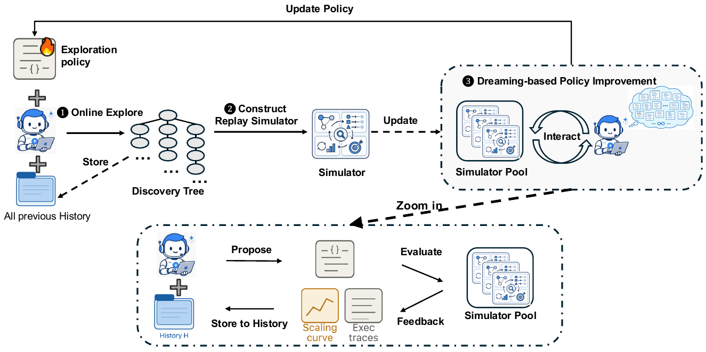
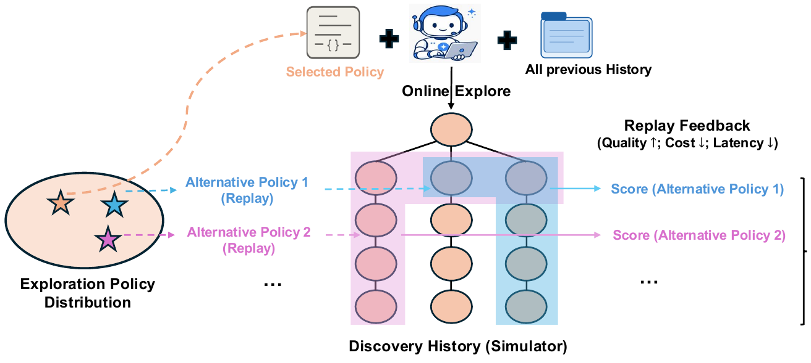

# Dream-RSI: Recursive Self-Improvement through Evolving Worlds

## 来源信息

| 项 | 内容 |
| --- | --- |
| 标题 | Dream-RSI: Recursive Self-Improvement through Evolving Worlds |
| 作者 | Tong Zheng¹², Xidong Wu¹, Zheng Zhang¹, Zhankui He³, Chaoyi Zhang¹, Benjamin Coleman³, Ruoqiao Wei¹, Di Bai³, Haolin Liu⁴, Rui Liu², Xue Wang¹, Yue Zhuan¹, Wang-Cheng Kang³, Renkai Xiang¹, Heng Huang², Xinwu Cheng¹, Yunsong Guo¹（¹ Google；² University of Maryland, College Park；³ Google DeepMind；⁴ University of Virginia）。通讯作者：xidongwu@google.com、zzhangx@google.com |
| 机构 | Google（第一机构；README 清单行「论文单位」列写 Google） |
| 来源 | 项目页 <https://dream-rsi.com/>；原文 PDF 直链 <https://www.dream-rsi.com/assets/dream-rsi.pdf>（本次阅读所用来源；该工作另有 arXiv 版，见下「arXiv 版」行） |
| 发布日期 | 2026-09-11（仓库 `CITATION.cff` 的 `date-released`）；PDF 生成时间戳 2026-09-12；仓库创建 2026-09-13、最近推送 2026-09-16 |
| 代码 | <https://github.com/zhengkid/Dream-RSI>。截至 2026-10-08（本笔记阅读日）仓库只含 `.gitignore` / `CITATION.cff` / `README.md` / `assets/` / `papers/`，**无代码**；README「Release plan」表：Paper ✅、项目页与交互 demo ✅、arXiv 发布 🔜、Discovered programs / Full codebase / Reproduction scripts 均为 ⏳。**仓库未标注 license**；阅读时 ★1382，复核当日（2026-10-08）★1383 |
| 许可 | 论文首页版权标注为 **"© 2026 Google. All rights reserved"**——未声明开放许可（不是 CC，也不是 arXiv 的非独占许可）。本笔记的配图引用请按此理解 |
| 仓库编号 | 00214（清单行内标题、年份、单位已核对一致） |
| 归档 | [`papers/00214-Dream-RSI.pdf`](../../../papers/00214-Dream-RSI.pdf)（36 页，975,357 B，sha256 `b2403013a14c588d772fc6b66a2ae556e5e8e2bcc58402dd4b582d9ba95a793f`）。2026-10-08 复核：与站点当前 `assets/dream-rsi.pdf` **字节一致**（同一 sha256），即归档对应的是当前线上版本 |
| 阅读日期 | 2026-10-08 |
| 阅读范围 | 全文 36 页（文件页码＝印刷页码，标题页为第 1 页）：正文 §1–7 + References + 附录 A（四个任务的精确定义）、B（Listing 1/2：在线探索提示词、回放改进提示词）、C（Listing 3：发现的 Lasso 求解器，845 行编号代码）。**已渲染页逐项核对**：公式 (1) 及其全部上下标（p.6，放大渲染核对）；Figure 3(a) 表格（p.8，逐格）；Table 1（p.9，逐格）；Figure 6(a)(b) 数据标签（p.11，逐项）；正文 §4.1/§4.2/§4.3/§5.1/§5.2 的关键数值句。**已做像素测量**（方法：网格线/刻度标定 + 颜色掩码 + 行剖面取平台）：Figure 4 四个面板的曲线平台值与代数端点（p.10）、Figure 3(b) 两个面板的逐轮折线读数（p.8）。**已做像素测量（同上方法）**：Figure 5 四条曲线的终值与早期区间比较（p.11）。**仅目视核对（未像素测量）**：Figure 1 与 Figure 2（示意框图，无定量元素）。Listing 3 只读结构与首尾，未逐行审阅 845 行代码。**复核时另行下载并比对 arXiv v1/v2**（见「版本关系」），但 v2 新增的 harness optimization 一节与 PACEvolve 对比**未读** |
| 配图 | `assets/` 下 2 张（Figure 1、Figure 2），自归档 PDF 渲染页裁剪（220 dpi，均 ≥200 dpi）。**裁剪框先校验在图像尺寸内，成品逐张回看确认无黑边/越界/截断，边框像素全为 255，并与第二次独立渲染的同区域做像素差比对（差异 = 0）**。Figure 2 的边界一次到位；**Figure 1 首版上边界（y=288）截掉了图内顶部的 "Update Policy" 标注（该标注在 y=267–284）**，复核时上移到 y=258 重裁并重验（含该标注、像素差 = 0、四边皆白）。来源 PDF 版权为 "© 2026 Google. All rights reserved"，引用请注明出处 |
| 复核记录 | 2026-10-08 依 check-paper-note 复核（基准：重读仓库归档 `papers/00214-Dream-RSI.pdf`，sha256 与笔记声明一致；并下载 arXiv v1/v2 对照）。手段：Figure 3(a) 与 Table 1 在 300 dpi 渲染页逐格重核；式 (1) 回渲染页重核；Figure 4 四面板、Figure 3(b) 两面板、Figure 5 四曲线全部用网格线/刻度标定 + 颜色掩码**独立重测**（项目页版与 arXiv 版数字一致）；否定性断言用符号与词多轮检索（`𝐾1`/`𝐾2`/`𝛽1`/`𝛽2`/`𝑀`/`generation`/`revision`/`round`）；配图与第二次独立渲染做像素差并放大核验四边。本轮修正：①**配图 Figure 1 首版上边界截掉了图内 "Update Policy" 标注**，上移 30 px 重裁并重验；②「摘要写」→「§1 引言（p.3）写」（逐域结果声明不在摘要）；③Figure 3(b) 左面板第 4 轮 5764→**5691** ms、差距 1060→**990** ms；④VGG16 灰线越过 0.52 的代数 432→**≈460**；⑤LayerNorm 蓝平台起点 332→**≈365–370**、灰终值起点 652→**≈690**、末标记中心 559→**≈553**、比值改为 1.76–1.81 区间；⑥ConvDiv 灰线端点 1033→**998**（原值把坐标轴箭头当数据）；⑦RCV1 口径改为「均值改善 656.1 ms vs RCV1 原始变化 −4934.1 ms（折合 −822.4 ms/项）」；⑧自相关不等式补「第一、第二要求非负、第三允许带符号」并新增 Circle Packing 的 $n\in\{26,32\}$ 同类问题；⑨新增张力第 9 条（§1 写 "identical"、图注写 "comparable"）；⑩**新增「版本关系」一节**：查证该论文已有 arXiv 版（v1 36 页 ≈ 本笔记基准版；v2 43 页为实质修订，已改掉/补上本笔记 5 条张力并新增 harness optimization 与 PACEvolve）；⑪补 Lasso 任务定义的准确口径（17 个实例的用途、正确性在新实例上校验） |
| 归档说明 | 本笔记以**非 arXiv 来源**（项目页版）阅读，该版 PDF 已归档为 `papers/00214-Dream-RSI.pdf`。复核时核实该工作已有 arXiv 版，按用户要求**清单编号单元格已改指 [arXiv:2609.14858](https://arxiv.org/abs/2609.14858)**；归档文件按「`papers/` 已有文件不动」保留（笔记正文引用的「原文 PDF」仍指该本地文件） |
| arXiv 版（复核时查证） | **该论文同时存在 arXiv 版本：[arXiv:2609.14858](https://arxiv.org/abs/2609.14858)**（cs.CL）。v1 首发 2026-09-14、36 页；**v2 更新于 2026-10-06、43 页**（arXiv 元信息 `comment` 仍写 "11 pages"，与实际页数不符）。复查时两版 PDF 均已下载核对，见下「版本关系」。仓库 README 自述的 "arXiv posting 🔜" 截至 2026-10-08 未更新，与实际不符 |
| 外部补充 | 2026-10-08 经 `curl` 访问项目页与 GitHub API（内置网页抓取被网络策略拦截）：用于确认线上 PDF 与归档一致、仓库代码发布状态与许可。仓库 README 的 alt 文本给出与论文 §1 略有不同的结果表述，见「原文自身的表述张力」第 1 条 |

---

## 版本关系（2026-10-08 复核时新增）

本笔记基于**项目页版**（36 页，PDF 生成 2026-09-12，与站点当前 `assets/dream-rsi.pdf` 字节一致）。复核时下载了 arXiv 两个版本逐项比对，结论是**正文数字一致、但 v2 是实质性修订版**，读的时候不要混用：

| | 项目页版（本笔记基准） | arXiv v1 | arXiv v2 |
| --- | --- | --- | --- |
| 页数 / 日期 | 36 页 / 2026-09-12 | 36 页 / 2026-09-14 | **43 页 / 2026-10-06** |
| §3 形式化 | `A(T)`、`A(T;W)`、`CONTINUE(v)`、$K_1/K_2$；含一处未写完的句子 "For every node $v \in C$," | 同一套记号，**措辞更紧凑，未写完的句子已修好** | 同上（记为 "selects nodes in T to continue exploration"） |
| Figure 3(a) / Table 1 数值 | — | **完全一致** | **完全一致**（3587.1→2931.0、317/550、2350.6/2516.7、1.145427、1.456375、2.635983 等逐项相同） |
| 倍数标注 | 2.43×/1.79×、2.09×/1.44× | 同 | 同 |
| §1 数学优化口径 | "**matches or surpasses** strong baselines within 1k generations" | 同项目页版 | **改为 "matches or exceeds the best results among the compared baselines on two of three tasks"** |
| §1 kernel 口径 | "under **identical** budget constraints" | 同项目页版 | **改为 "under a comparable budget"** |
| §4.1 跨模型比较 | 无任何提示 | 同项目页版 | **补上 "although these comparisons use different model backbones"** |
| §4.1 RCV1 | 只说 "the program ... appears particularly well suited to large-scale matrices such as RCV1" | 同项目页版 | **补上 "For 3.1 Pro, the average improvement over fixed exploration is driven by RCV1, despite slower runtimes on other datasets"** |
| §4.1 "consistently achieves superior" | 有 | 同项目页版 | **已删改** |
| "fewer than 1,000 generations" | 有（无出处） | 同项目页版 | **已删** |
| 新增内容 | — | — | **新增 harness optimization 实验（Terminal-Bench 2.1 上较种子 harness 提升 8 分以上）**、kernel 侧新增 PACEvolve 基线（发现时间上限设为两天）、以及 Meta-Harness／Terminus-Kira／Claude Code 等对比 |

**这张表的含义有两层**：① 本节下方「原文自身的表述张力」里第 1、2、3、4、6 条（共 5 条）**在 arXiv v2 中已被作者改掉或补上**——所以那些张力是本笔记基准版（项目页版 / arXiv v1）的问题，不是这篇工作当前公开版本的表述；② v2 新增的 harness optimization 一节与 PACEvolve 对比**本笔记未覆盖**（未读）。

---

## 核心结论

一句话：**这篇论文把"自我改进"从"改模型/改候选"挪到了"改怎么搜"这一层——并且发现，只要把一次真实的、代价高昂的发现过程完整记录下来（决策树 + 每个节点的执行结果），这棵历史树本身就是一个零成本的世界模型（replay simulator），可以让大量候选探索策略在"做梦"中先比一遍，再把赢家部署回线上。**

作者的三条主张：

1. **把探索显式化、可编程化**（§1、§3）：探索策略被写成一份**可执行的 Python 代码**（决定从哪个节点继续、哪些尝试并行、何时停止），由一层轻量编排层执行，底层 coding agent、评测器、执行接口全部冻结不动。改的是 harness，不是权重。
2. **把历史当成回放模拟器**（§2）：一次在线 rollout 产出的发现树记录了"过去每个决策点及其已经真实发生的代码执行结果"。因此另一个探索策略在这棵树里"走一遍"时，不需要重跑 agent 或评价器，只需**揭示已存的记录**——于是原来必须靠长程线上试错才能拿到的元层反馈，变成了离线、零执行成本的回放打分。这是全文的核心洞见，也是与「把历史当上下文/当微调数据」的既有工作的分界线（§6）。
3. **闭环递归**（§3）：在线探索 → 把树并入模拟器池 → 用回放反馈让 LLM 政策开发 agent 改探索策略代码、在被冻结的历史上评估 M 个版本、取回放分最高者 → 重新上线。外层迭代 t 增大时，模拟器池也随之增大。

**结果规模**（8 个任务 / 3 个领域）：算法工程（Lasso 正则化路径）上，相对同一系统内的固定策略基线，下游平均运行时间从 3587.1 ms 降到 2931.0 ms（Gemini-3.1-Pro，同时 agent 调用从 550 降到 317）；数学优化上 3 个任务里 2 个达到或超过所选基线（其中 Sum–Difference 有新最好值）；GPU kernel 上 4 个 kernel 都改善（2 个同等性能下更省代数、2 个同预算下分数更高）。

**它本质上不是"更强的求解器"，而是"更省试错的搜索控制器"**——所以它改善的是质量–算力权衡，不是单点质量上限；作者的结论句也只用 "competitive or improved ... in several settings" 这种保守口径。

**适合谁看**：在做 agent 驱动的自动搜索/自动发现（AlphaEvolve 一类）、且已经被"搜得越多越浪费"卡住的人；以及关心"不训练权重、只改 harness 的 RSI"这条路线的人（与本仓库 00212 RRSI 属同一族，但那一篇正则化的是**筛选准则**，这篇改造的是**探索控制器的获取方式**）。



*图 1（原文 Figure 1，p.2）：Dream-RSI 的三阶段 RSI 循环。❶ 在线探索——当前探索策略引导 coding agent 展开发现树并记录历史轨迹；❷ 构建回放模拟器——把生成的发现树转成可复用的模拟器池；❸ 基于 dreaming 的策略改进——agent 在"脑中"设想大量候选策略，把它们喂给回放模拟器模拟执行、拿到快速反馈并持续精炼；更新后的策略重新部署到下一轮在线探索。下方 Zoom-in 框是 dreaming 的细节：Propose（基于 History H）→ Evaluate（在 Simulator Pool 上）→ Feedback → 回写历史。裁剪自原文 PDF（© 2026 Google. All rights reserved）。*

---

## 问题与动机

### 已有的两种做法，各有一个瓶颈

- **手工设计、全程固定的探索策略**（§1 的引用列表：AlphaEvolve、SimpleTES、PACEvolve、DeltaEvolve、MLEvolve）：分支宽度、并行度、停止条件都由人写死，发现过程中不因经验而变。当搜索空间随任务变难而膨胀时，固定策略会把算力反复投向已经无效的方向。
- **在线优化探索策略**（§1 引 Liu et al. 2026a，即 *EvoX: Meta-evolution for automated discovery*）：听起来更对，但作者点出元层特有的两个难点（§1）：
  1. **反馈延迟且昂贵**：评价一个*候选解*只要一次评估；评价一个*探索策略*却要观察它如何塑造后续几十上百轮"提案–评估"的走向，必须整条 rollout 跑完才知道好坏。
  2. **元策略空间巨大**：新提的策略可能很差，需要试很多个。于是每个策略都要付一次长程线上代价 → 闭环转不起来。

### 关键前提：发现历史天然是一棵树

作者要的前提很轻：只要把 rollout 组织成**发现树**（§3），并且**把每个节点的执行结果落盘**，历史就自动具备了模拟器的资格。这与 model-based RL / World Models 的类比是全文的论证骨架（§2 用"走过一次的路变成地图"引入，并明确对标 Dreamer 家族：Dreamer 学一个紧凑动力学模型、在模型里想象轨迹来改策略；这里则**不学模型**，直接用被记录的真实结果当模型）。

### 与既有"历史复用"的差别（§6 的定位）

| 历史怎么用 | 论文引的代表工作 | 局限（论文的定位） |
| --- | --- | --- |
| 静态文本上下文 / 记忆 | §1 引 Hu et al. 2025、Ouyang et al. 2026b；§6「Memory, History, and Experience Reuse」段另有 DeltaEvolve（语义 delta 结构化演化历史）、SwarmResearch 与 MLEvolve（跨分支/回溯信息引导搜索） | 只影响"下一次怎么想"，不产生可用于**评价策略**的反馈 |
| 微调数据 | §1 引 Wang et al. 2025、Yuksekgonul et al. 2026（据 §4.2 的引用，前者即 Table 1 的 ThetaEvolve、后者即 TTS-Discovery） | 需要权重更新，而且信号稀疏 |
| **可回放的世界**（本篇） | Dream-RSI | 只在**已实现**的搜索空间上有效（见「局限」，这是最本质的代价） |

---

## 方法与贡献

### 3.1 发现树与唯一的原子动作

一个 rollout 增量地构建一棵以任务根 $r$ 为根的**发现树**（根代表初始 workspace 状态）：

- 每个非根节点 $v$ 有唯一 primary parent；该 parent 标明了产生 $v$ 的那次尝试**从哪里开始**——发现 agent 恢复 parent 保存的 workspace，用那里累积的观测当上下文生成一个新候选，再评测。
- 节点 $v$ 记录从 $r$ 到 $v$ 的演化历史，以及这一次尝试的结果：**文件系统快照、生成的产物、评测诊断、分数 $s_v$**（分数越大越好，任务内协议固定）。

唯一的原子操作是 $\mathrm{CONTINUE}(v)$：恢复 $v$ 的 workspace，生成并评测**一个新子节点**。从根继续 = 开一个新分支；从非根叶子继续 = 精修/修复该分支末端。

设并行 worker 数 $W \ge 1$（每个 worker 一次只能跑一个生成–评测请求）。对当前树 $\mathcal{T}$，可继续节点集合与可行批：

$$A(\mathcal{T}) = \{r\} \cup \{v \in \mathcal{T} : v \text{ 是叶子}\}, \qquad A(\mathcal{T}; W) = \{C \subseteq A(\mathcal{T}) : |C| \le W\}$$

探索策略每一轮从当前树里选一个批 $C \in A(\mathcal{T};W)$，观察这一批全部完成后的结果，再进入下一轮。**选空批 = 终止 rollout。**根在开出分支后仍然可选（所以可以继续开新根），而从非根叶子继续则把该分支推进到它的新子节点。

> **原文此处有一处未写完的句子**（p.5，已回渲染页确认）：正文写到 "The exploration policy selects a batch $C \in A(\mathcal{T};W)$ from the current tree. For every node $v \in C$," 就在逗号处中断，下一段直接接 "One decision round consists of..."。从 §Online rollout 的 "the discovery agent executes CONTINUE($v$) for each $v \in C_{t,k}$" 可推断原意是"对 $C$ 中每个 $v$ 并行执行 $\mathrm{CONTINUE}(v)$"。这是原文的写作/排版瑕疵，不影响可理解性。

### 3.2 在线 rollout 与离线回放的唯一差别

两个阶段**共用同一个树式决策接口**，差别只在"一次继续如何产生下一个观测"：

- **在线**：真正执行，产生**新**结果。策略 $\pi_t$ 在已完成历史 $\mathcal{H}_{t-1}$ 的辅助下跑一次 rollout，最多 $K_1$ 个决策轮；每轮选批 $C_{t,k}$，对批内各节点执行 $\mathrm{CONTINUE}$ 并评测，把产出的子节点挂到各自 parent 上得到 $\mathcal{T}_{t,k+1}$。**转移是随机的**（同一 workspace 下 agent 可能给出不同结果）。结束时把 $\mathcal{T}_t$ 并入历史：$\mathcal{H}_t = \mathcal{H}_{t-1} \cup \{\mathcal{T}_t\}$。
- **离线回放**：历史 $\mathcal{H}_t$ **冻结**，策略经历 $M$ 次代码修订 $\pi_t^0=\pi_t, \ldots, \pi_t^{M-1}$。每个版本都在**每一棵**已记录树 $\mathcal{T}_i\ (i=1..t)$ 上回放一遍。回放从根开始，只揭示已记录的子节点：$\mathcal{T}_i^{m,k+1} = \mathcal{T}_i^{m,k} \cup \{\mathrm{Child}(v;\mathcal{T}_i) : v \in C_i^{m,k}\}$，**转移是确定的**（直接给到记录的那个孩子，孩子可能不存在）。策略**只能看到已揭示的子树与合法动作信息，看不到未揭示节点的结果**。每个回放最多 $K_2$ 轮，终止条件为选空批 / 无记录可继续 / 用完 $K_2$ 轮。每个"策略–树"对都**从根重新回放**，新版本不继承之前版本揭示过的子树。



*图 2（原文 Figure 2，p.4）：历史作为回放模拟器。上：选定策略 + 全部历史 → 在线探索产出一棵含执行轨迹的发现树（每个节点是一次尝试及其完整观测）。下：不同候选策略（Alternative Policy 1/2）在**同一棵**已记录的树里走出不同的轨迹（虚线箭头 = 揭示已存结果），各自得到一个回放分数（Quality ↑ / Cost ↓ / Latency ↓）。因为节点结果都已预存，一次昂贵的在线运行可以支撑上千次快速、零执行成本的 off-policy 评估。裁剪自原文 PDF（© 2026 Google. All rights reserved）。*

### 3.3 回放目标（式 1）与策略选择

记 $N_i^m = |\mathcal{T}_i^{m,k_i^{m,\star}}| - 1$ 为回放中揭示的非根节点数——**回放本身不执行任何新尝试**，但 $N_i^m$ 计的就是这条轨迹**所代表的**生成–评测请求数。对固定系数 $\beta_1, \beta_2 \ge 0$：

$$V_i^m \;=\; \underbrace{\max_{v \in \mathcal{T}_i^{m,k_i^{m,\star}}} s_v}_{\text{discovery quality}} \;-\; \underbrace{\beta_1 N_i^m}_{\text{execution cost}} \;+\; \underbrace{\beta_2 \cdot \frac{N_i^m}{\max\{1,\, k_i^{m,\star}\}}}_{\text{parallelism bonus}} \tag{1}$$

三项的直觉：① 回放期间达到的**最好解质量**；② 惩罚尝试过的生成次数（总工作量）；③ 对**非空回放**，奖励"每个决策轮平均执行了多少次尝试"——即鼓励把有用的继续**成批**发出，而不是串行一个个跑（$k_i^{m,\star}$ 是该次回放完成的轮数）。

策略版本 $\pi_t^m$ 的评测分是在固定历史上的平均回放分：

$$V^m = \frac{1}{t}\sum_{i=1}^{t} V_i^m$$

离线阶段先评测当前策略 $\pi_t^0=\pi_t$，再由 policy-development agent 阅读回放轨迹与分数（以及更早修订的反馈），识别成功决策与反复出现的失败，改出 $\pi_t^{m+1}$ 并在同样的 $t$ 个回放世界上评测。$M$ 次修订后选

$$\pi_{t+1} = \pi_t^{m^\star}, \qquad m^\star \in \arg\max_{m \in \{0,\ldots,M-1\}} V^m$$

**这是全文唯一的"保证"**：因为候选集包含当前策略本身，所以 $V^{m^\star} \ge V^0$——**即下一轮策略在固定历史 $\mathcal{H}_t$ 上的平均回放分不劣于当前策略**。注意这是对**回放分数**的保证，不是对在线发现结果的保证（见「局限」）。

> 与图注的对照：Figure 1 图注写 "the agent \"dreams\" up a massive pool of alternative policies in its mind"，Figure 2 图注写 "Thousands of candidate policies can then be tested within this simulator"。论文未给出候选策略数量的实测值，也未给出 $M$、$K_1$、$K_2$、$\beta_1$、$\beta_2$ 的具体取值——**这些超参全文均无数值**（复核时用 `𝐾1`、`𝐾2`、`𝛽1`、`𝛽2`、`𝑀`、`decision rounds`、`revisions` 等符号与词在全文与附录多轮检索确认；附录中 `K` 的命中全部来自 Listing 3 的 C++ 循环变量）。

---

## 关键公式与直觉（补充说明）

- **$A(\mathcal{T})$ 把"开新根"与"精修已有分支"统一成同一种动作**：根永远是合法动作，所以"explore 新方向"与"exploit 当前分支"在形式上没有区别，只是同一个批里选了不同的节点。这让策略代码可以在一个统一的 batch 选择问题里表达探索/利用/修复的组合（Listing 2 里确实要求策略构建"exploitation + exploration + 至多一个 recovery"的 dynamic portfolio）。
- **式 (1) 的第二、三项构成了一个内在张力**：$N_i^m$ 同时出现在"惩罚总工作量"和"奖励每轮工作量"里。加大并行度能提高第三项但若没有更好的解，第一项不变而第二项变大——所以 $\beta_1/\beta_2$ 实际上在编码"宽而浅"还是"窄而深"的偏好。
- **回放分数不是"预测"而是"重放"**：因为不学动力学模型，$s_v$ 是**真实发生过的**分数。代价是它无法回答"如果当时选了另一个节点会怎样"——那部分结果没被记录（见「局限」第 2 条）。
- 论文原文推导仅到式 (1) 与 $V^m$ 的取平均；本节的"直觉"段落是本笔记的注释，不是原文表述。

---

## 实验与证据

### 实验协议（§4）

- **对照基线 = Recursive Fixed Exploration**：与 Dream-RSI 共用同一个 discovery agent、评估器、初始化、资源约束，**并且从同一份手工设计的探索策略出发**（"并行精修策略"：开多个独立 workspace，各自维护本地轨迹、反复精修当前候选）。两者**第 1 轮行为完全相同**，之后固定策略保持不变、Dream-RSI 每轮用回放改进后重新部署。成本口径 = **累计 discovery-agent 调用次数**。
- discovery agent：Gemini-3.1 Pro 与 Gemini-3.7-Flash，经 Gemini CLI 调用。**每轮预算**：Pro 为 10 个并行 workspace × 最多 11 个精修步 = 110 次调用；Flash 为 32 × 20 = 640 次调用。Lasso 跑 5 轮、数学优化跑 10 轮（kernel 的轮数与预算未交代，但 Figure 6 显示至少 9 轮）。
- 8 个任务 / 3 个领域：Lasso 正则化路径（算法工程）；Sum–Difference、Circle Packing、Autocorrelation Inequalities（数学优化）；VGG16、LayerNorm、ConvDiv、ConvMax（GPU kernel，取自 KernelBench）。

### ① 算法工程：Lasso 正则化路径（§4.1，Figure 3）

任务背景：Lasso 正则化路径是高维统计的基础计算原语；沿用 SimpleTES 的 benchmark 设定——发现阶段用与 SimpleTES **相同的 17 个合成实例**（覆盖不同维度、稀疏度、特征相关性与活跃集结构）；正确性判据为 $F_k(\tilde{w}_k) \le F_k(w_{k,\text{sklearn}}) + 10^{-6}$（对每个 $k$），且**在不同于计时实例的新实例上校验**，任一检查失败则搜索分记 0；通过后搜索分取计时实例集 $\mathcal{I}$ 上完整路径耗时的**几何均值的倒数** $R_{\text{search}} = \left(\prod_{i \in \mathcal{I}} t_i\right)^{-1/|\mathcal{I}|}$（附录 A Problem 1）。另在**六个留出下游数据集**上测泛化（非生物：Gisette、RCV1；生物：DNA、Leukemia、Colon、Duke Breast）。

Figure 3(a)（p.8 表格，已逐格核对）：

| 方法 | 模型 | Compute | Gisette | RCV1 | DNA | Leukemia | Colon | Duke Breast | **Avg.** |
| --- | --- | ---: | ---: | ---: | ---: | ---: | ---: | ---: | ---: |
| sklearn | – | – | 11275.2 | 252881.7 | 93.8 | 227.2 | 229.8 | 374.0 | 44180.3 |
| glmnet | – | – | 9063.6 | 73072.8 | 351.9 | 45.0 | 24.2 | 47.7 | 13767.5 |
| SimpleTES | gpt-oss-120b | 51,200 | 3141.9 | 19625.6 | 15.9 | 15.5 | 11.6 | 18.1 | 3804.8 |
| SimpleTES † | gpt-oss-120b | 51,200 | 8651.0 | 41143.1 | 37.6 | 28.2 | 19.5 | 31.1 | 8318.4 |
| Recursive Fixed Exploration | Gemini-3.1-Pro | 550 | 1861.8 | 19550.1 | 41.5 | 26.1 | 14.5 | 28.4 | 3587.1 |
| Recursive Fixed Exploration | Gemini-3.7-Flash | 3200 | 1133.1 | 13873.0 | 29.8 | 24.1 | 15.7 | 24.4 | 2516.7 |
| **Dream-RSI** | Gemini-3.1-Pro | **317** | 2841.0 | 14616.0 | 49.9 | 30.2 | 16.4 | 32.5 | **2931.0** |
| **Dream-RSI** | Gemini-3.7-Flash | **1879** | 1091.9 | 12923.4 | 31.4 | 21.0 | 12.2 | 23.6 | **2350.6** |

（单位 ms，越低越好；Compute = 累计 discovery-agent 调用数。原表只把 "DREAM-RSI" 方法名排成**小型大写体**（"Recursive Fixed Exploration" 为常规字体）以示区分，**数值本身未加粗**，不存在"加粗即最好"的暗示。† 一行是 SimpleTES 的另一个配置，论文全文未解释 `†` 的含义——该符号只出现在这张表里。本笔记的重排与原文列序一致：方法｜模型｜Compute｜Gisette｜RCV1｜DNA｜Leukemia｜Colon｜Duke Breast｜Avg.）

**本笔记复算**：
- 相对固定策略：平均时间 3587.1 → 2931.0 即 **1.224×**（Flash：2516.7 → 2350.6 即 1.071×）；调用数 550 → 317 即 **1.74× 更少**（Flash 3200 → 1879 即 1.70×）——与 §1 引言的 "1.7× over fixed-exploration baselines" 一致（p.3）。
- 相对 SimpleTES：51200 / 317 = **161.5 ≈ 162×**（Pro）；51200 / 1879 = 27.2×（Flash）。§1 引言的 "up to 162×" 取的是 Pro 这一侧。
- **改善高度集中在 RCV1 一个数据集上**（这点论文只在正文提了一句"Pro 发现的程序似乎特别适合 RCV1 这类大规模矩阵"，见「原文自身的表述张力」第 2 条）。

Figure 3(b) 给出的是**逐轮**的下游平均时间 vs 累计算力的轨迹（已做像素测量，网格线标定；标定用末轮值与 Figure 3(a) 表格对齐，误差 <1%）。左面板（Gemini-3.1-Pro）读数：

| 轮次 | Dream-RSI 平均时间 | 固定策略平均时间 | 双方累计算力（次调用） |
| --- | ---: | ---: | --- |
| 1 | ≈5.25k ms | 同左（设计上相同） | 各 ≈105（红蓝第 1 点重合） |
| 2 | ≈5.35k ms | ≈5.35k ms | Dream-RSI ≈120 / 固定 ≈220 |
| 3 | ≈5.36k ms | ≈5.30k ms | Dream-RSI ≈150 / 固定 ≈335 |
| 4 | **≈5.69k ms** | **≈4.70k ms** | Dream-RSI ≈235 / 固定 ≈450 |
| 5 | 2931.0 ms（表格值） | 3587.1 ms（表格值） | Dream-RSI 317 / 固定 550（表格值） |

（第 1–3 轮三个红点的读数差异在 ±2% 的测量误差内，不宜按小数列出；固定策略侧的点近似等间距 ≈110 次调用，与其固定每轮预算一致。第 4 轮两线差距约 **990 ms**，远超测量误差。）

右面板（Gemini-3.7-Flash）读数：Dream-RSI 各轮 ≈2733 / 2396 / 2378 / 2329 / 2351 ms，固定策略 ≈2733 / 2993 / 3013 / 2912 / 2518 ms——**Flash 这一侧从第 2 轮起每一轮都更好**。（末轮读数与表格 2350.6 / 2516.7 吻合，用于校验标定。）

> 也就是说：**"Dream-RSI 在递归轮次中一致更优"这个说法在 Pro 面板有明确反例**——第 4 轮它比固定策略差了约 990 ms（≈+21%），直到第 5 轮才靠一次大幅下降反超。§4.1 正文的措辞是 "consistently achieves superior downstream performance"，见「原文自身的表述张力」第 3 条。

**发现的求解器**（§4.1 末 + 附录 C）：与 SimpleTES 在 LARS 与坐标下降间按维度切换不同，Dream-RSI 发现的求解器把自适应性放进了**活跃集优化内部**——strong-rule screening 搭配**基于 Cauchy–Schwarz 的 KKT 剪枝**（只在界无法证明某特征非活跃时才重算精确梯度，剪枝失效时回退到全刷新），再加上不相交活跃集记账、惰性 Gram 矩阵构造与硬件感知优化。Listing 3 共 **845 行编号代码**：外层是 Python 模块（`# EVOLVE-BLOCK-START`），`CPP_CODE` 字符串内是 C++/Eigen 实现（`EIGEN_UNROLL_LOOPS`、OpenMP、`__restrict__` / `__builtin_assume_aligned` 对齐假设），末尾附 `COMPILE_FLAGS = ["-fopenmp", "-ffast-math"]`。论文只给这一个任务的求解器源码。

### ② 数学优化（§4.2，Table 1）

Table 1（p.9，已逐格核对；Sum Diff 与 Circle Packing 越高越好，Auto Correlation 越低越好，原表加粗 = 最好）：

| 方法 | LLM | Sum Diff (↑) | Auto Correlation (↓) | Circle Packing (↑) |
| --- | --- | ---: | ---: | ---: |
| AlphaEvolve | Gemini-2.0 Pro + Flash | – | 1.455700 | 2.635862 |
| AlphaEvolveV2 | Gemini-2.0 Pro + Flash | 1.121936 | – | **2.635983** |
| OpenEvolve | - | – | 1.460000 | - |
| CodeEvolve | - | – | – | 2.635980 |
| ShinkaEvolve | Mixed | – | 1.457800 | 2.635982 |
| TTS-Discovery | Qwen3-8B | – | – | **2.635983** |
| ThetaEvolve | Distilled-Qwen3-8B | – | 1.493000 | **2.635983** |
| EvoX | Gemini-3.0-Pro | – | 1.458900 | 2.635900 |
| SimpleTES | GPT-OSS-120B | 1.143975 | **1.453675** | **2.635983** |
| Recursive Fixed Exploration | Gemini-3.1-Pro | 1.144047 | 1.456001 | **2.635983** |
| **Dream-RSI** | Gemini-3.1-Pro | **1.145427** | 1.456375 | **2.635983** |

- **Sum–Difference**：Dream-RSI 1.145427，高于 SimpleTES（1.143975）、Recursive Fixed Exploration（1.144047）与 AlphaEvolveV2（1.121936）。这是本表里 Dream-RSI 唯一明确刷新最好值的列，也是它对自身固定基线的唯一改进。
- **Autocorrelation**：Dream-RSI 1.456375 **明显差于 SimpleTES 的 1.453675（全表最好）**，也**差于自己的固定基线 1.456001**。§4.2 正文对此的措辞是 "remaining competitive"，理由诉诸成本（SimpleTES 需 51,200 代，本篇"少于 1,000 代"）。
- **Circle Packing**：2.635983 与 AlphaEvolveV2 / TTS-Discovery / ThetaEvolve / SimpleTES / 自身固定基线**并列**，不是改进。
- 任务定义见附录 A（Sum–Difference 最大化 $\Gamma(A)=\log(|A+A|/|A|)/\log(|A-A|/|A|)$；Circle Packing $n \in \{26,32\}$ 最大化半径和；Autocorrelation 附录定义了三个不等式 $\Phi_1,\Phi_2,\Phi_3$）。**主表只报一列 "Auto Correlation" 且未注明是哪一个**：论文内部线索只有"越小越好"与取值区间 ≈1.4537–1.4930，**本笔记推测是第一不等式 $\Phi_1$（最小化 $\max_t (f*f)(t)$），但这是解读、未经查证**（见「原文自身的表述张力」第 7 条）。

### ③ GPU kernel 工程（§4.3，Figure 4）

四个 KernelBench 任务，指标为逆运行时间 1/ms（越高越好），带正确性检查。**Figure 4 已做像素测量**（网格线标定 + 颜色掩码取平台）：

| 任务 | Dream-RSI 曲线代数范围 | 固定策略曲线代数范围 | 论文标注 | 本笔记像素测量复核 |
| --- | --- | --- | --- | --- |
| VGG16 | ≈95 → **423** 代（末标记中心 ≈408 代） | ≈102 → **998** 代 | 2.43× fewer costs | 蓝线顶平台 ≈0.5209、最高标记 ≈0.533–0.539；灰线终值 ≈0.53，其在 **≈460 代**越过 0.52（复核细测：gen 431 时 0.5104、gen 443 时 0.5173、gen 462 起 0.5209）。**总代数比 998/423 ≈ 2.36，按末标记中心 ≈2.45**（论文 2.43） |
| LayerNorm | ≈94 → **567** 代（末标记中心 ≈553 代） | ≈102 → **998** 代 | 1.79× fewer costs | 蓝线终平台 1.1219（复核细测自 **≈365–370 代**起），灰线终值 1.1273（自 **≈690 代**起）。**总代数比：按曲线端点计 998/567 ≈ 1.76，按末标记中心（≈553 代）计 998/553 ≈ 1.81**——论文的 1.79 落在两者之间（端点判定本身有 ±2% 的读数误差） |
| ConvDiv | ≈95 → **800** 代 | ≈102 → 998 代 | 2.09× higher score | 蓝线终值 **1.898**（Fig 6a 的 E8 标签值，与像素反算的 y 位置吻合）；灰线在**同一代数（≈793–867 段）**仍停在 **0.9081** 平台（其 1.284 平台从 ≈872 代才开始）→ **1.898 / 0.9081 = 2.090**，与论文 2.09 逐位吻合 |
| ConvMax | ≈94 → **684** 代 | ≈102 → 998 代 | 1.44× higher score | 蓝线末点尖峰顶端 ≈**0.4286**（标记中心，顶端边缘 0.4388）；灰线同代数平台 **0.2991** → **0.4286 / 0.2991 = 1.433 ≈ 1.44**，与论文一致 |

（测量口径备注：四个面板的固定策略曲线末端在本笔记两轮测量中都落在 **gen ≈998**。左侧两个面板的横轴右端带箭头，箭头像素会被灰色掩码命中，若不按面板边界截断会把曲线末端虚读成 ≈1033 代——本笔记首版即误记此值，复核时按 `x <` 面板右边界重测修正。）

**关键口径差异（本笔记强调）**：VGG16/LayerNorm 的两个数字是**"达到相当性能所需代数"**之比（图中两方法的**总代数不同**：Dream-RSI 曲线在 423/568 代就结束，固定策略跑到 ~1000 代）；ConvDiv/ConvMax 的两个数字是**同等代数下**的性能之比。图注本身把这两类分开措辞（"fewer generations" vs "under comparable discovery budgets"），但读者若混用会得到错误印象——例如 ConvDiv 若改成"终点对终点"，比值只有 1.898/1.284 ≈ **1.48**，因为固定策略在 Dream-RSI 停手后还在涨。

### ④ 两条进一步分析（§5）

**历史作为"提示" vs 作为"模拟器"（§5.1，Figure 5）**：把历史抽象成高层方向性洞见、直接当语义指导写进提示词，然后分别加到固定策略与 Dream-RSI 上。四条曲线的终值（**像素测量**，ConvDiv，横轴到 ≈1000 代）：Dream-RSI **1.90**（末点 gen≈785）＞ Dream-RSI+Guidance **1.44**（末点 gen≈845，此前长期停在 1.37 平台）；Fixed Exploration **1.28** ＞ Fixed+Guidance **0.63**。也就是**两个范式里加指导的终值都更低**，与作者的结论一致。

  但 "consistently" 这类全称措辞在图上并不严格：**Dream-RSI 这一对里，橙色（+Guidance）在约 211–390 代区间一直高于蓝色（不加指导）**，直到 ≈390–440 代蓝色才反超并拉开差距（本笔记像素测量）。作者的解读是：长时程发现中已有多条并行线程时，强语义先验会**过度约束搜索空间、损害探索多样性**。

**探索行为的演化（§5.2，Figure 6，数据标签逐项核对）**：ConvDiv 上 9 个递归轮次 E0–E8 的**轮内最好性能** / **评测尝试数**：

| 轮次 | E0 | E1 | E2 | E3 | E4 | E5 | E6 | E7 | E8 |
| --- | ---: | ---: | ---: | ---: | ---: | ---: | ---: | ---: | ---: |
| 轮内最好性能 | 0.427 | 0.625 | 0.855 | 1.403 | 1.488 | 1.499 | 1.770 | 1.880 | 1.898 |
| 评测尝试数 | 110 | 110 | 87 | 80 | **50** | 92 | 80 | 91 | 86 |

作者读法：性能上升时**先收缩算力**（尝试数 110 → 50），随后进展停滞时**再加大探索**，接着又出现性能跃升。实际序列里 E5=92 只换来 1.488→1.499 的微小变化，而真正的大跳跃发生在尝试数**回落**到 80 的 E6（1.499→1.770）——所以"加大探索→随后增益"的因果叙述与逐轮数据只是**大致吻合**（本笔记的判断）。同一张图也显示后期增益递减：1.770 → 1.880 → 1.898。

---

## 工程视角

### 策略的实际接口（来自附录 B 的 Listing 2，非论文正文）

论文正文是数学化的（策略 $\pi$ 是抽象的"选择批的函数"），但 Listing 2 泄露了真实接口——**策略是一份 Python 代码**，需要实现：

```
class OptimalPolicy(LLMDesignedMethod):
    def solve(self, question, budget=None): ...        # 在线/回放共用的决策循环
    def plan_grid(self, context: GridPlanningContext) -> GridPlan: ...  # 下一轮网格规划
```

`question` 提供的接口（回放时是冻结 trace 的只读视图）：

```
question.reset()
question.observed() -> dict[str, Observation]  # 只含已揭示前缀
question.legal_actions() -> list[str]          # 根 + 已开分支的前沿
question.legal_roots() -> list[str]            # 仅未开的根
question.opened_branches() -> list[int]
question.meta(cell_id) -> CellMeta             # .branch .attempt .parent_id .seq .tags
question.probe_batch(cells, on_reveal=...) -> list[Observation]
question.baseline_score
question.max_parallelism
```

`Observation` 字段：`branch, attempt, score, evaluated, valid, fail_class, error, delta_vs_baseline, delta_vs_parent, n_valid, n_total`；另有 `see.policy.observation_signal` 提供的 `branch_promising` / `branch_failed_hard` / `probe_improved_vs_parent` / `probe_improved_vs_baseline` 等辅助信号。

于是"环境"的准确形态是**一张 branch × attempt 的冻结不规则网格**：策略只能打开一个根、或推进某个已开分支的下一格，**每揭示一格算一次 probe**。这解释了几个设计选择：

- **"前缀可见"是硬约束**：策略不得使用未揭示的分数、真实最优值、硬编码的获胜 cell id、绝对分数阈值。原因很直白——策略代码跑在冻结 trace 上，不约束就可以直接"偷看答案"，回放评测就失去意义。Listing 2 里大量 "must never / do not" 条款（不要把 trace 特有的 branch/cell id/分数/目标写进策略逻辑）都是在堵这个洞。
- **`plan_grid` 让策略同时控制"下一轮线上跑多大"**：`GridPlan(branch_count=W, refine_count=R)`，创建分支 `0..W-1` 与每根之后 `R` 次精修。这解释了 §4 里的 "10 × 11 = 110" 与 "32 × 20 = 640"。**并且 Listing 2 明确写了回放的一个硬边界**："In replay, a requested plan beyond the frozen trace's `context.trace_branch_count` or `context.trace_refine_count` is out of support and cannot earn replay reward."——**回放只能评估不超过已有记录规模的网格**。
- **β 是唯一标量旋钮，且分三个角色**（Listing 2 §Beta）：① 单次回放/线上 episode 内**固定**，所有行为阈值统一走 `_schedule(beta)`，高 β = 更宽、更有耐心、更弱剪枝；② 离线评估时**扫一个固定的 β 栅格**，用来测量策略是否真的暴露了"达成度/工作量/并行度"的权衡；③ 提出下一个策略版本时，**一次性选好 baked-in 默认 β**（依据最近 2–3 次**线上** cycle 的 manifest 与匹配的 `beta_sweep.json`，步长约 0.1–0.2、clamp 到 [0,1]；证据不足时用约 0.6 的偏探索默认值），此后在整个下一轮线上探索中保持不变。

### 实际评测口径与正文式 (1) 不同

Listing 2 写的是：评估器扫描 β 后，对整条曲线排序

```
pareto.reward = pareto.auc - lambda * parallel_penalty
```

其中 `pareto.auc` 奖励"用更少的**总 probe** 达到更高的单轨迹达成度"，`parallel_penalty` 是 `effective_sequential_rounds / total_probes` 在扫描上的均值——串行策略惩罚接近 1，装满批次的策略接近 $1/W$。**这与正文式 (1) 的单一标量化目标不是同一个式子**（式 (1)：$\max s_v - \beta_1 N + \beta_2 N/\max\{1,k\}$；实现：β 栅格扫描 + 帕累托 AUC − 并行惩罚，且 β 是**策略内部**的阈值旋钮而非目标函数系数）。两者精神一致（都在权衡质量/工作量/并行度），但论文没有说明这一层替换。

### 成本与规模

- **在线侧**：每次 $\mathrm{CONTINUE}(v)$ = 1 次 coding-agent 调用 + 1 次评估。Lasso 的 Pro 配置每轮 110 次、Flash 每轮 640 次（$W \times (R+1)$）。
- **回放侧**：不调用 agent、不调评估器，只读记录 → 论文所说的 "zero-execution-cost off-policy evaluations" 指的是**这一步**。**但代价转移到别处**：① 离线阶段每个策略版本要在**全部** $t$ 棵树上（再乘 β 栅格）回放，第 $t$ 轮的工作量 $\propto$ 版本数 × $t$；② 策略提案本身要花 LLM 调用（policy-development agent），**论文的成本口径完全没有计这一部分**；③ 每个节点要落盘文件系统快照 + 产物 + 诊断，存储随探索量线性增长。这三项都未被量化。
- **发现树的分支因子受 $W$ 限制**，深度受 $R$（网格）与 $K_1/K_2$（决策轮上限）共同限制；后两者无数值。

### 可能的失败模式（解读）

1. **代理目标漂移**：回放分数与在线发现质量之间没有理论联系，式 (1) 的保证只是"回放分不劣化"。Figure 3(b) 第 4 轮的回退就是这种漂移的一次实际观测。
2. **结构性偏置（最本质）**：回放只能在**已记录**的格子上给分，而"本来应该开一个全新根"的策略拿不到任何奖励——因为那个根的结果没被记录。于是改进循环天然偏向**深化已探索方向**，这可能正是后期增益递减（Figure 6 的 1.770→1.880→1.898）以及"改善集中在 RCV1"的成因。论文没有做这一项的对照实验。
3. **策略代码的自由度**：策略是任意 Python，可以有 bug。Listing 2 的约束条款（必须实现 `plan_grid` 且任何路径都返回非 None、不要在 `solve()` 内读 trace 文件、不要把 `best_so_far`/`budget_spent` 当决策依据、不得用绝对分数阈值）读起来像是**从实际踩坑里总结出来的护栏**——反过来说，这些护栏之外的行为是否正确，论文没有报告。

---

## 原文自身的表述张力

> **适用范围说明**：以下各条针对本笔记的基准版——**项目页版（36 页）/ arXiv v1**。其中第 1、2、3、4、6 条涉及的问题在 **arXiv v2（43 页，2026-10-06）中已被作者改掉或补上**（逐条见上「版本关系」表），引用时请注明版本。

1. **数学优化的"matches or surpasses"与 Table 1 不符**〔arXiv v2 已改为 "two of three tasks"〕。**该声明在 §1 引言（p.3），不在摘要**——摘要只说 "achieving competitive or improved discovery quality ... in several settings"。§1 写 "In mathematical optimization (sum-difference, autocorrelation, circle packing), it matches or surpasses strong baselines within 1k generations"。但 Table 1 中 **Autocorrelation 一列 Dream-RSI 1.456375 既低于 SimpleTES 的 1.453675（全表最优），也低于自己系统的固定基线 1.456001**；正文 §4.2 的措辞只是 "remaining competitive"，并未声称超越。三个任务里 2 个达到或超过。**旁证**：仓库 README 的 alt 文本自己写的是更准确的口径——"Mathematical optimization: **2 of 3 tasks at or above** the selected baseline"。
2. **Lasso 的平均改善几乎全部来自一个数据集**（本笔记复算）〔arXiv v2 已自行补上该 caveat〕。Gemini-3.1-Pro 下，Dream-RSI 相对固定策略的**六数据集平均**改善 656.1 ms（3587.1−2931.0），而其中 **RCV1 单个数据集的原始变化就是 −4934.1 ms**（折合到均值上是 −822.4 ms/项），**其余五个数据集全部变差**：Gisette 1861.8→2841.0（+979.2）、DNA 41.5→49.9（+8.4）、Leukemia 26.1→30.2（+4.1）、Colon 14.5→16.4（+1.9）、Duke Breast 28.4→32.5（+4.1）。论文正文承认 "the program discovered by Gemini-3.1-Pro appears particularly well suited to large-scale matrices such as RCV1"，但 §4.1 的总结句 "Dream-RSI achieves a better downstream quality–compute trade-off than Recursive Fixed Exploration" 未提示这一点。Flash 侧则是 6 个里 5 个改善（仅 DNA 略差 29.8→31.4），同样由 RCV1 主导（−949.6 ms）。
3. **"consistently achieves superior downstream performance"有反例**〔arXiv v2 已删改该句〕。§4.1 的 Recursive Discovery Dynamics 段写 "Dream-RSI consistently achieves superior downstream performance while requiring substantially lower cumulative compute across both Gemini-3.1-Pro and Gemini-3.7-Flash"。但 Figure 3(b) **左面板（Pro）第 4 轮**，Dream-RSI ≈5691 ms 明显差于固定策略 ≈4708 ms（本笔记两轮独立像素测量一致；复核时以末轮值与表格 2931.0/3587.1 对齐标定，误差 <0.5%）；"每一轮都更优"只在 Flash 面板成立（第 1 轮两者设计上相同）。
4. **"within 1k generations"没有出处**〔arXiv v2 已删去该表述〕。"over 50× budget savings compared to SimpleTES"的算术是 51200/1000 = 51.2，但 §4.2 既没有给出每个数学任务的每轮预算，也没有给出总代数，"少于 1,000 代"这一基数在正文、表格与附录中都无处可查。（复核时以 `generation`／`1k`／`rounds`／`budget` 等词全文检索，唯一的 "1,000" 之外的相关数字是 §4.3 kernel 图的横轴上限 1,000 代——固定策略曲线跑到 ≈998 代，本笔记像素测量——那是另一组实验。作者应掌握该实际值，只是论文没有记录。）
5. **式 (1) 与附录 B 的评测器不是同一个目标**（见「工程视角」），论文未说明这一层替换。
6. **跨模型比较的口径**〔arXiv v2 已自行补上 "these comparisons use different model backbones"〕。§4.1 把 "317 discovery-agent calls" 与 SimpleTES 的 "51,200 generations" 直接对比（"roughly two orders of magnitude fewer"），但两者**模型不同**（Gemini-3.1-Pro vs gpt-oss-120b）、且 "generation"（SimpleTES 侧）与 "discovery-agent call" 是否为同一单位，论文未加界定。
7. **附录 A 定义的任务变体多于主表报告的列，且论文未注明对应哪一个**。两处：① 附录 A 的 "Autocorrelation Inequalities" 下定义了三个不等式（$\Phi_1$ 最小化 $\max_t(f*f)(t)$、$\Phi_2$ 最大化 $\|f*f\|_2^2/(\|f*f\|_1\|f*f\|_\infty)$、$\Phi_3$ 最小化 $\max_t|(f*f)(t)|$；第一、第二要求 $f$ 非负，第三明确允许带符号函数；均约束 $\int_{-1/4}^{1/4} f = 1$、支撑在 $[-1/4,1/4]$），而主表只有一列 "Auto Correlation"；论文内部可查的线索仅"越小越好 + 取值区间 ≈1.4537–1.4930"，**本笔记推测是 $\Phi_1$，但未找到原文说明、也未在本次核对中查证外部文献**。② Circle Packing 在附录 A 定义为 $n \in \{26, 32\}$ 两个规模，主表同样只给一列 2.635983 而未注明是哪个 $n$。引用这两列数值时请按"变体未注明"理解。
8. **p.5 有一处未写完的句子**（"For every node $v \in C$," 后直接断掉），已回渲染页确认是原文如此〔arXiv v1/v2 均已修好，故这条只属于项目页版〕。
9. **同一组 kernel 数字在两处口径不同**：§1 引言（p.3）写 "improves kernel performance by up to 2.09× under **identical** budget constraints"，而 Figure 4 图注（p.10）写的是 "under **comparable** discovery budgets"。§4.3 正文与图注一致（"comparable"），只有引言用了更强的 "identical"。〔arXiv v2 的引言已改为 "under a comparable budget"，与本条一致〕

---

## 局限与待确认问题

**作者表述中承认的**：

- 只能在**已实现**的搜索空间上做回放。§2 把它表述为 "a grounded model of the portion of the discovery space that has already been observed"（对所观测部分的有据模型）；Listing 2 则把它落成实现约束：回放超出冻结 trace 网格规模的计划 "out of support and cannot earn replay reward"。

**本笔记根据证据提出的**：

1. **保证只对代理目标成立**。$V^{m^\star} \ge V^0$ 是关于固定历史回放分的单调性声明；在线发现结果与回放分的关系没有理论刻画，也没有做"回放分提升 vs 在线结果提升"的相关性分析。Figure 3(b) 第 4 轮的回退说明二者会脱钩。
2. **改进循环有系统性偏置**：只在已记录格子上给分 ⇒ 无法奖励"开新方向" ⇒ 后期容易收敛到深化已有分支（与 Figure 6 后期递减一致）。缺少"回放池大小/多样性 vs 在线收益"的消融。
3. **成本核算不完整**：只统计 discovery-agent 调用；policy-development agent 的 LLM 调用、离线回放总工作量（随外层轮数 $t$ 线性增长 × 版本数 × β 栅格）、以及每节点的快照存储均未计量。因此「改进探索策略更省算力」这一结论目前只在**被计量的那一部分**上成立。
4. **关键超参全无默认值**：$K_1$（线上决策轮上限）、$K_2$（回放轮上限）、$M$（每轮代码修订次数）、$\beta_1,\beta_2$、β 栅格、`lambda`、以及"dream 出来的候选策略"的实际数量——正文与附录都没有给出。加上**代码未发布**（截至 2026-10-08 仍标 "being prepared"），**目前无法复现**。
5. **单点驱动与稳健性**：ConvMax 的 1.44× 完全来自蓝线**最后一个数据点**从 ≈0.278 平台跳到 ≈0.429（标记中心；顶端边缘 0.439）的孤立尖峰（本笔记像素测量）；Lasso 的改善集中在单一数据集（见张力第 2 条）。都没有多种子/重复实验的方差报告。
6. **长时程递归的证据深度有限**：外层轮数只有 5（Lasso）/10（数学），kernel 侧 Figure 6 显示 9 轮内增益已递减——1.499→1.770（+0.271）→1.880（+0.110）→1.898（+0.018）。"递归自我改进"的叙事需要更长的轮次曲线（是否饱和、何时饱和）才站得住。
7. **数学任务只报 3 项、其中一项落后**；Circle Packing 是并列而非改进。三个领域里真正体现"改进了发现质量"的只有 Sum–Difference 一项 + kernel 的两个任务。
8. **本笔记基准版之外的证据未覆盖**：arXiv v2（43 页）新增了 harness optimization 实验（Terminal-Bench 2.1 上较种子 harness 提升 8 分以上）、kernel 侧的 PACEvolve 基线（上限两天）以及若干新对比系统。这些**本笔记未读、未核**；若关心「这套方法在 harness 自改进上也work吗」，需要另读 v2。
9. **与 RSI 的距离**：本文改进的对象是**探索策略代码**，而发现质量提升的机制（更会分配算力）与"模型/系统能力自我提升"不是一回事；论文自身的贡献清单也把它定位在 "meta-exploration layer"。读的时候不宜把标题里的 Recursive Self-Improvement 直接读成能力自举。

---

## 本笔记引用的外部资料

| 内容 | 来源 | 核对方式 |
| --- | --- | --- |
| 归档 PDF 与线上版本是否同版 | <https://www.dream-rsi.com/assets/dream-rsi.pdf> | 2026-10-08 下载，sha256 与 `papers/00214-Dream-RSI.pdf` 完全一致 |
| 发布日期、代码发布状态、许可、star 数 | <https://github.com/zhengkid/Dream-RSI>（API + README + CITATION.cff） | 直接读取仓库元数据与 README 的 Release plan 表；CITATION.cff `date-released: 2026-09-11` |
| README 的 alt 文本结果摘要（用于交叉核对论文 §1 的结果口径） | 同上仓库 README | 逐句抄录，仅在张力第 1 条作为旁证引用 |
| arXiv 版是否存在、版本与页数 | <http://export.arxiv.org/api/query?id_list=2609.14858> | 2026-10-08 查询：1 条结果，`2609.14858v2`，17 位作者同名，v1 2026-09-14 / v2 2026-10-06，`comment: 11 pages`（与实际页数不符） |
| arXiv v1 / v2 与本笔记基准版的差异 | <https://arxiv.org/pdf/2609.14858v1>、<https://arxiv.org/pdf/2609.14858v2> | 2026-10-08 下载后 `pdfinfo` 得 36 页 / 43 页；以 `pdftotext` 抽取后对 10 余组关键句与全部关键数字逐项比对，结果见「版本关系」 |

（内置网页抓取工具被网络策略拦截，上表内容经 `curl` 获取；`dream-rsi.com` 与 `api.github.com` 均可达。）

---

## 一句话备忘

Dream-RSI = **把"搜索历史"从上下文升级成可回放的世界模型**：一次真实发现留下的一棵树 = 一个零执行成本的反事实评估器（但只对已走过的格子有效），于是"怎么搜"这一层可以离线比出赢家再上线；换来的收益是质量–算力权衡上的改善（且高度依赖具体任务/数据集），代价是改进方向被已有历史结构锁定。
